CUDA Denoiser For CUDA Path Tracer
================

**University of Pennsylvania, CIS 565: GPU Programming and Architecture, Project 4**

* Zhiyu Lei
  * [LinkedIn](https://www.linkedin.com/in/zhiyu-lei/), [Github](https://github.com/Zhiyu-Lei)
* Tested on: Windows 22, i7-2222 @ 2.22GHz 22GB, GTX 222 222MB (CETS Virtual Lab)

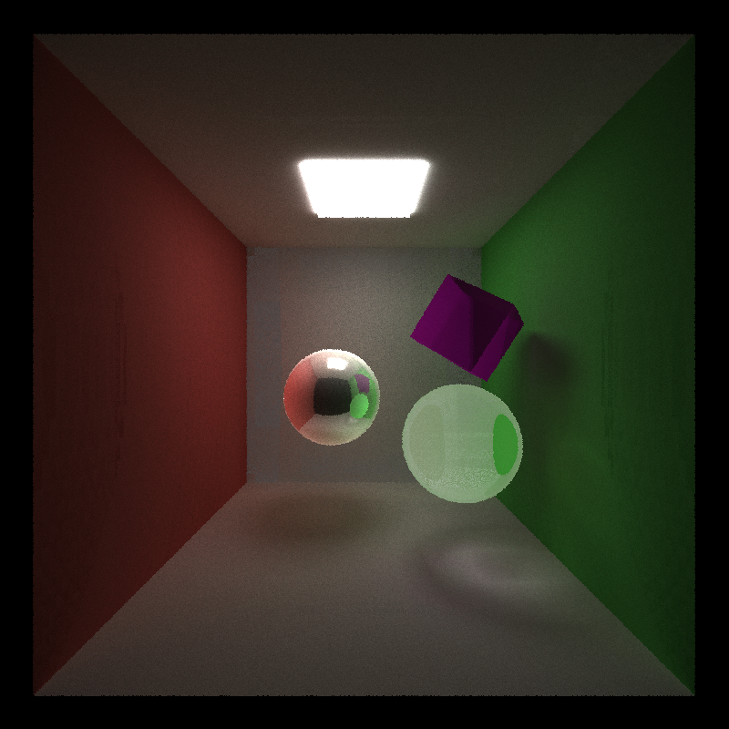

(This output is generated from the scene in [scenes/customize.txt](scenes/customize.txt))

### Project Features
This project is extended from the [CUDA Path Tracer](https://github.com/Zhiyu-Lei/CIS5650-Project3-CUDA-Path-Tracer) project by implementing the A-trous wavelet filter with and without edge-avoiding technique in order to denoise the path tracer output. The A-trous wavelet filter is introduced in [Dammertz et al.'s paper](https://jo.dreggn.org/home/2010_atrous.pdf). More details are described below:

#### G-Buffers for normals and positions
Since the edge-avoiding technique requires the normal and position of each pixel to detect edges and compute weights of neighboring pixels for filtering, normals and positions are stored as G-Buffers and can be visualized as following:
|Per-pixel normals|Per-pixel positions|
|:---:|:---:|
|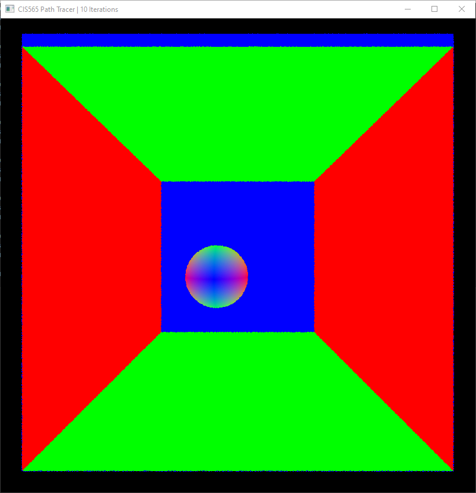|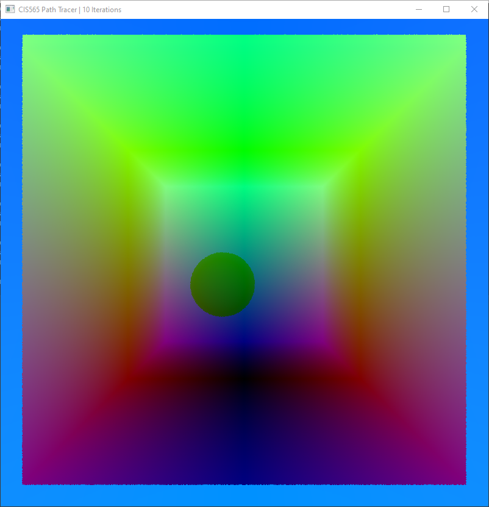|

#### A-trous kernel and its iterations without weighting, i.e. Gaussian blur
The following two images show a comparison of outputs after 3 iterations between the raw output and the one applied with a 5x5 Gaussian filter. The Gaussian filter has some denoising effect, but it also blurs the output and smooths the sharp edges.
|Raw output|Gaussian filter|
|:---:|:---:|
|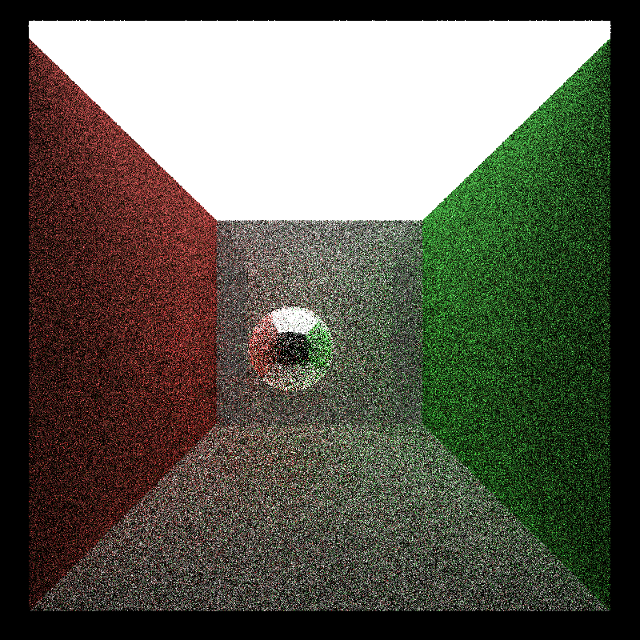||

#### A-trous kernel and its iterations with weighting
The following two images show a comparison of outputs after 3 iterations between the raw output and the one applied with a 5x5 weighted A-trous kernel. G-Buffers with per-pixel normals and positions are used to perceive edges and weigh neighboring pixels less if they are from different surfaces. This kernel has better denoising effect than the previous Gaussian filter, and it preserves the edges better.
|Raw output|A-trous with weighting|
|:---:|:---:|
||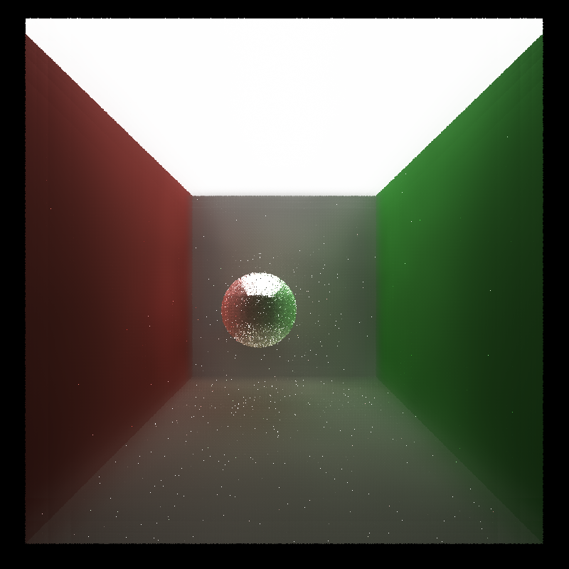|

### Performance Analysis
#### How much time denoising adds to your renders
Without denoising, the average frame rate is 60 FPS. With the Gaussian filter, the average frame rate reduces to 45 FPS. With the weighted A-trous kernel, the average frame rate further reduces to 20 FPS.

#### How denoising influences the number of iterations needed to get an "acceptably smooth" result
The following two images show the "acceptably smooth" results from the raw output and the one applied with the weighted A-trous kernel, which are obtained after 100 and 5 iterations respectively. In this case, though each iteration takes triple time for the denoised output than the raw output, denoised output requires much less iterations and is thus more efficient.
|Raw output (100 iterations)|A-trous with weighting (5 iterations)|
|:---:|:---:|
|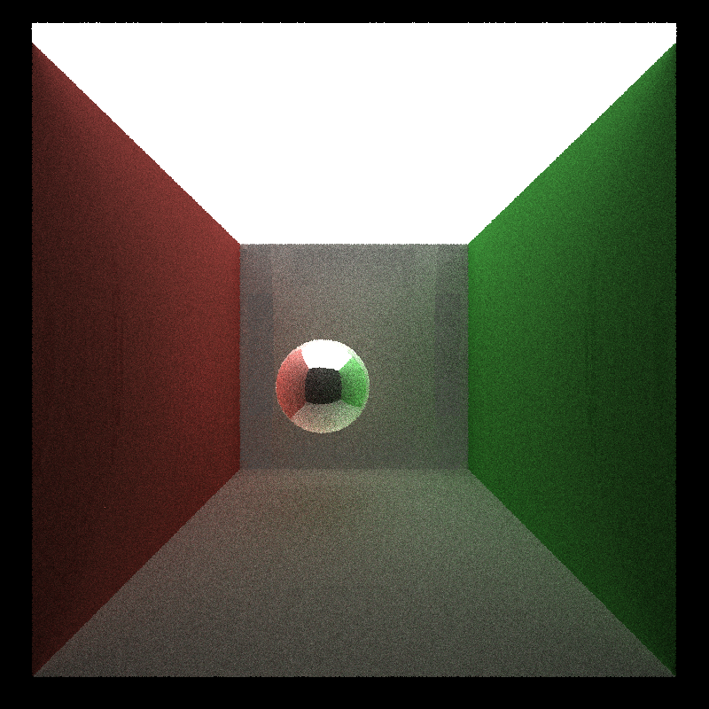||

#### How denoising at different resolutions impacts runtime
The plot below shows the average frame rate with respect to the resolution for the weighted A-trous kernel with filter size 8. Obviously, larger resolution makes the computation and rendering slower.
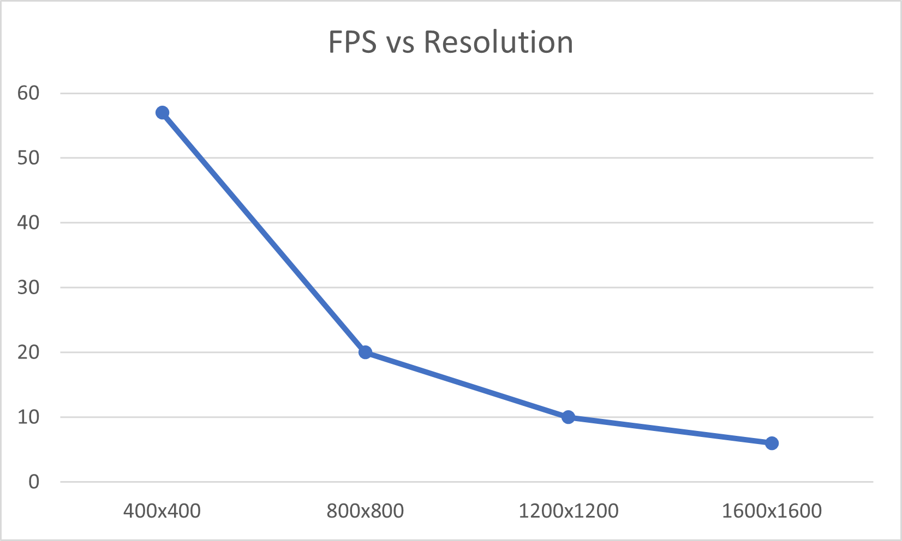

#### How varying filter sizes affect performance
For the filter size $n$, $n$ iterations are executed in the denoising step, and a maximum of $(1+2\cdot2^n)$ neighboring pixels are weighted for each output pixel.

The plot below shows the average frame rate with respect to the filter size for the weighted A-trous kernel applied on the 800x800 resolution output. Obviously, larger filter size makes the computation and rendering slower.
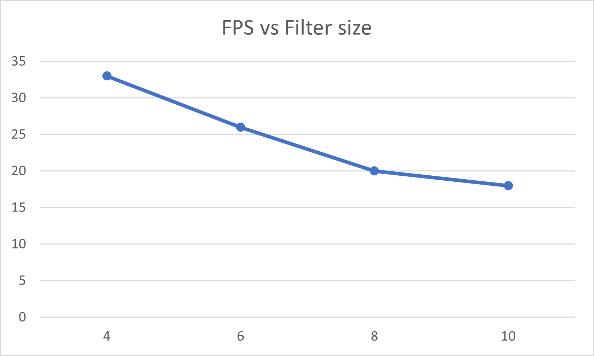

#### How visual results vary with filter size
The following four images show a comparison of outputs applied with the weighted A-trous kernel with filter sizes 4, 6, 8, and 10 respectively. By eyeballing the outputs, larger filter size tends to slightly improve the denoising but the variation is not significant in fact.
|4/8|6/10|
|:---:|:---:|
|||
|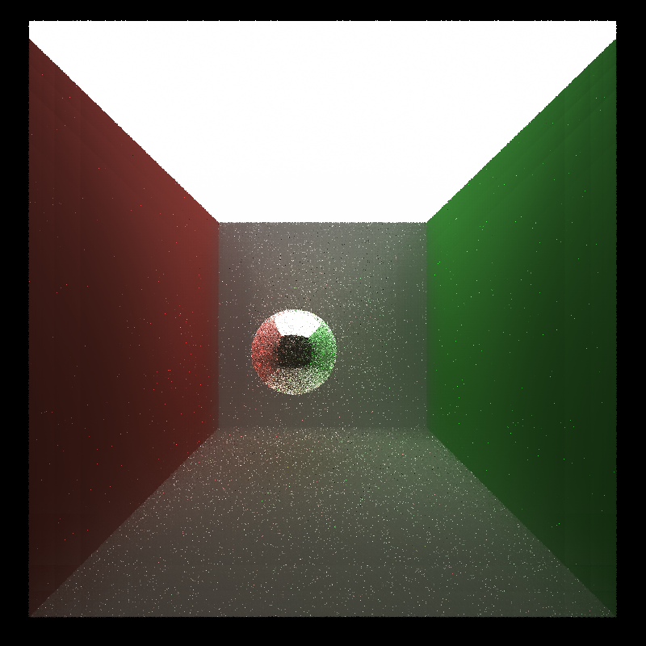||

#### How effective/ineffective is this method with different material types
The previous images can somewhat show this denoising method is the most effective with diffuse materials, but not that effective with specular-reflective or refractive materials.

#### How do results compare across different scenes
The following four images show a comparison of outputs between the row output and the one applied with the weighted A-trous kernel for a scene with a large light source ([scenes/cornell_ceiling_light.txt](scenes/cornell_ceiling_light.txt)) and a scene with a small light source ([scenes/cornell.txt](scenes/cornell.txt)). The scene with the larger light source has better denoising effect since more rays can terminate with hitting a light source during path tracing to create the more accurate output.
|Scene|Raw output|A-trous with weighting|
|:---:|:---:|:---:|
|Large light source|||
|Small light source|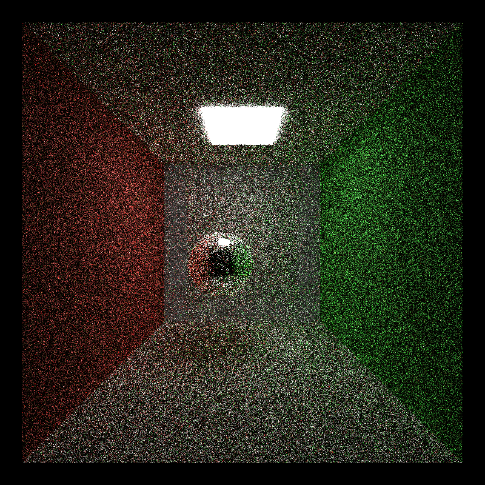|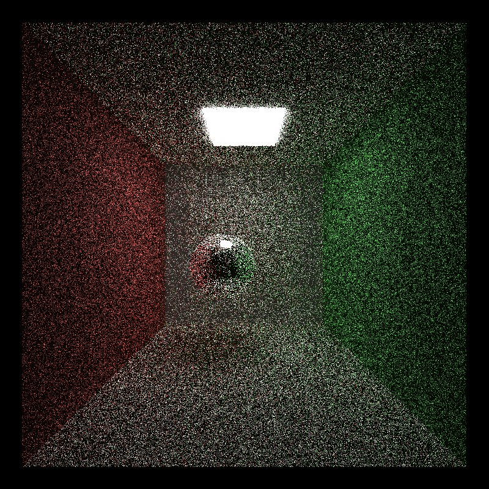|
