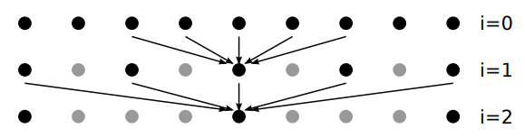
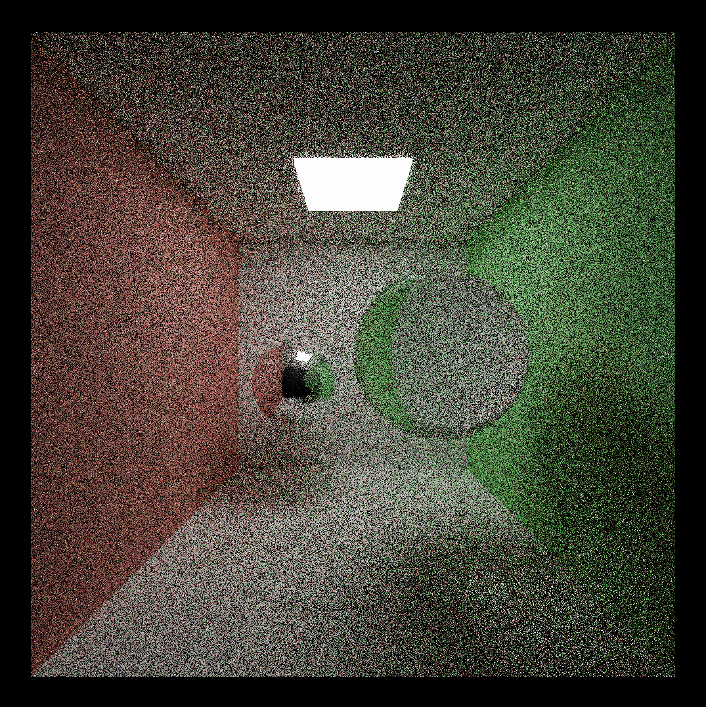
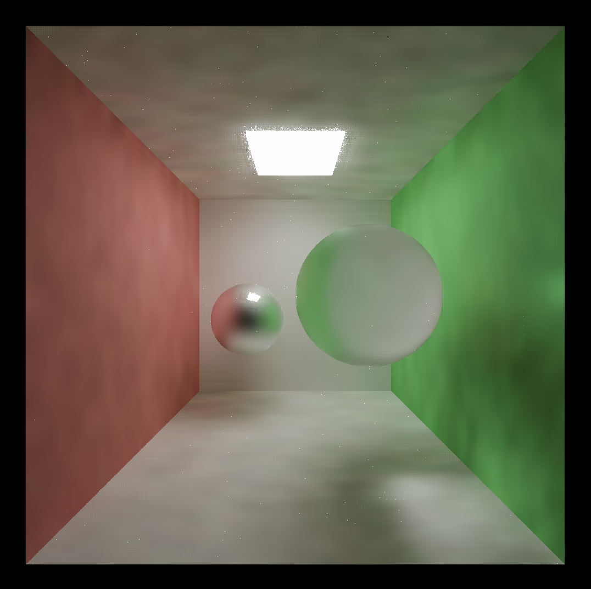
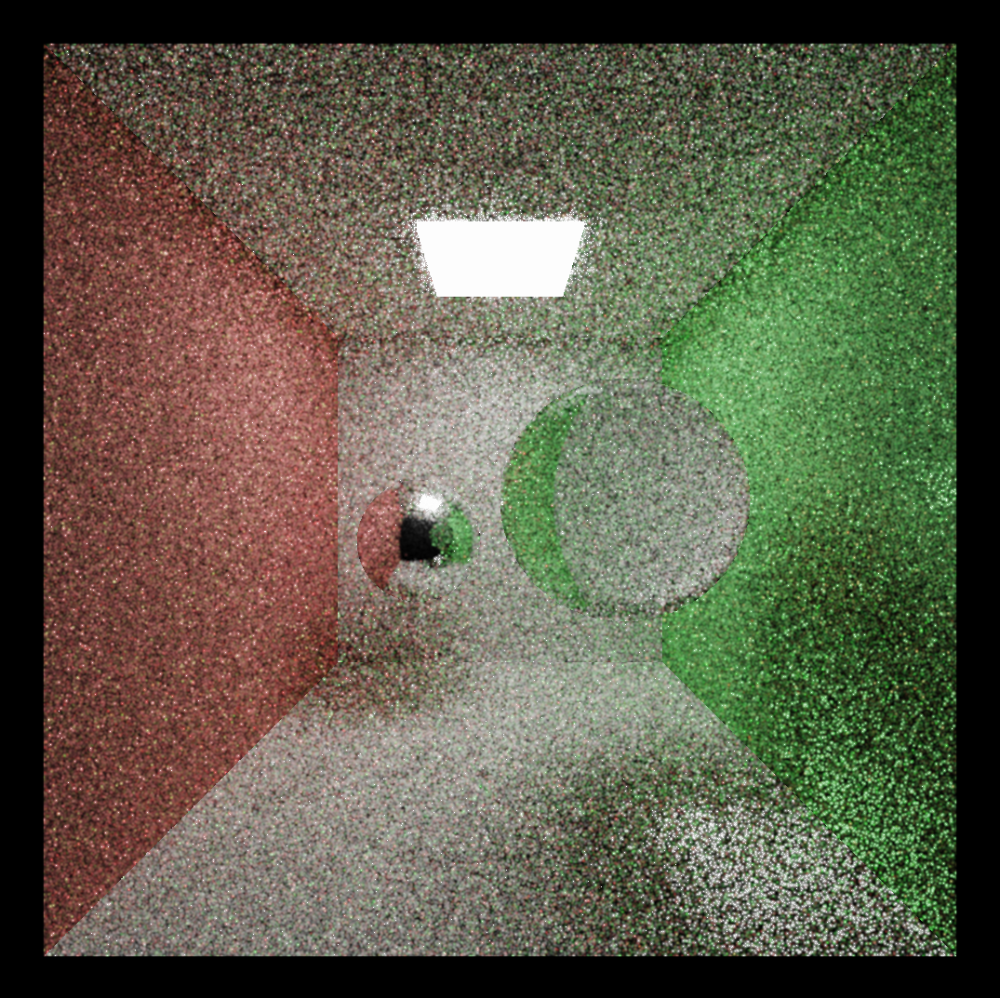
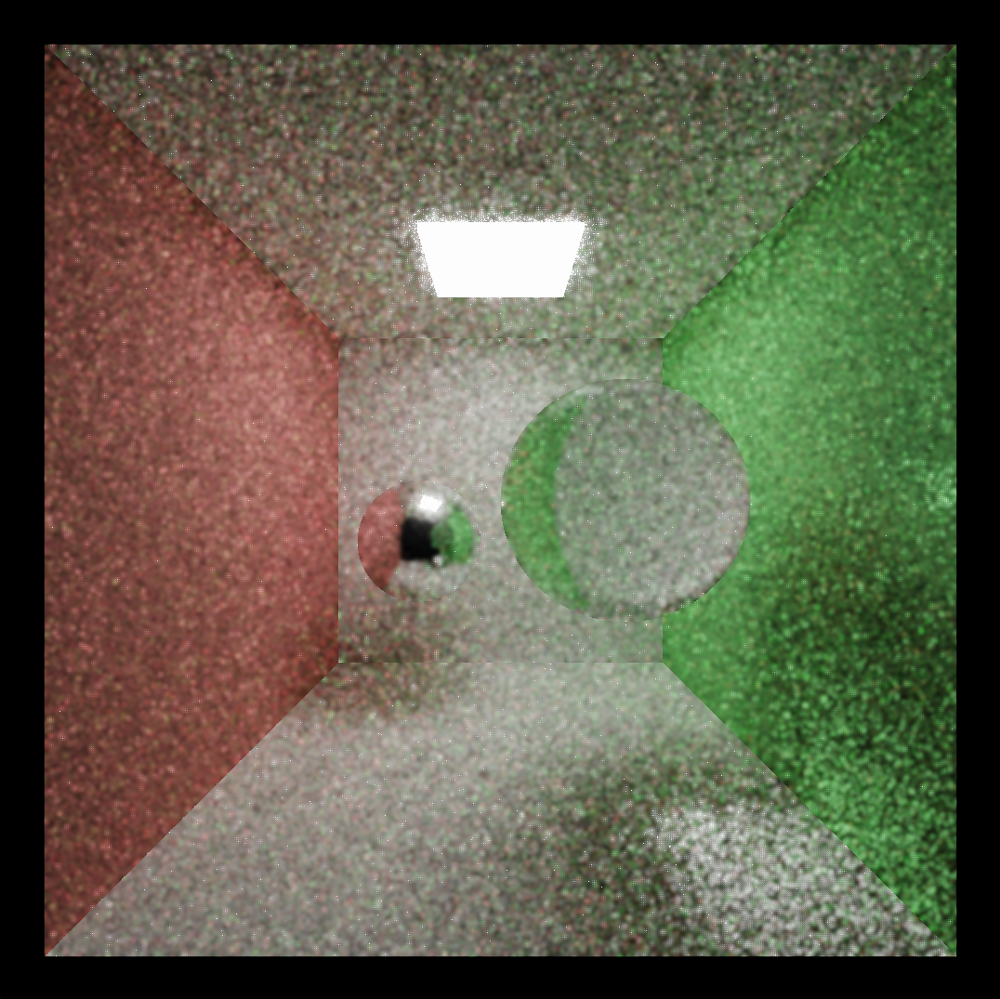
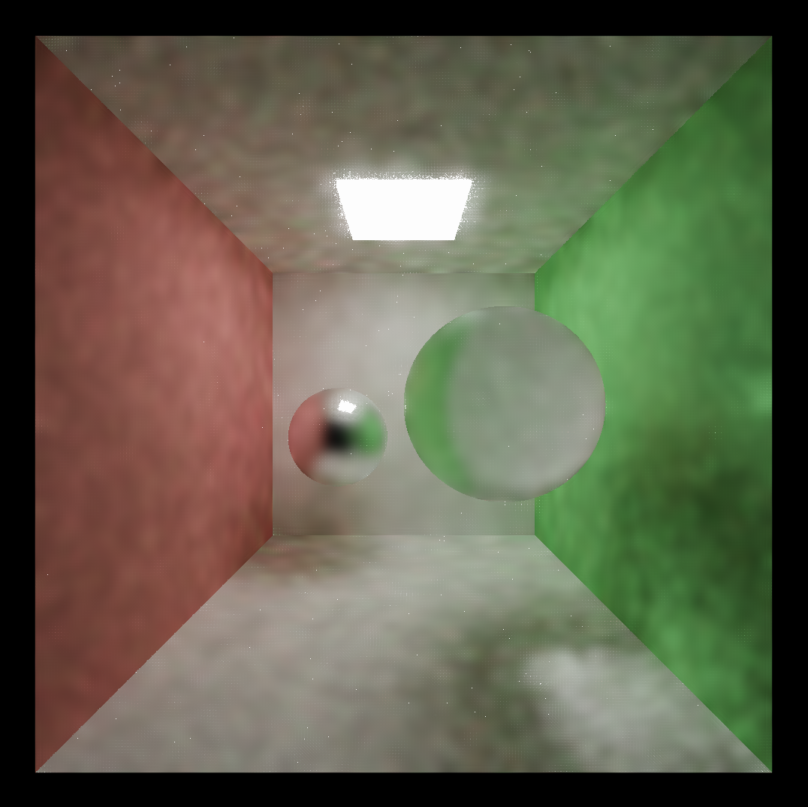
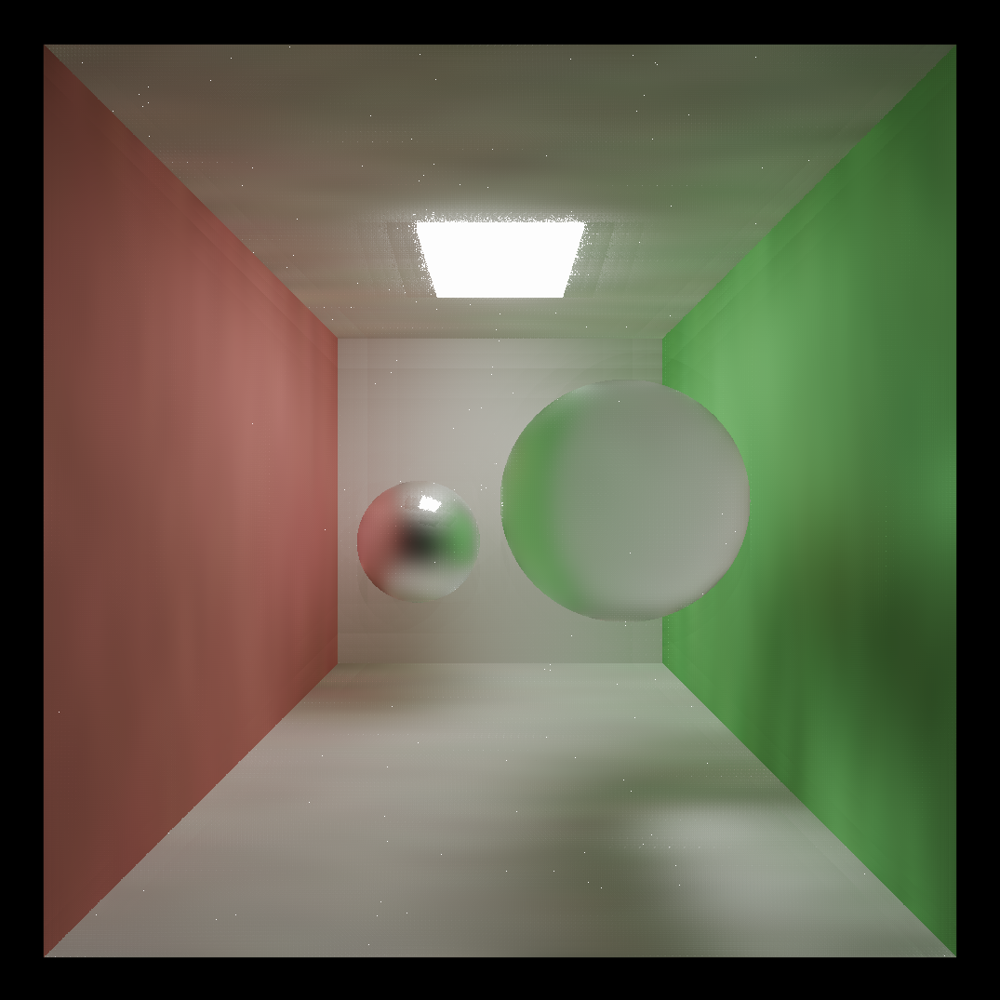
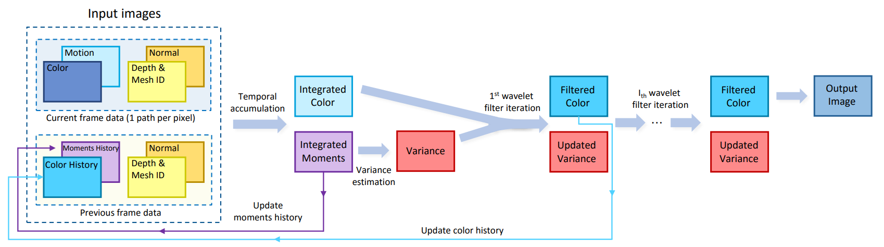

CUDA Denoiser For CUDA Path Tracer
==================================

* **University of Pennsylvania, CIS 565: GPU Programming and Architecture, Project 4**
  * Han Yang
    *  [LinkedIn](https://www.linkedin.com/in/han-yang-0031231a3/), [personal website](https://bdwhst.wixsite.com/portfolio), etc.
  * Tested on: Windows 11, i9-12900HX @ 2.30GHz 16GB, RTX4080 laptop 12GB

## Final Result

## Principles and Analysis

Path tracing, a type of ray tracing, involves shooting rays from the camera into the scene to simulate the paths of rays of light. Because it's probabilistic and based on random sampling, this can lead to noisy images, especially with a limited number of samples per pixel. Denoising these images while preserving details is a significant challenge.

### Edge-Avoiding A-Trous Wavelet Filter

- **Wavelet Transformation**: The term "à trous" is French for "with holes". In this method, the wavelet transformation is used to decompose an image into various frequency bands. By expanding the filter's support using a hole (or gap) between the samples, we can achieve different scales of wavelets.
- **Edge-Avoidance**: As with most image processing techniques, the primary challenge is to apply the desired effect without compromising the image's details. The Edge-Avoiding component of this filter ensures that while smoothing is applied generously in flat regions, it avoids areas with sharp intensity differences or edges, preserving details.
- **G-buffer Information**: When used in computer graphics, especially in a deferred shading context, the filter can benefit from the G-buffer's information. Elements like depth, normals, and albedo can guide the filtering process. For instance, a significant depth difference can indicate an object boundary, signaling the filter to avoid crossing that edge.
- **Stopping Function**: The stopping function, guided by the G-buffer data, determines how the filtering process should be modified in specific regions of the image. It helps in making informed decisions to preserve high-frequency details.

|  1spp Original (with MIS)  | 1spp A-Trous Filtered (with MIS) |
| :------------------------: | :------------------------------: |
|  |           |

#### Latency

Here we choose three scenes with the same resolution(1080*1080), they have similar delay with the A-Trous filter.

|                   | cornell-sphere.txt | cornell-sphere-vase.txt | sponza.txt |
| ----------------- | ------------------ | ----------------------- | ---------- |
| Latency Added(ms) | ~4                 | ~3                      | ~4         |

For the same resolution, the delay of filtering remain the same, irrelevant of the scene. This is intuitive because filtering is basically a screen space post processing.

#### Appearance with different iteration

| 1 iteration               | 2 iteration               |
| ------------------------- | ------------------------- |
|  |  |

| 3 iteration               | 4 iteration               |
| ------------------------- | ------------------------- |
|  |  |

| 5 iteration               | 6 iteration               |
| ------------------------- | ------------------------- |
|  |  |

Every time we increase filter iteration by one, filter size will multiply by two. In "one-spp Cornell box" case we need at least 6 iterations to get a smooth result. 

#### Runtime with different resolution

Here we choose the Cornell sphere scene file as a benchmark, with filter iteration=6.

|             | 600*600 | 700*700 | 800*800 | 900*900 | 1000*1000 |
| ----------- | ------- | ------- | ------- | ------- | --------- |
| Latency(ms) | ~8.7    | ~11.6   | ~14.1   | ~18.9   | ~21.8     |

As the image size increases, the latency also increases. This suggests that processing larger images takes more time, which is expected as there are more pixels to handle in bigger images.

#### Runtime with different filter size

Filter size of A-Trous filtering is actually controlled by number of filter iterations, and it will exponentially growth with the increase of filter iterations. Here we choose the Cornell sphere scene file as a benchmark, with filter iteration=6, resolution=1000x1000.

|             | 5*5 (1 iteration) | 10*10 (2 iteration) | 20*20 (3 iteration) | 40*40 (4 iteration) | 80*80 (5 iteration) |
| ----------- | ----------------- | ------------------- | ------------------- | ------------------- | ------------------- |
| Latency(ms) | 18.5              | 19.1                | 19.3                | 20.7                | 22.2                |

We can see that increase the filter size will slightly increase the latency, although it is not significant.

### GBuffer Optimization

Here I used linear depth reconstruction and octahedral normal encoding to reduce GPU memory bandwidth cost.

#### Depth Reconstruction

Use the depth in view space to reconstruct world position, relatively easy.

#### Octahedral Normal Encoding

Normals are vectors that are perpendicular to a surface and are used extensively in computer graphics to determine how light interacts with surfaces. Storing and transmitting these normals efficiently, especially in contexts like deferred rendering or texture storage, is crucial for performance. Octahedral normal encoding is a technique that encodes 3D unit vectors (normals) into 2D vectors without significant loss of precision, making them more compact and suitable for storage.

Advantages of Octahedral Normal Encoding:

1. **Memory Efficiency**: Reduces the storage requirements for normals, which can lead to significant memory savings.
2. **Performance**: Encoded normals can be efficiently decoded in shaders, leading to faster rendering times.
3. **Precision**: Provides a good balance between memory usage and precision, ensuring that the normals' accuracy is maintained.

Implementation:

1. First, the 3D normal is mapped onto an octahedron.
2. This octahedron is then unfolded into a 2D space, producing a 2D vector.
3. The 2D vector can be stored in a regular texture, reducing memory bandwidth requirements.
4. During rendering, the 2D encoded normal is read from the texture and decoded back into a 3D normal for lighting calculations.

*Latency before and after octahedral normal encoding is almost the same, since it requires little computation to encode and decode the normals, but with octahedral encoding, we can get a 4 byte (one float) of bandwidth saving with each stored normal.*

### Spatial-temporal Variance Guided Filter

1. **Input Images**:
   - The data for the current frame (produced at a rate of 1 path per pixel) consists of:
     - **Motion**: Information about the movement in the scene.
     - **Color**: The color values captured for each pixel.
     - **Normal**: Vector data depicting the orientation of surfaces.
     - **Depth & Mesh ID**: Represents the distance of objects/surfaces from the camera and identifiers for the objects.
   - The previous frame data, stored for reference, includes:
     - **Color History**: Past color data for temporal coherence.
     - **Moments History**: Statistical moments of previous frames.
     - **Depth & Mesh ID**: Previous data about object depth and identification.
2. **Temporal Accumulation**:
   - This phase integrates or accumulates data over time (both from the current frame and historical data) to improve the signal-to-noise ratio.
   - The result is the **Integrated Color**, which is the temporally smoothed color, and **Integrated Moments**, which are statistical summaries of the image data.
3. **Variance Estimation**:
   - Using the Integrated Moments, the pipeline estimates the variance (a measure of noise or uncertainty) in the image data. This is depicted as **Variance** in the red box.
4. **Wavelet Filtering**:
   - The process applies a wavelet filter on the Integrated Color data, guided by the variance, to denoise and enhance the image.
   - The first iteration produces the **Filtered Color**.
   - This process can be iteratively repeated for 'l' times (where 'l' is a positive integer) to continually refine the output. After each iteration, the variance is updated and used for the next filtering iteration.
5. **Update Histories**:
   - After filtering, the histories (Color and Moments) are updated with the new filtered data for use in subsequent frames.
6. **Output Image**:
   - The final enhanced and denoised image is produced after the filtering iterations are completed.

#### Comparison

|            A-Trous            |            SVGF             |
| :---------------------------: | :-------------------------: |
|  |  |

|          A-Trous           |           SVGF           |
| :------------------------: | :----------------------: |
|  |  |

