CUDA Denoiser For CUDA Path Tracer
==================================

**University of Pennsylvania, CIS 565: GPU Programming and Architecture, Project 4**

* Yuanqi Wang
  * [LinkedIn](https://www.linkedin.com/in/yuanqi-wang-414b26106/), [GitHub](https://github.com/plasmas).
* Tested on: Windows 11, i5-11600K @ 3.91GHz 32GB, RTX 4090 24GB (Personal Desktop)

# Overview

Original (10 iters, 8 depth)   |  Denoised (filter size 65x65)
:-------------------------:|:-------------------------:
  |  

A CUDA-based A-Trous denoiser for path tracers.

In real-time rendering, even modern machines don't have the capability to perform an sufficient number of path tracing iterations to achieve a photo-realistic image. Within a few iterations, the image generated can have a lot of noise, resulting in high variance. Therefore, denoising is need to smooth the image. A naive Gaussian blur can indeed smooth the image, but will blur across edges. Also, using a large Gaussian kernel is expensive when performing convolution. Therefore, we use the A-Trous wavelet filter with an edge-stopping function.

This denoiser implements the method by [Dammertz et al.](https://jo.dreggn.org/home/2010_atrous.pdf), with a few tweaks.

# Performance Analysis

## Filter Sizes

The time cost of denoising is dependent on how many iterations are performed. We record the time cost by computing the denoised image, at different number of iterations requested.

To unify the benchmarks, without explicit mention, all tests are performed using [Cornell Ceiling Light](scenes\cornell_ceiling_light.txt) scene, at the default resolution and camera position. A total of 10 path trace iterations are performed, with a depth of 8 each. Denoising parameters are default as `color_phi = 3.740`, `normal_phi = 0.285`, `position_phi = 2.642`. Image resolution is by default `800x800`.

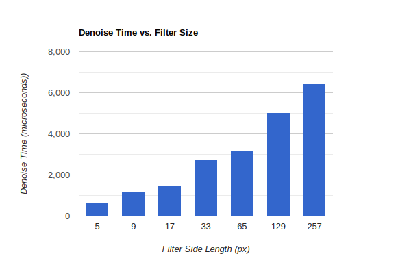

As seen in the plot, the denoise time cost increases with the filter size. This is expected because increased filter size generally means more denoise iterations. And since the computation cost of each iteration stays generally the same, more iterations mean more time cost.

Since at iteration $i$, the side length of the expanded filter is $4 \times 2^i + 1$, only filter sizes that is on threasholds are chosen.

The denoise results at each filter size is shown below:

5x5 Filter   |  9x9 Filter | 17x17 Filter
:-------------------------:|:-------------------------:|:------------------:
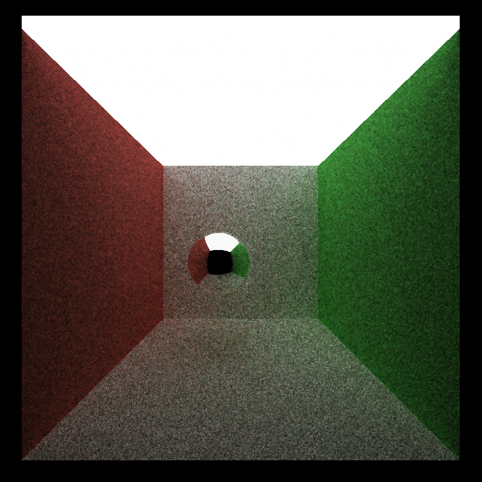  |   | 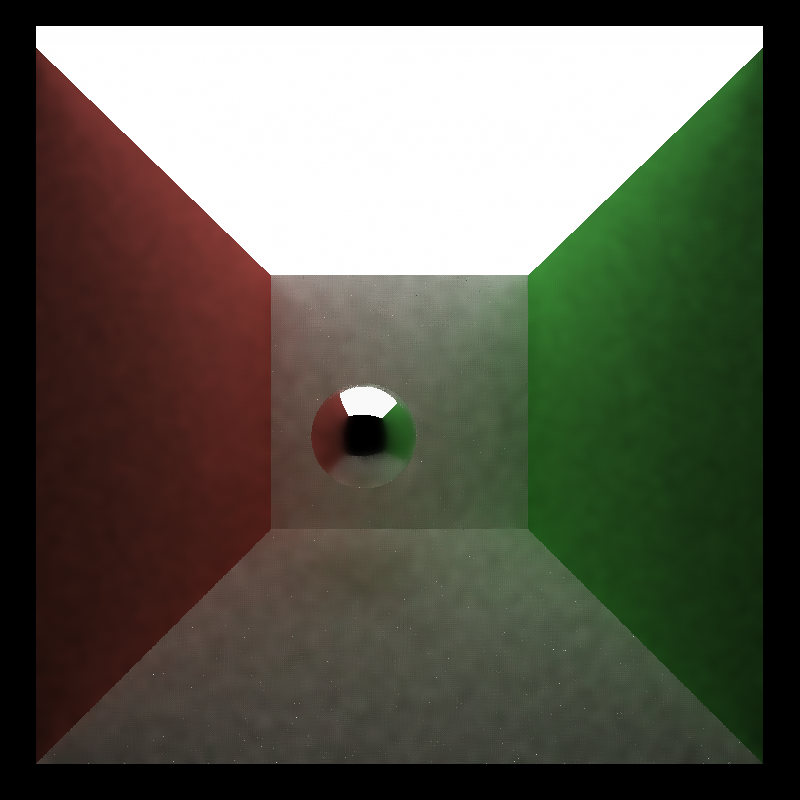
33x33 Filter   |  65x65 Filter | 129x129 Filter
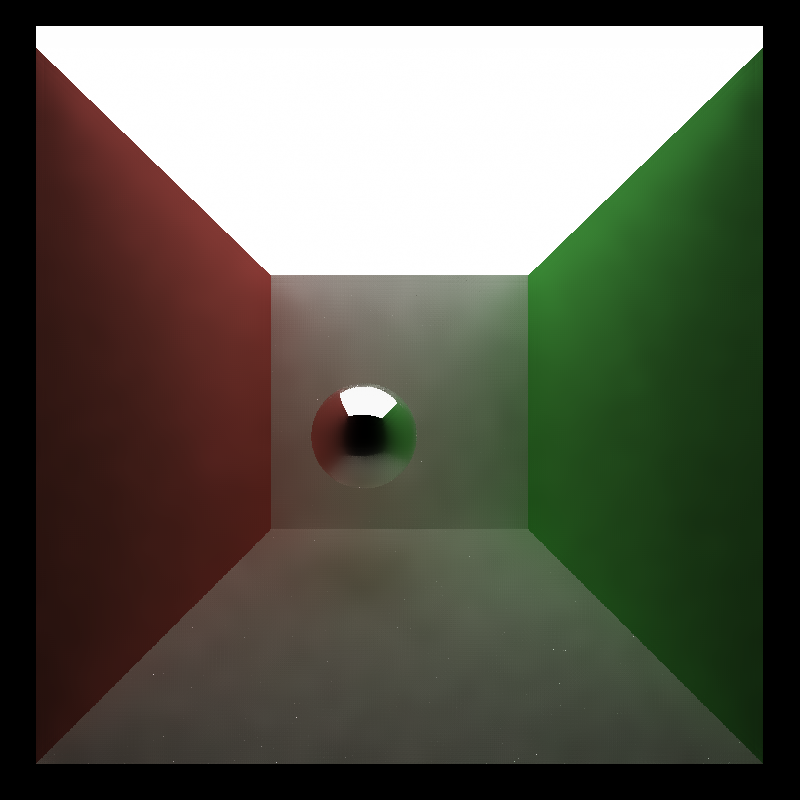  |   | 
257x257 Filter |
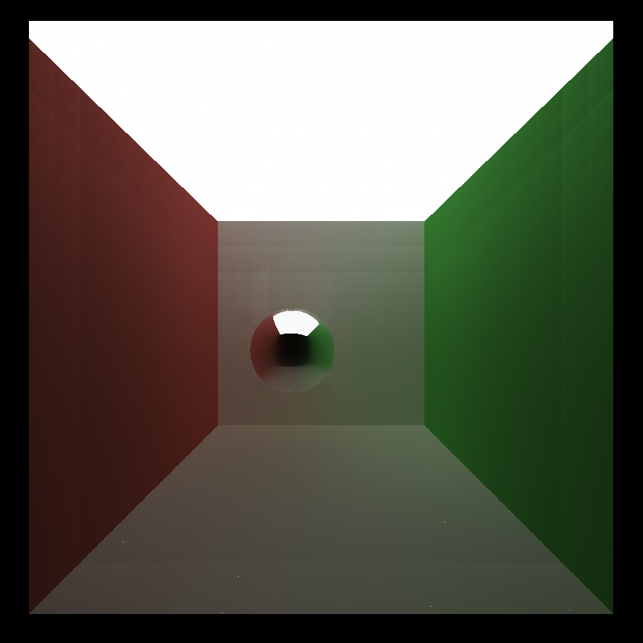 |

We can see that as the filter size increases, the denoising benefits have diminishing returns, and sometimes erase local details. For this scene, denoising achieves best result when applying 65x65 filters, producing a smooth image while retaining details like shadows. If there are too few iterations, the noise is not sufficiently removed. However, if there are too more iterations, details like shadows begin to disappear because larger filters tend to blend in colors further away, and hence colors become overly simplified.

## Resolution

Aside from filter size (number of iterations), the resolution of the input image also affects how much time is taken to perform denoising. Here we perform denoising on several square resolutions (from `800x800` up to `4800x4800`) and examine the time cost with respect to the number of pixels in image.

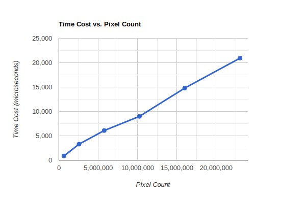

It is clear that the time cost for denoising scales linearly with the number of pixels. This is also expected because the amount of computation for each pixel stays nearly constant, hence the total time cost scales with the number of pixels.

## Smoothing Benefits

To understand how denoising produces better images with fewer iterations, we first generate a ray trace ground-truth by performing 10k iterations, for the maximum quality. Then we compare the image generated by 10 iterations with denoising. Parts of difference are highlighted below:

Original (10 iters, 8 depth)   |  Denoised (filter size 65x65)
:-------------------------:|:-------------------------:
  |  
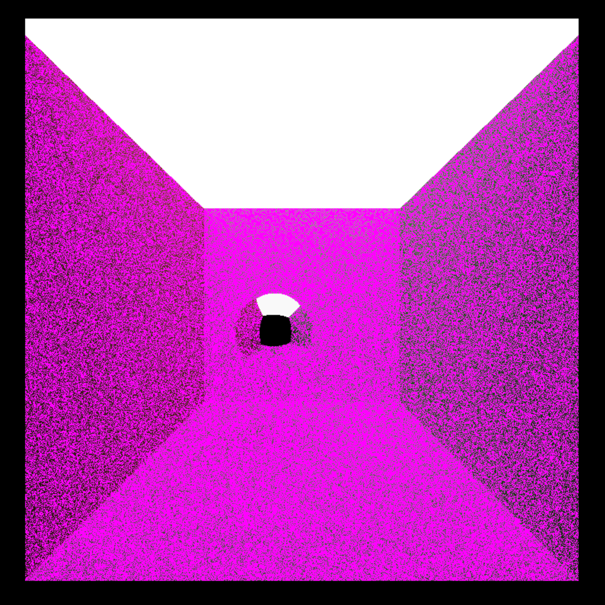  |  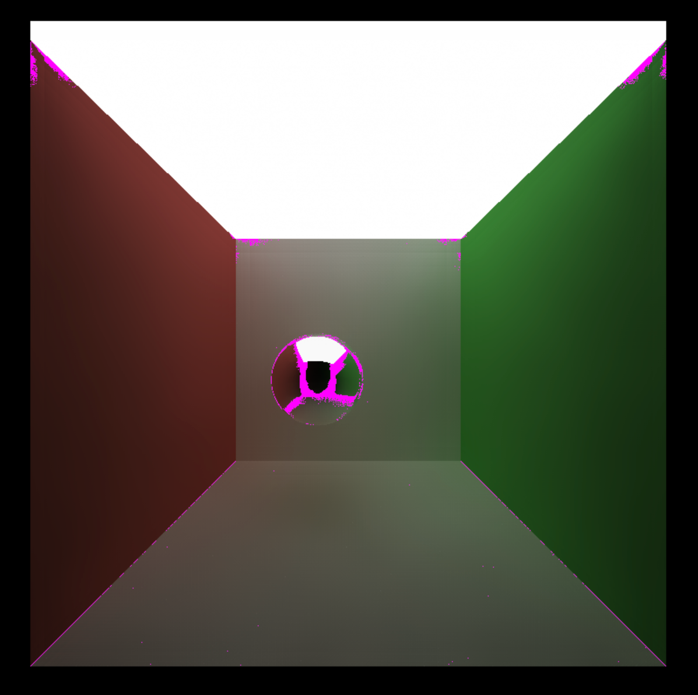

We can see that by applying denoising, the difference between the ground-truth and the image with 10 iterations is reduced rapidly. The only exceptions lie on the boundaries of colors and sharp object intersections. We can see that for homogeneous surfaces that have uniform colors, this denoising technique does a good job.

## Material Types

To compare the effect of denoising on different material surfaces, we examine perfect specular surfaces and purely diffusive surfaces.

Specular Original (10 iters, 8 depth)   |  Specular Denoised (filter size 65x65)
:-------------------------:|:-------------------------:
  |  

Diffusive Original (10 iters, 8 depth)   |  Diffusive Denoised (filter size 65x65)
:-------------------------:|:-------------------------:
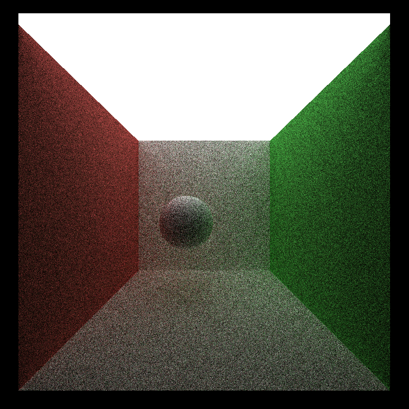  |  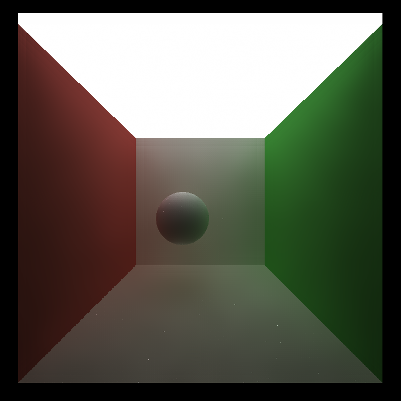

We can see that the denoiser performs much better on diffuse surfaces than on specular surfaces. On specular surfaces, particularly, the colors are smeared and blend together. This is expected because the color of pure specular surfaces rely solely on the color they reflect. This color, however, can have little relation to the surface normals or positions. Therefore, the denoiser cannot leverage the full potential of normals or positions to identify edges, therefore resulting in a bad reconstruction.

## Scene Differences

We also test the denoiser's effectiveness on different scenes. In this case, we test both [`cornell_ceiling_light`](.\scenes\cornell_ceiling_light.txt) and the original [`cornell`](.\scenes\cornell.txt) scene.

Cornell Ceiling Light Original (10 iters, 8 depth)   |  Cornell Ceiling Light Denoised (filter size 65x65)
:-------------------------:|:-------------------------:
  |  

Cornell Original (10 iters, 8 depth)   |  Cornell Denoised (filter size 65x65)
:-------------------------:|:-------------------------:
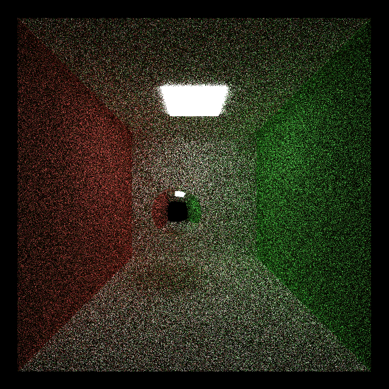  |  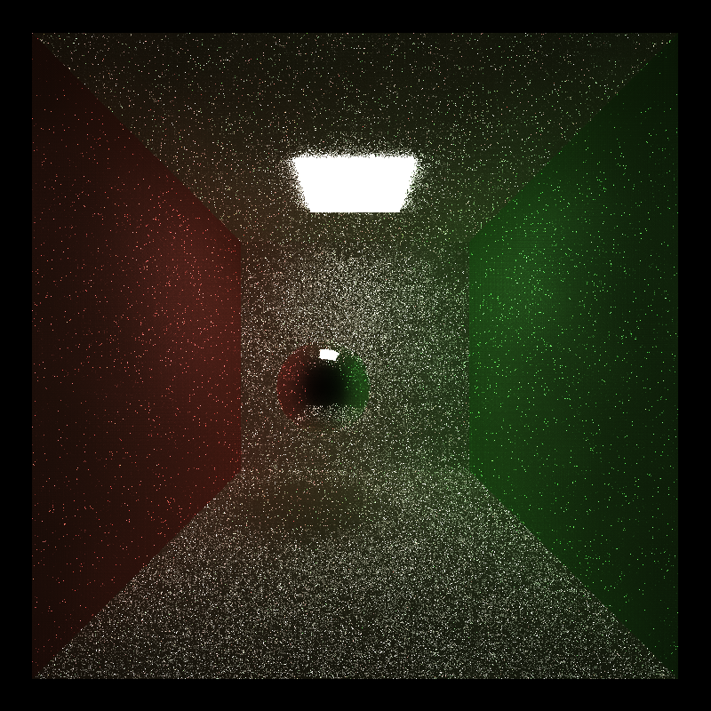

We can see that with a smaller light in the original `cornell` box, with the same 10 iterations, the denoiser performed poorly and didn't remove a noticible amount of noise, while making the image darker. This is because a smaller light means less valid samples and we can obtain less information with the same number of iterations. As a result, the amount of noise increases, and the denoiser cannot effectively remove noise.