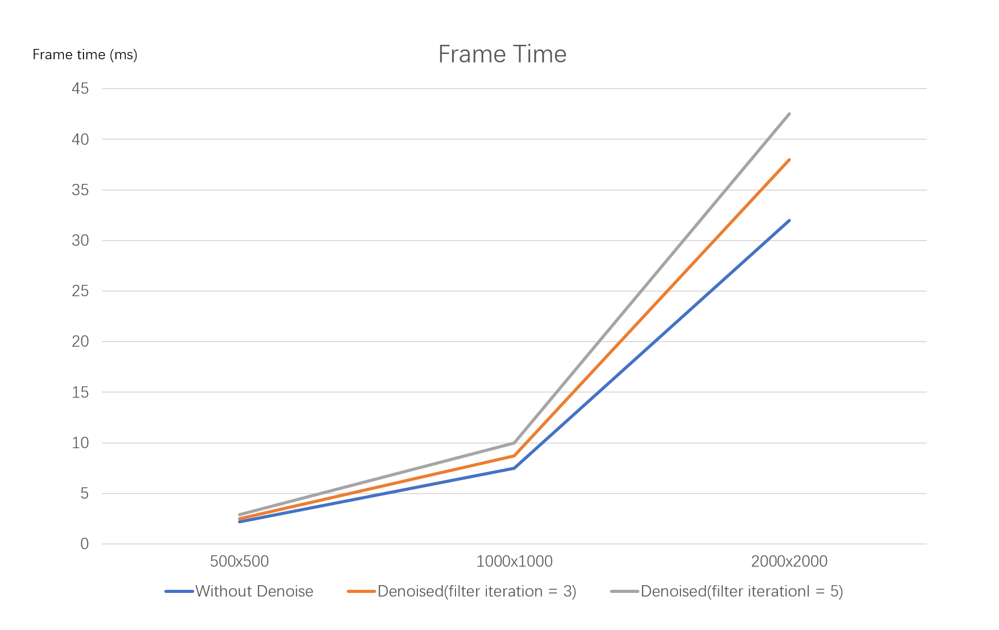
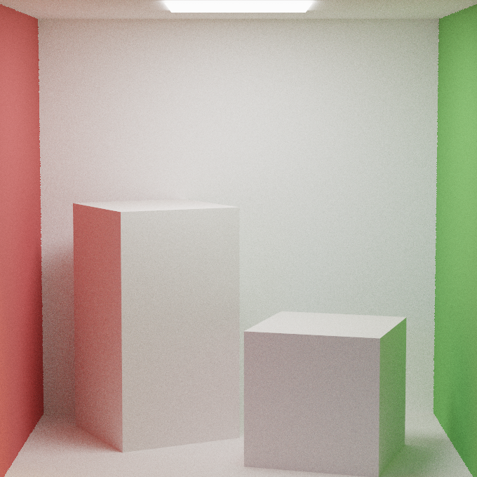
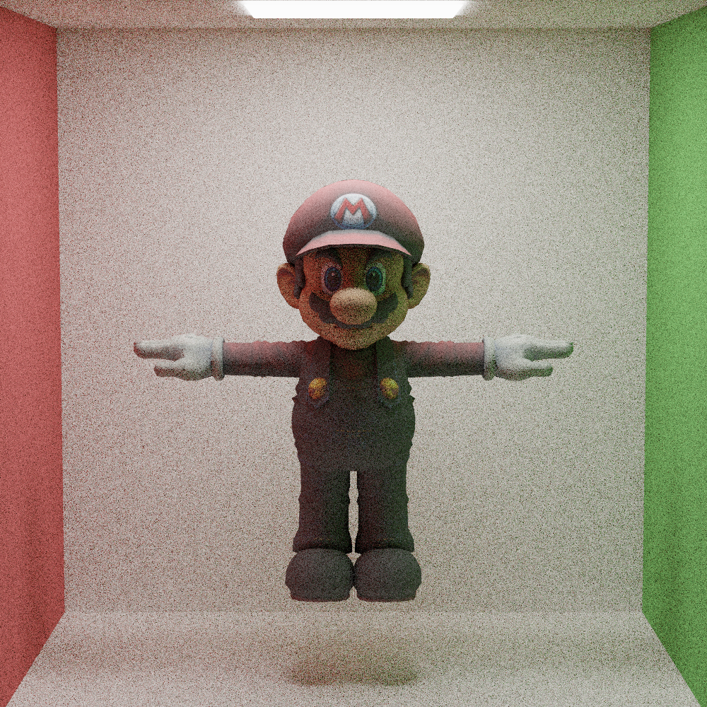
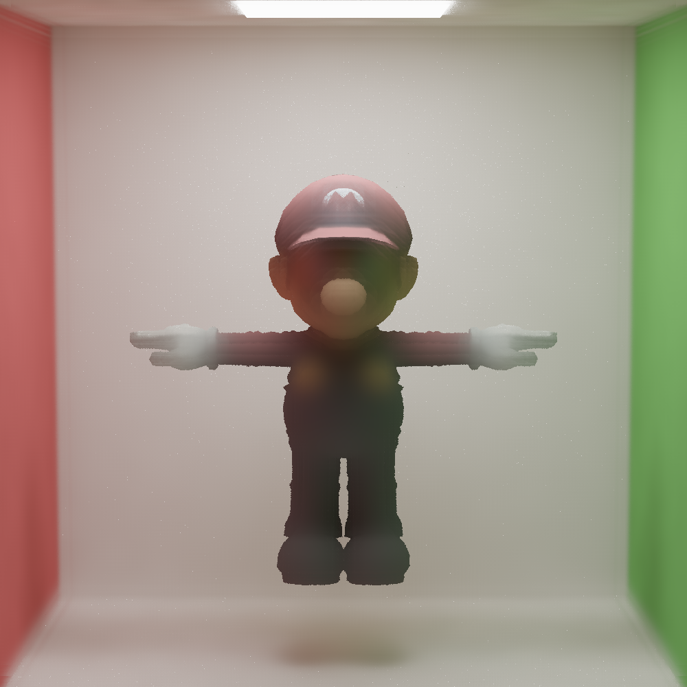
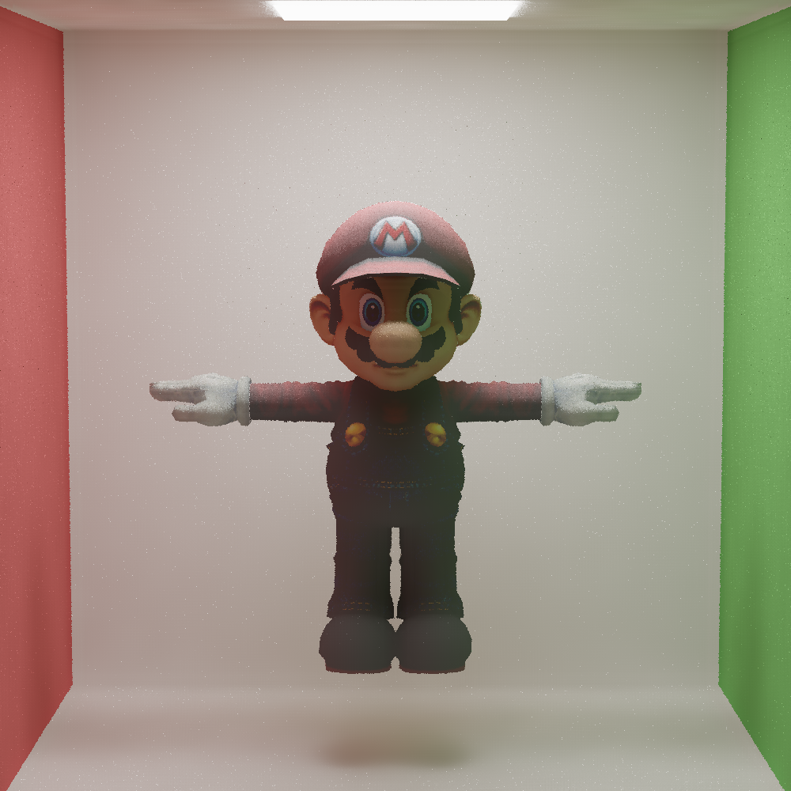

Edge-avoiding A-Trous Wavelet Transform Desnoier
================
In this project, I implemented a denoiser for my path tracer based on this [paper](https://jo.dreggn.org/home/2010_atrous.pdf).

**University of Pennsylvania, CIS 565: GPU Programming and Architecture, Project 4**

* Mengxuan Huang
  * [LinkedIn](https://www.linkedin.com/in/mengxuan-huang-52881624a/)
* Tested on: Windows 11, i9-13980HX @ 2.22GHz 64.0 GB, RTX4090-Laptop 16384MB
-----------------------------
## Outcome
CornellBox scene with 100 sample per pixel
|Without denoiser| Gaussian Filtering| Edge-avoiding A-Trous Wavelet Transform denosier|
|:--------:|:--------:|:--------:|
||||

## G-Buffer Visualization
|Normal| Position|
|:--------:|:--------:|
|||

## Performance Analysis
### A-Trous Denoiser Frame Time
Test on the CornellBox scene

  

As shown in the line chart, there will be an increase on the frame time after appling denoiser. Besides, when the resolution increase, the denoised time also increases. And more filter iteration requires more time to complete.

### A-Trous Denoised Result Comparision
Test configuration
|Resolution|Filter Iterations|Color Weight|Normal Weight|Position Weight|
|:--------:|:--------:|:--------:|:--------:|:--------:|
|680 x 680| 5|0.7|0.35|0.2|

|Number of Iterations|1|100|200|300|
|--------|:--------:|:--------:|:--------:|:--------:|
|Origin Image|  ||||
|Denoised Image|||||

  

*Reference image without denoiser after **3000** iterations*

According to my experiment, the rendered result is acceptably smooth after **200** iterations, while there still some obvious noise in the reference image after **3000** iterations.

### A-Trous Denoiser Quality on Different Configurations

  

*Reference image with*
|Resolution|Path Tracer Iteration| Filter Iterations|Color Weight|Normal Weight|Position Weight|
|:--------:|:--------:|:--------:|:--------:|:--------:|:--------:|
|680 x 680| 100|3|0.45|0.35|0.2|

### Filter iteration
|Reference Image|Filter iteration = 5|
|:--------:|:--------:|
|||

As shown in the images, more filter iteration(which also means larger filter size), will improve the quality of the denoised image. But it will also slightly blur the sharp edge of the geomerties.

### Weights
|Reference Image|Color Weight = 1|Normal Weight = 1|Position Weight = 1|
|:--------:|:--------:|:--------:|:--------:|
|||||

As shown in the images, large color weight can make the denoised image more smooth, but make it more blur at the same time. Larger normal and position weights can keep the sharp edges better but weaken the denoised quality.

### A-Trous Denoiser Quality on Different BSDFs
*Test on a cornellBox scene with a Mario under Configuration*
|Resolution|Path Tracer Iteration| Filter Iterations|Color Weight|Normal Weight|Position Weight|
|:--------:|:--------:|:--------:|:--------:|:--------:|:--------:|
|1000 x 1000| 200|3|0.45|0.35|0.2|

#### Diffuse Reflection
|Without Denoise|Denoised|
|:--------:|:--------:|
|||

#### Specular Reflection
|Without Denoise|Denoised|
|:--------:|:--------:|
|||

#### Glass
|Without Denoise|Denoised|
|:--------:|:--------:|
|||

Accoding to the comparision, A-Trous works better on diffuse reflection than the specular reflection and the glass, as the denoiser will blur the specular BSDFs.

#### Texture Mapping (Diffuse Reflection)
|Without Denoise|Denoised|Denoised(Extract first albedo)|
|:--------:|:--------:|:--------:|
||||

I noticed that the denoiser works very bad when geomerty with albedo texture mapping. This might because albedo textures are usually high frequency and will become low frequency after filtering. To avoid this, I record the albedo in the first ray-scene intersection (not multiply it into the throughput) and multiply it back after denoising. As shown in the result, this makes the denoiser perform much better for albedo texture mapping.

### A-Trous vs Gaussian Filter
Test configuration
|Resolution|Filter Iterations|filter size(Gaussian)|Sigma(Gaussian)|
|:--------:|:--------:|:--------:|:--------:|
|680 x 680| 200|20|1.0|

|A-Trous|Gaussian|
|:--------:|:--------:|
|||

As shown in the images, A-Trous perform a smoother and more clear result than Gaussian filter. This is because the Gaussian filter simply blur the the pixel with its neighbors without adjusting the weight based on geometry informations like normal and position. Besides, with the increase of filter size, the frame time increase significantly as the time complexity of Gaussian is $O(n^2)$