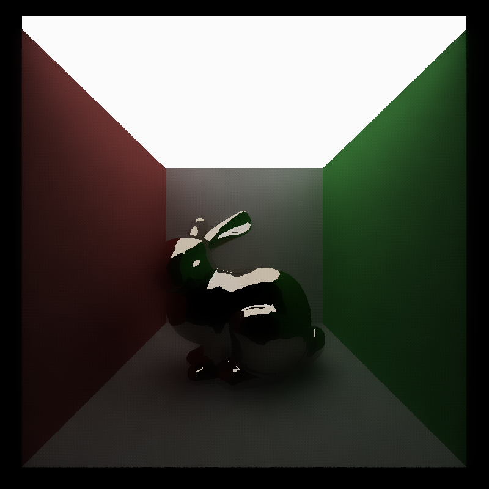
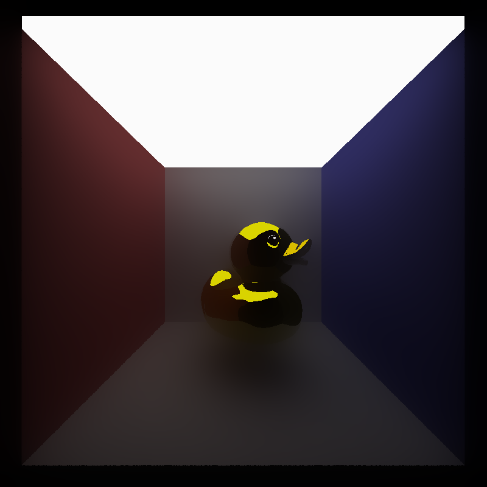
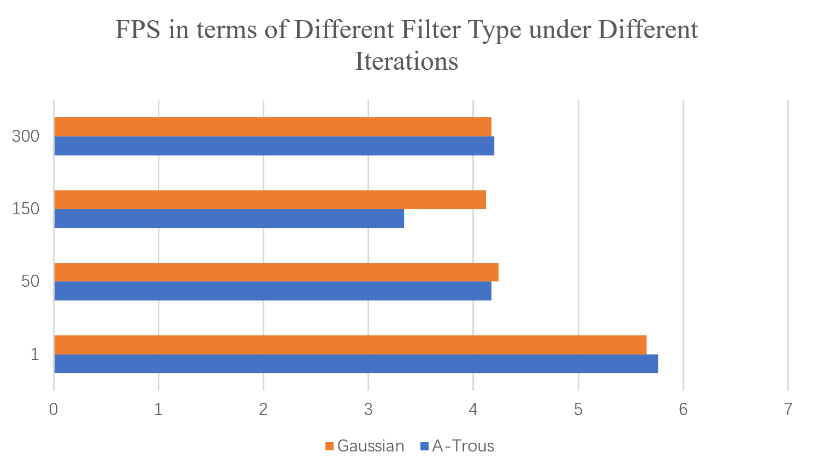
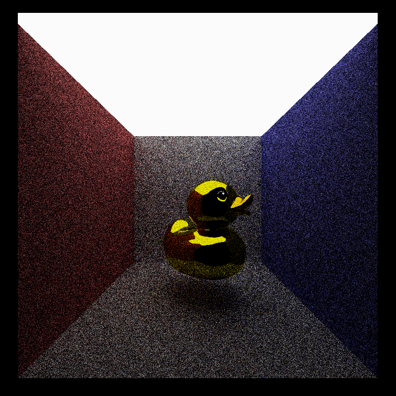
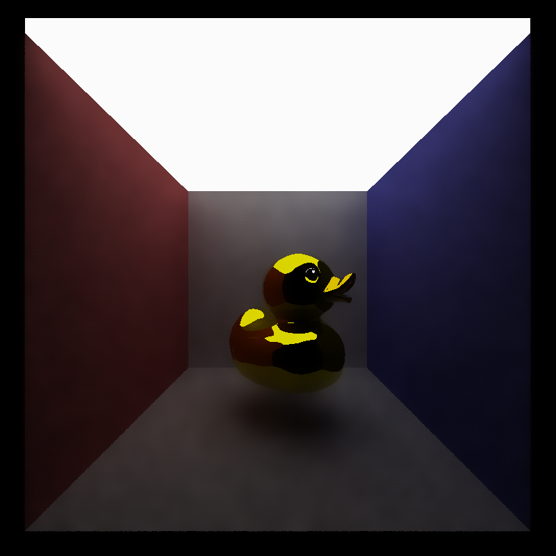
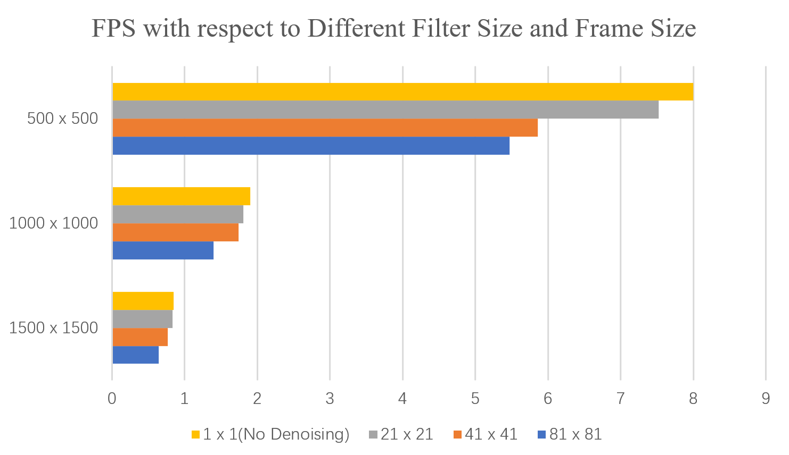
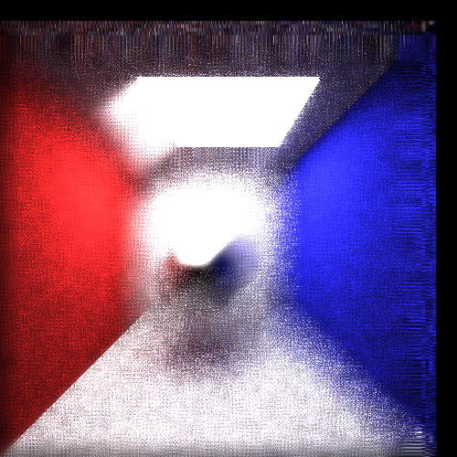

CUDA Denoiser For CUDA Path Tracer
================

**University of Pennsylvania, CIS 565: GPU Programming and Architecture, Project 3**

* Hanting Xu
* [GitHub](https://github.com/HantingXu), [LinkedIn](www.linkedin.com/in/hanting-xu-25615b28b).
* Tested on: (Personal Computer) Windows 11, i7-12700H @ 2.70GHz 32GB, GeForce RTX 3070 Ti Laptop GPU

## Denoising

### Showcase

* Specular Bunny at 10 iteration

 * 

* Specular Rubber Duck at 10 iteration

 * 

### Method

* Gaussian
  * Gaussian filter is A-Trous filter without any intervals in between. The results between Gaussian and A-Trous are quite similar at the beginning. However, as iterations goes up, Gaussian filter becomes more and more blur, while A-Trous would more resembles the undenoised image.

  * | Gaussian at 100 iteration | A-Trous at 100 iteration |
    | --- |---|
    |||

* A-Trous
  * A-Trous filter also takes in a n x n filter at the beginning. However, it will spread each sample spot further away in each or a number of iterations.

* Bilateral

 * Using the bileteral function to obtain the weights of each pixel can balance different property of a object like its depth, albedo, normal and so on. In this case the texture of the object can avoid to be blurred, while maintaining the edges. However, specular objects might still be hard to handle in this case, since the color of the specular object is largely depended upon the surrounding environment. In this case, storing the information (normal, albedo) of the second intersection would be important. This program simply deals with single specular object in the scene. To further handling mulpitle specular mirroring each other, we may add give a priority to each specular object to decide how to caching their second bounces or just use another method. Refactoring objects are still hard to handle in this case, since it is really hard to predict the refraction result of each ray. Also, shawdows can also get pretty blurry in the denoising.

 * It is pretty easy to use the z-buffer data in Bilateral function. However, I think it works worse than albedo information, since albedo also preserves the uv informarion. Also using z-buffer is theoretically faster. However, to my observation, its performance is still quite similar to using the normal or albedo information.

 * specular duck with z-buffer at 20 iteration:

  * 

  * With / Without considering the specular object:

 * | Without Caching 2nd intersection at 10 iteration | Caching 2nd Intersection at 10 iteration |
   | --- |---|
   |||

* Performance: At the beginning of the iterations, Gaussian and A-Trous filter are quite similar. However, as the iteration proceeds, the speed of the A-Trous declines and then increase and even slightly exceeds that of Gaussian filter. The first deline in speed is probably because with the growth of the interval ( means that we need to fetch the incontinuously distributed data in memory ), the visits to data becomes less efficient. However, with the growth of the interval, the number of filter segments that need to be visited delined, thus the performance of A-Trous becomes better eventually.

 * 

### Performance Analysis

* In my observation, denoising really only contributes little to the total render time, especially when there are more pixels to render in the scene. The efficiency difference between denoising or not can be even really hard to recoganize comparing to the total render time.

* In my case, images with 5 iterations or above of denoising are all acceptably smooth. Whereas without denoising, maybe 300 iterations are at least needed. For more details, see the picture below.

 * | No Denoising at 5 iteration | Denoising at 5 iteration |
  | --- |---|
  |||

 * | Denoising at 5 iteration | Denoising at 10 iteration | Denoising at 15 iteration | Denoising at 20 iteration | Denoising at 25 iteration |
  | --- |---|---|---|---|
  ||||||

* Comparing the big light source (10 x 10) and small light source (4 x 4) in cornell box setting, the performance of that of the big light source looks better. That is probably because with large light source, there are more pixels are lit up in each iteration, there are more useful pixels to be collected and less useless data to be filtered out.

* The higher resolution the image is, the worse denoising effect the smaller filter would produce. This situation is pretty similar to that of the light source.

* Denoising time are increased with respect to the growth of the resolution and the filter size. In graph below, the y-axis is the resolution and the x-axis means the FPS. We can observe that with the growth in the resolution, the filter size becomes a more important factor in performance.

 * 

### Blooper
*   
