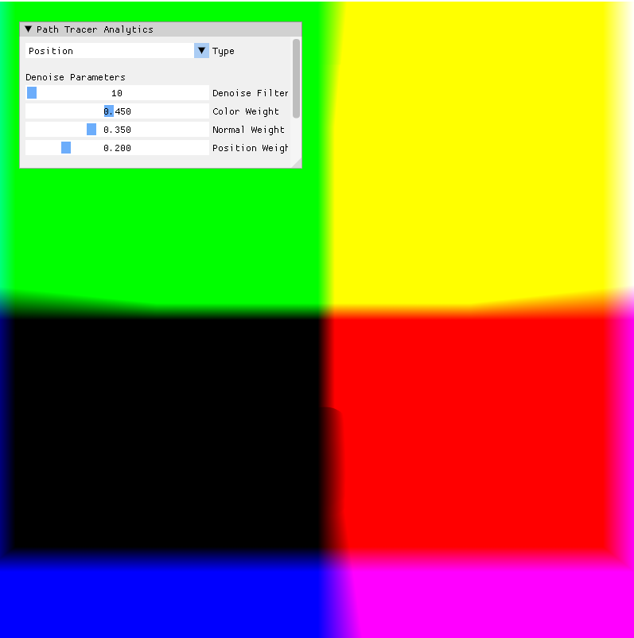
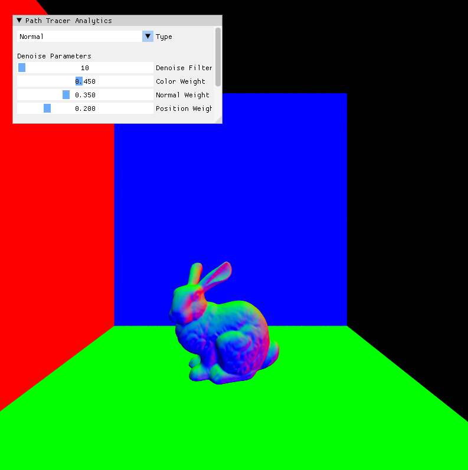
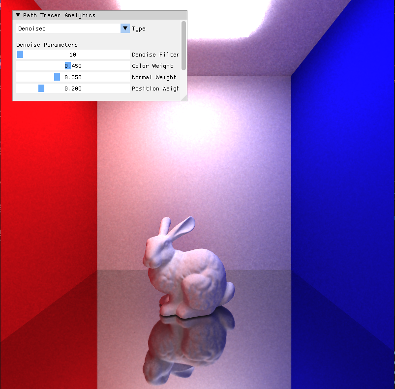
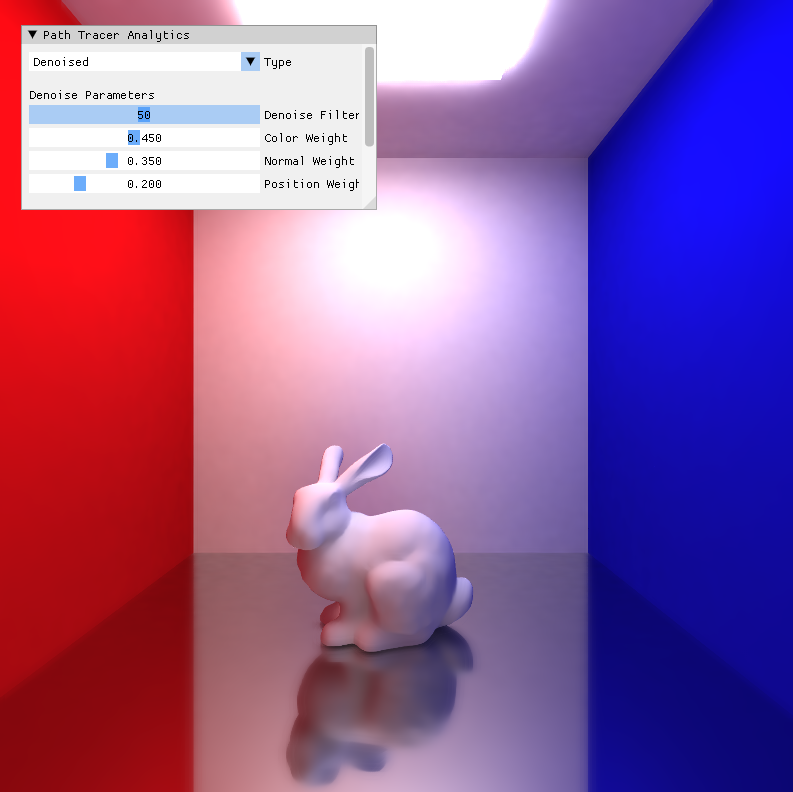
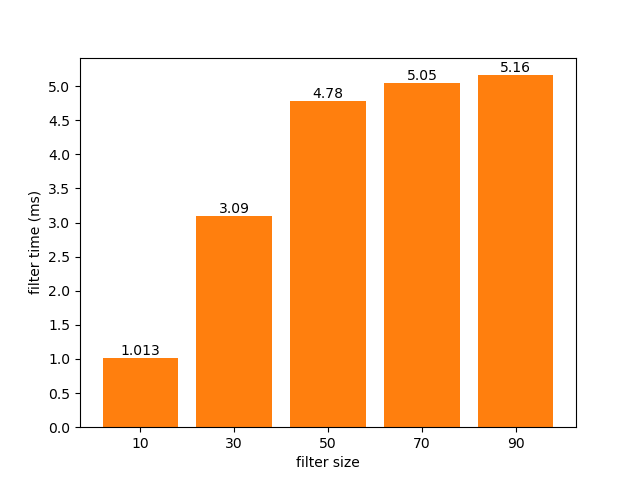

CUDA Path Tracer
================
[pbrt]: https://pbrt.org/

**University of Pennsylvania, CIS 565: GPU Programming and Architecture, Project 4**

* Yian Chen
  * [LinkedIn](https://www.linkedin.com/in/yian-chen-33a31a1a8/), [personal website](https://sydianandrewchen.github.io/) etc.
* Tested on: Windows 10, AMD Ryzen 5800 HS with Radeon Graphics CPU @ 3.20GHz 16GB, NVIDIA GeForce RTX3060 Laptop 8GB

### Denoiser

- G-Buffer
Implemented a combo to show different G-Buffer conveniently

- Denoised result

We use the scene `pathtracer_bunny_mis.glb` to test the denoiser. 

The floor is specular and the bunny is diffuse.
<table>
    <tr>
        <th>No denoiser</th>
        <th>Denoiser with 10 Pixel Filter</th>
    </tr>
    <tr>
        <th></th>
        <th></th>
    </tr>
      <tr>
        <th>Denoiser with 30 Pixel Filter</th>
        <th>Denoiser with 50 Pixel Filter</th>
    </tr>
    <tr>
        <th></th>
        <th></th>
    </tr>
</table>

### Performance Analysis

We also tested the time used during denoise process under different size of denoise filter.

- Denoised Time under different filter size

It could be found out that although denoise time is increasing as filter size increases, the increasing speed declines. 

Also, we can observe from the result above that as we increase the filter size, the details in the resulting image is also more vague.

