CUDA Denoiser For CUDA Path Tracer
==================================

**University of Pennsylvania, CIS 565: GPU Programming and Architecture, Project 4**

* Helena Zhang
* Tested on: Windows 11, i7-10750 @ 2.6GHz 16GB, Geforce RTX 2060 6GB

### Results
Pathtraced Cornell Box at 20 iterations, without and with Atrous Denoising

  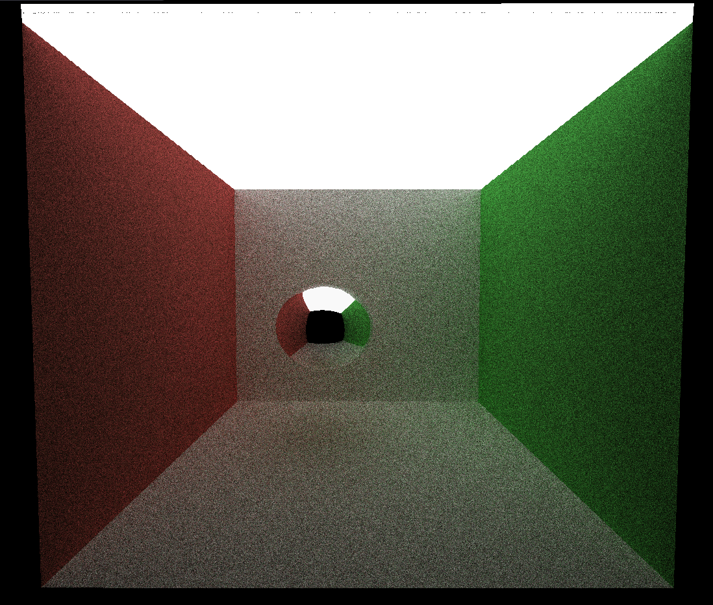
  

### Analysis

**Performance:**
The denoising functionality adds two additional kernels to the base pathtracing code: a gBuffer storage kernel that records a path's first bounce's position and normals, and the atrous denoising convolution kernel (function not the matrix) that will adjust the color results with its neighbors. Since the two kernels will run for every path used to render the image, the number of calls and the runtime increases as the number of paths, or resolution increases. 

  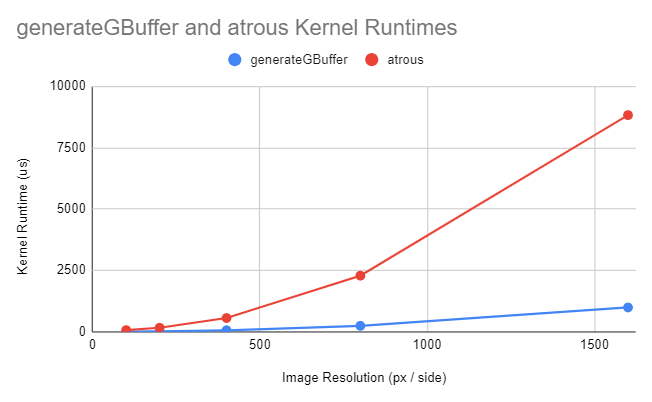
  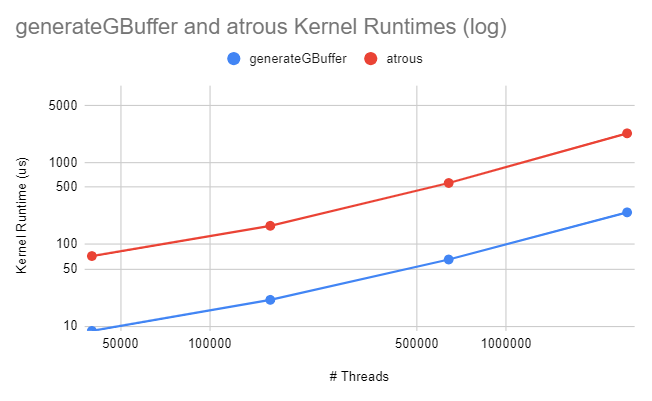

The two kernel's runtimes are compared above for 100 by 100, 200 by 200, 400 by 400, 800 by 800, and 1600 by 1600 pixels. The runtimes for both kernels increased exponentially when compared to the length of the images, but linearly when compared to the number of pixels, or threads. 

Another variable used in the atrous kernel is the size of the convolution filter. The filter takes 25 pixels around the target pixel, where the farther pixel taken is +/- (2s + 1, 2s + 1) where s is gap between each adjacent pixels used to calculate the weighted average color. 

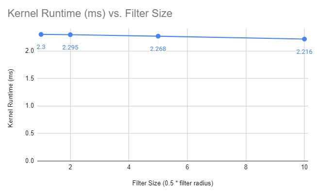

The figure above compares the average runtime for each execution of the atrous kernel where each pixel used for the kernel is 1, 2, 5, and 10 pixels apart. There is a slight decrease in average runtime per kernel as the filter size increases. This is because for larger kernel sizes, the atrous kernel will find pixels that are farther away, and these neighbors may not exist for pixels near the edges of the image. Thus, for these pixels, its atrous calls will have fewer memory access, hence the shorter runtime. However, the overall runtime will still be higher for larger filter sizes, since it will have more atrous kernel calls, but each atrous call takes on average a short time. 

**Visuals:**
With the correct weights and filter size, the denoiser can smooth images with just two iteration of pathtracing:

  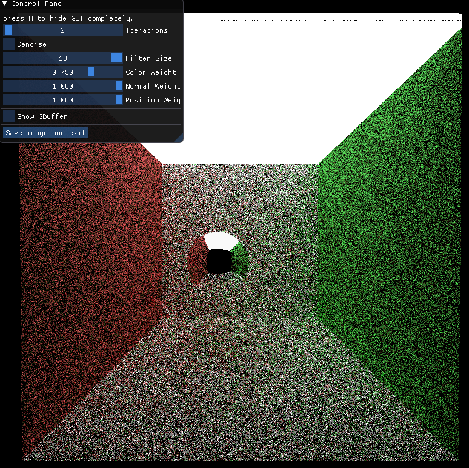
  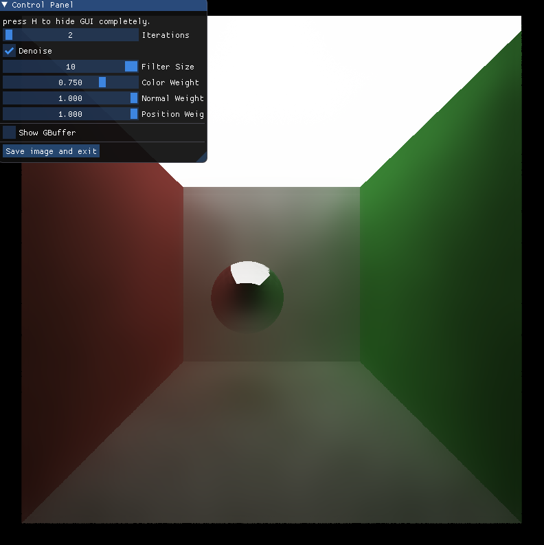

As filter sizes increase, more pixels with a larger range will be taken into consideration when smoothing. 

 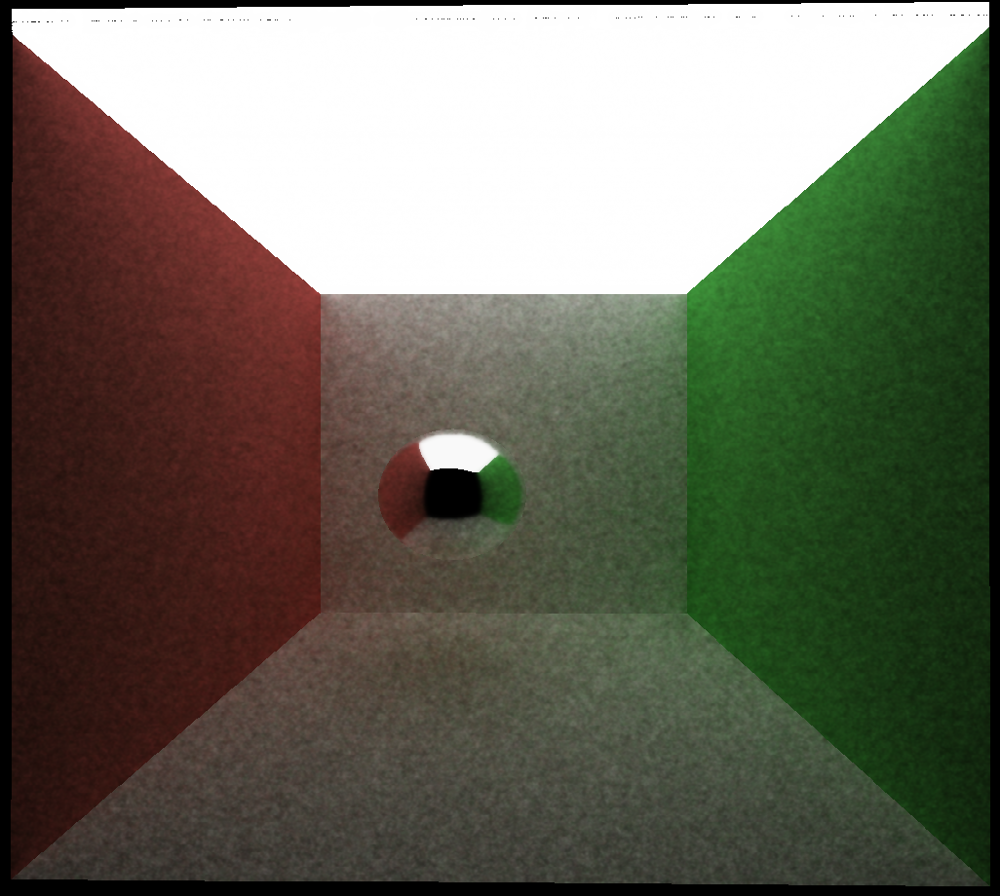
  
  Filter size: 5*5 (No space between pixels)
  
  
  

   Filter size: 9*9 (1 space between pixels)
   
  
  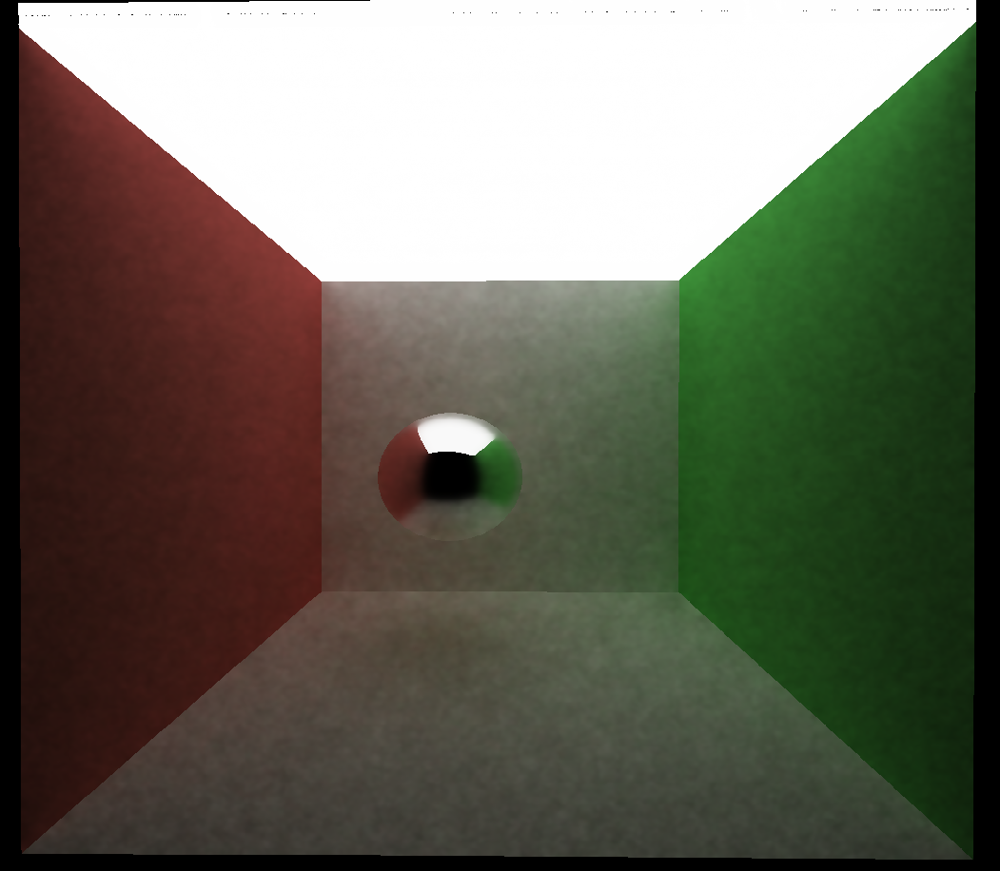

   Filter size: 13*13 (2 spaces between pixels)
   
   
  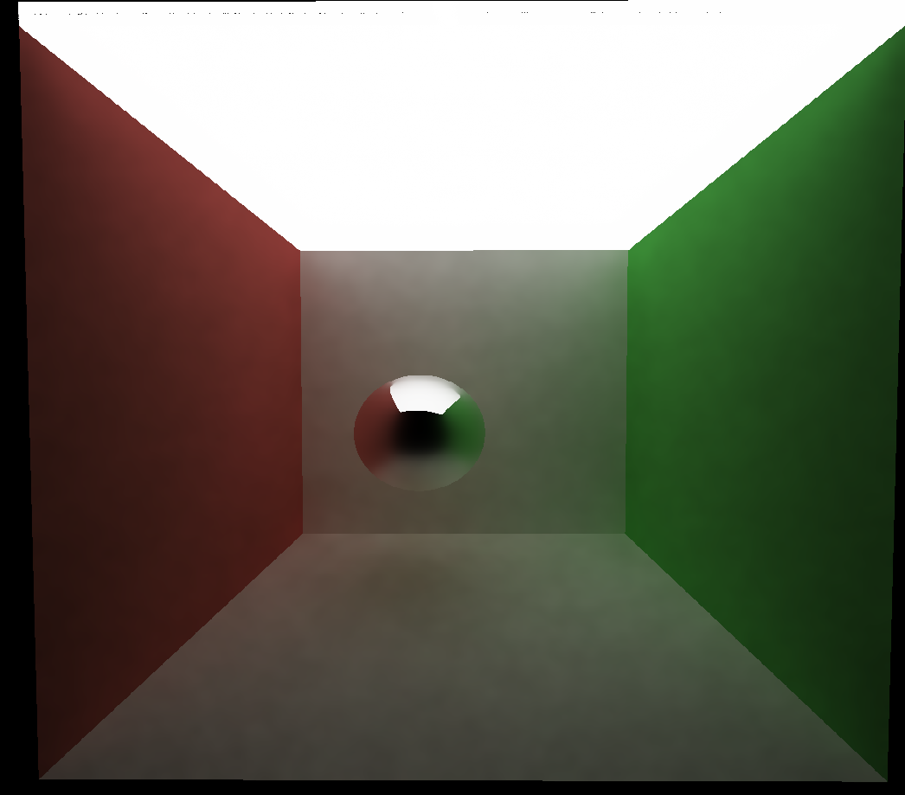

 Filter size: 17*17 (3 spaces between pixels)
 
  

The images appear more smooth as filter size increases, as the number of atrous kernel calls and kernels taken into consideration increases. However, there are diminishing returns for larger filter sizes. 

  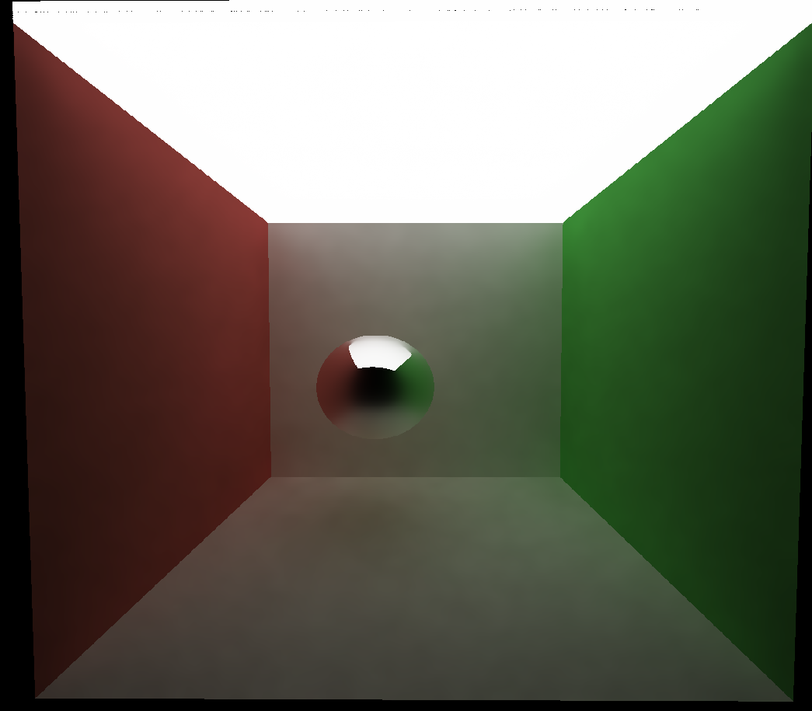

   Filter size: 21*21 (4 spaces between pixels)
   
  
  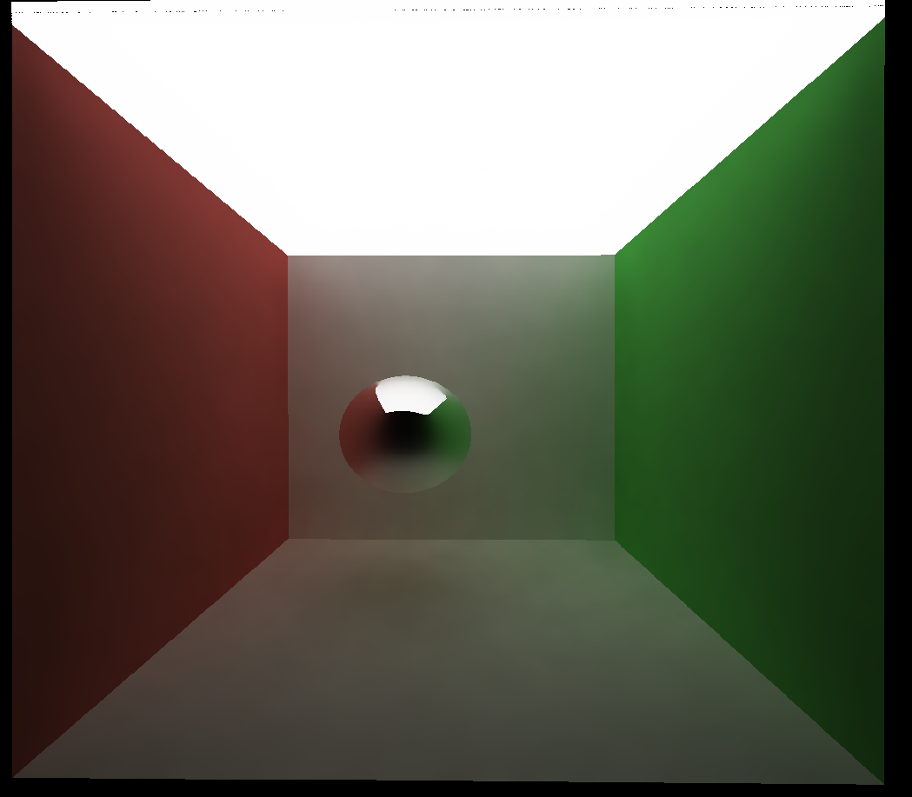

   Filter size: 29*29 (6 spaces between pixels)
   
   
  

 Filter size: 41*41 (9 spaces between pixels)

Finally, although the atrous denoising technique can smooth images without much additional runtime, there are still some caveats. 

For certain materials and scenes, the technique doesn't perform as well. For instance:

The render above appears mostly smooth, but there are reflected edges of the reflecting ball are blurred. 

  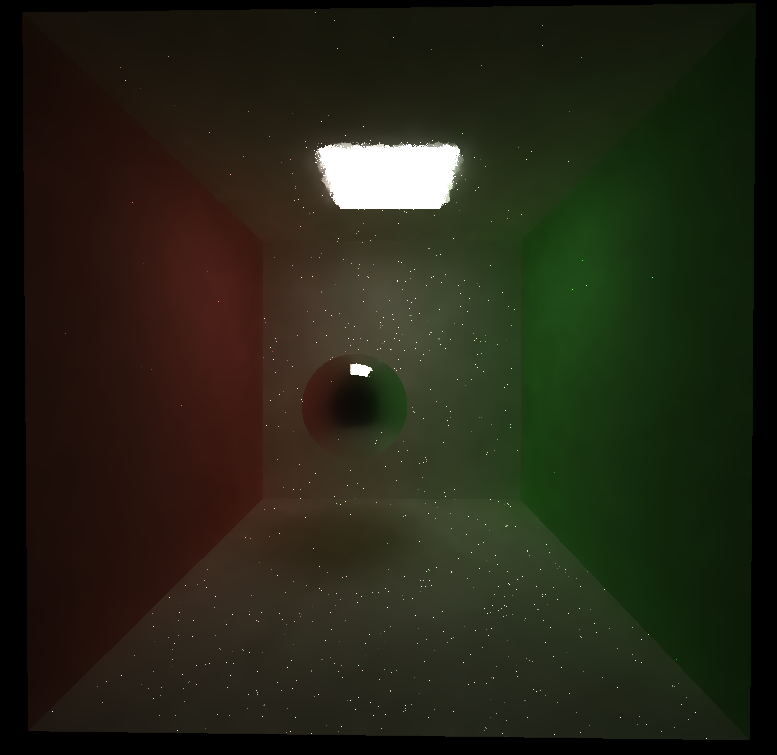
  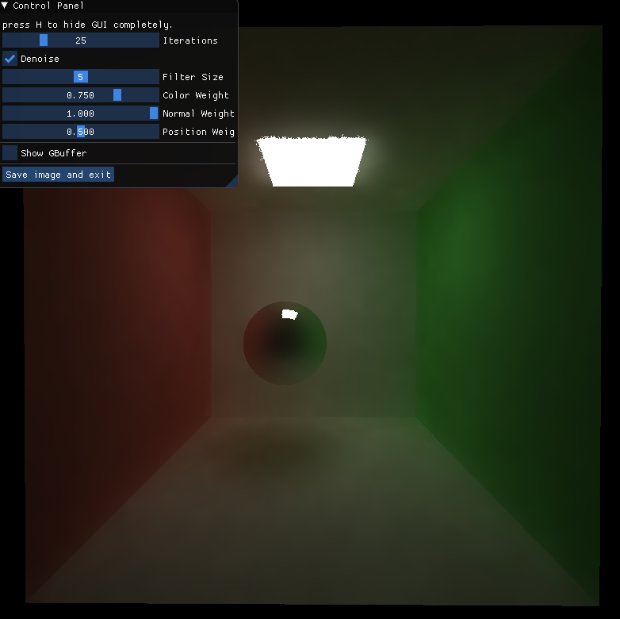

In a Cornell box with less light (hence more noise), there are noisy specs (left), even though the render uses the same setting as the brighter Cornell box above it. With some adjustments to the filter size and weights, most of the specs are gone (right), but there is still noise around the light source, and the perfect reflective sphere appears blurry. 
