CUDA Denoiser For CUDA Path Tracer
==================================

**University of Pennsylvania, CIS 565: GPU Programming and Architecture, Project 4**

* Yinuo (Travis) Xie
  * [LinkedIn](https://www.linkedin.com/in/yinuotxie/)
* Tested on: Windows 10, i7-12700 @2.10GHz 32GB, NVIDIA T1000 (Moore Windows PC Lab)
  
---

<div>
    <table align="center">
        <tr>
            <td>Ray Tracing Result</td>
            <td>Denoiser Result</td>
        </tr>
        <tr>
            <td>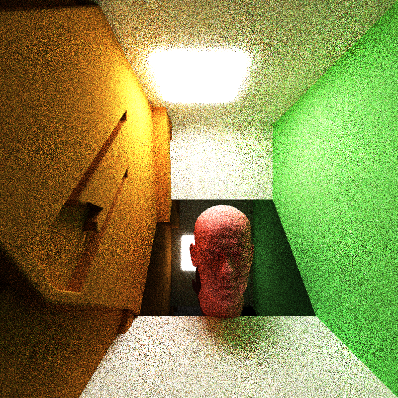</td>
            <td>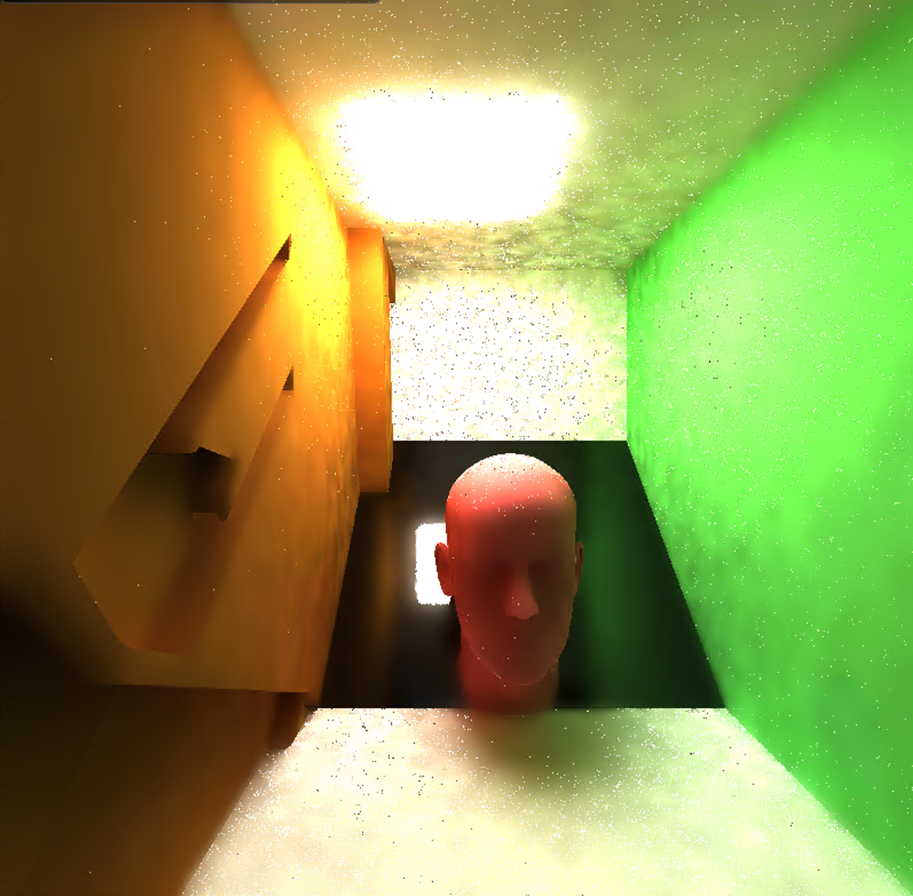</td>
        </tr>
    </table>
</div>

---

## Table of Contents

* [Overview](#overview)
* [What is Denoising?](#what-is-denoising)
* [Why Denoise?](#why-denoise)
* [Edge-Avoiding À-Trous Wavelet Transform Denoiser](#edge-avoiding-à-trous-wavelet-transform-denoiser)
* [Implementation](#implementation)
* [Evaluation and Results](#evaluation-and-results)
* [Performance Analysis](#performance-analysis)
* [Bloopers](#bloopers)

## Overview

Monte Carlo ray tracing is widely recognized for its ability to produce realistic images. However, it comes with a trade-off: the introduction of noise, particularly when utilizing fewer samples. To address this challenge, I implemented the [*The Edge-Avoiding À-Trous Wavelet Transform Denoiser*](https://jo.dreggn.org/home/2010_atrous.pdf). Enhanced by the computational prowess of CUDA, this denoiser swiftly eliminates the unwanted noise, delivering clearer images without compromising on their integral details.

---

## What is Denoising?

Think of denoising as a meticulous editor for images. It scans through the picture, identifying and removing the unwelcome “grainy” or “speckled” distortions – commonly referred to as noise. The end result is a crisper, more polished image. It’s akin to cleaning up a manuscript, where the editor removes typos and errors to present a flawless final draft.

--- 

## Why Denoise?

### 1. **Enhanced Image Quality**

Imagine trying to enjoy a movie, but the screen is fuzzy and unclear. That’s what noise does to images. Denoising acts like a clarity filter, enhancing the image’s quality, making it more appealing and professional-looking.

### 2. **Achieve Results Faster**

Time is of the essence, especially in industries like film or video games where rendering realistic images is crucial. With denoising, you can opt for a quicker, albeit noisier, initial image render. The denoiser then swiftly cleans it up, saving precious time.

**Example**

*Rendering a complex scene with numerous light sources and intricate details can take hours. By using a denoiser, the same scene’s rendering time can be cut in half, with the final image quality remaining top-notch.*

### 3. **Uniformity in Animations**

Animations consist of numerous frames strung together. Inconsistencies in noise levels across these frames can be jarring. Denoising ensures a smooth, uniform look across the entire animation.

**Example**

*Consider an animated short film featuring a serene sunset. Without denoising, some frames might appear noisier than others, disrupting the tranquility of the scene. Denoising ensures each frame is as pristine as the next.*

### 4. **Rapid Processing with CUDA**

CUDA is like a turbocharger for denoising processes. It significantly accelerates the denoising operation, making real-time applications and quick iterations possible.

### 5. **Preservation of Critical Details**

Our denoiser is discerning. It differentiates between genuine image details and noise, ensuring that while the noise is removed, the crucial elements that give the image its character and depth are preserved.

---

## Edge-Avoiding À-Trous Wavelet Transform Denoiser

In the paper, [*The Edge-Avoiding À-Trous Wavelet Transform Denoiser*](https://jo.dreggn.org/home/2010_atrous.pdf), the authors introduces a novel denoising algorithm that is both fast and effective. It is based on the à-trous wavelet transform, which is a non-decimated wavelet transform. The algorithm is based on the following steps:

### Algorithm Overview

1. **Wavelet Decomposition**:
   * The image is decomposed into a series of wavelet scales using the à-trous wavelet transform. This process separates the image into different frequency bands, making it easier to isolate and attenuate noise.

2. **Edge Detection**:
   * Edge detection is performed to identify and preserve the edges in the image. This is crucial as traditional denoising algorithms often blur edges.

3. **Noise Estimation**:
   * Noise is estimated within each wavelet scale. This step is essential to determine the appropriate thresholding needed to suppress noise.

4. **Thresholding**:
   * Adaptive thresholding is applied to each wavelet scale based on the noise estimation. This step suppresses noise while retaining the significant features of the image.

5. **Wavelet Reconstruction**:
   * Finally, the denoised image is reconstructed from the thresholded wavelet scales. The reconstruction ensures that the image is denoised across all scales while preserving the essential structures.

You can find a more detailed explanation of the algorithm in the [*Paper*](https://jo.dreggn.org/home/2010_atrous.pdf) and [*Slides*](https://www.highperformancegraphics.org/previous/www_2010/media/RayTracing_I/HPG2010_RayTracing_I_Dammertz.pdf).

---

## Implementation

### GLSL Implementation
In the paper, the author implemented the denoiser in GLSL. I used this as a reference to implement the denoiser in CUDA.

```glsl
// Uniform variables
uniform sampler2D colorMap, normalMap, posMap;  // Texture samplers for color, normal, and position maps
uniform float cphi, nphi, pphi, stepwidth;  // Parameters for weight computation and wavelet step size
uniform float kernel[25];  // Convolution kernel
uniform vec2 offset[25];  // Offset values for wavelet decomposition

void main(void) {
    vec4 sum = vec4(0.0);  // Initialize accumulator for weighted sum
    vec2 step = vec2(1./512., 1./512.);  // Resolution step size for wavelet decomposition
    vec4 cval = texture2D(colorMap, gl_TexCoord[0].st);  // Current color value
    vec4 nval = texture2D(normalMap, gl_TexCoord[0].st);  // Current normal value
    vec4 pval = texture2D(posMap, gl_TexCoord[0].st);  // Current position value
    float cumw = 0.0;  // Initialize accumulator for weight sum

    // Loop through the kernel to accumulate weighted sum and weight sum
    for (int i = 0; i < 25; i++) {
        vec2 uv = gl_TexCoord[0].st + offset[i] * step * stepwidth;  // Compute texture coordinate based on wavelet offset
        vec4 ctmp = texture2D(colorMap, uv);  // Color value at the new texture coordinate
        vec4 t = cval - ctmp;  // Color difference
        float dist2 = dot(t, t);  // Square of color difference
        float cw = min(exp(-(dist2)/cphi), 1.0);  // Weight based on color difference (Step 3: Noise Estimation and Step 4: Thresholding)

        vec4 ntmp = texture2D(normalMap, uv);  // Normal value at the new texture coordinate
        t = nval - ntmp;  // Normal difference
        dist2 = max(dot(t, t)/(stepwidth*stepwidth), 0.0);  // Square of normal difference, normalized by stepwidth
        float nw = min(exp(-(dist2)/nphi), 1.0);  // Weight based on normal difference (Step 3: Noise Estimation and Step 4: Thresholding)

        vec4 ptmp = texture2D(posMap, uv);  // Position value at the new texture coordinate
        t = pval - ptmp;  // Position difference
        dist2 = dot(t, t);  // Square of position difference
        float pw = min(exp(-(dist2)/pphi), 1.0);  // Weight based on position difference (Step 3: Noise Estimation and Step 4: Thresholding)

        float weight = cw * nw * pw;  // Combined weight
        sum += ctmp * weight * kernel[i];  // Accumulate weighted sum (Step 4: Thresholding)
        cumw += weight * kernel[i];  // Accumulate weight sum
    }

    gl_FragData[0] = sum/cumw;  // Normalize weighted sum by weight sum to produce denoised output (Step 5: Wavelet Reconstruction)
}
```
---

### CUDA-based Denoiser Implementation

Inspired by the GLSL implementation, the denoiser algorithm was translated into CUDA to harness the parallel computing prowess that CUDA offers. The fundamental logic aligns with the GLSL version; however, the code structure has been tailored to capitalize on CUDA's parallelism.

#### Convolution Kernel Selection

The choice of kernel is pivotal for the denoising algorithm. A 5x5 B3 spline kernel, which is a quintic B-spline with a support of 5, has been employed. The kernel is defined as follows:

```cpp
float host_kernel[25] = {
        1.0 / 256, 1.0 / 64, 3.0 / 128, 1.0 / 64, 1.0 / 256,
        1.0 / 64,  1.0 / 16, 3.0 / 32,  1.0 / 16, 1.0 / 64,
        3.0 / 128, 3.0 / 32, 9.0 / 64,  3.0 / 32, 3.0 / 128,
        1.0 / 64,  1.0 / 16, 3.0 / 32,  1.0 / 16, 1.0 / 64,
        1.0 / 256, 1.0 / 64, 3.0 / 128, 1.0 / 64, 1.0 / 256
    };
```

The B3 spline kernel was chosen due to its smoothness and compact support which are beneficial for reducing aliasing and ringing artifacts, common challenges in image denoising.

#### Iterative Processing and Stepwidth Adjustment
An unspoken yet significant facet of the denoising algorithm is its iterative nature. To attain optimal denoising, the algorithm demands multiple rounds of processing. Each round generates a denoised image that then becomes the input for the following round. This iterative refinement aids in progressively mitigating noise while safeguarding image features. The iteration count, similar to the weights for color, normal, and position, is a tunable hyperparameter, providing a lever for performance fine-tuning.

Moreover, the `stepwidth` is doubled with each iteration. This expansion in `stepwidth` plays a key role as it enables multi-scale analysis of the image. With advancing iterations, a wider `stepwidth` allows the algorithm to tackle and diminish noise present in larger structures, thereby boosting the denoising efficacy. This multi-scale approach resonates with the core principles of wavelet transformations, enabling a more refined and effective noise reduction.

The image below, borrowed from the referenced paper, depicts the iterative process inherent to the denoising algorithm.

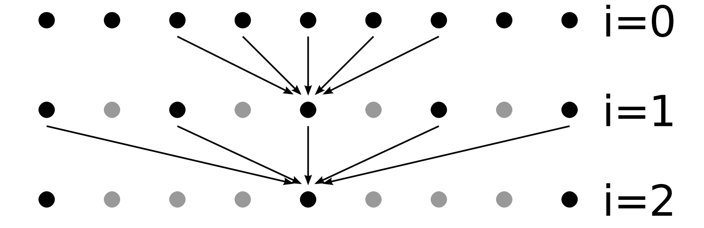

For a more granular look into the code, please refer to the `denoiser.h` file and `denoiser` function in `pathtrace.cu` File.

--- 

## Evaluation and Results

The denoiser was tested across a range of scenes to evaluate its performance under different conditions. The scenes include a simple Cornell box with and without the ceiling acting as a light source, a complex Cornell box, and a scene with loaded OBJ files. The denoiser was also tested on different materials to observe its effectiveness. The results are delineated below.

### Simple Cornell Box with Ceiling as Light

Hyperparameters:

* `cphi`: 0.719
* `nphi`: 0.631
* `pphi`: 0.152
* Filter kernel: 5x5 B3 spline
* Filter size: 32
* Iterations: 10
* Denoised Iterations: 10

<table align="center">
    <tr>
        <td>Ray Tracing Result</td>
        <td>Denoiser Result</td>
    </tr>
    <tr>
        <td></td>
        <td>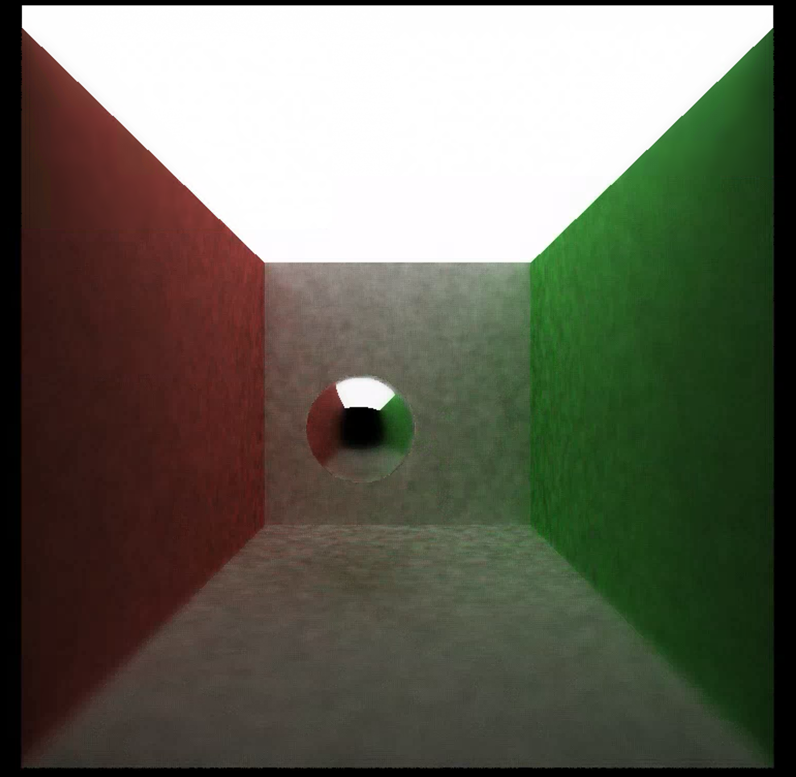</td>
    </tr>
</table>

---

### Simple Cornell Box without Ceiling as Light

Hyperparameters:

* `cphi`: 0.719
* `nphi`: 0.631
* `pphi`: 0.152
* Filter kernel: 5x5 B3 spline
* Filter size: 32
* Iterations: 10
* Denoised Iterations: 10

**Comparison with Simple Cornell Box with Ceiling as Light**
The denoiser effectively reduces the noise in the image, although the resulting image is darker compared to the one with the ceiling as light, attributable to the lesser light intensity.

<table align="center">
    <tr>
        <td>Ray Tracing Result</td>
        <td>Denoiser Result</td>
    </tr>
    <tr>
        <td>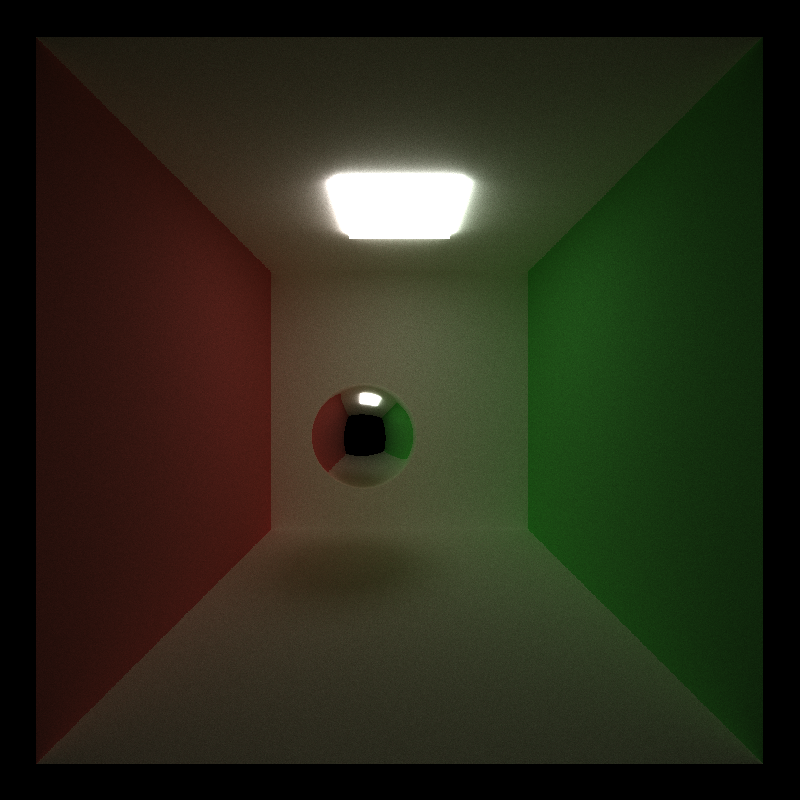</td>
        <td>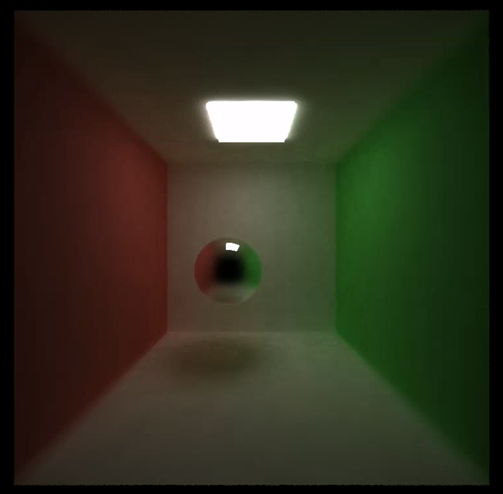</td>
    </tr>
</table>

---

### Complex Cornell Box

Hyperparameters

* `cphi`: 0.552
* `nphi`: 0.458
* `pphi`: 0.089
* Filter kernel: 5x5 B3 spline
* Filter size: 32
* Iterations: 1500
* Denoised Iterations: 500

<table align="center">
    <tr>
        <td>Ray Tracing Result</td>
        <td>Denoiser Result</td>
    </tr>
    <tr>
        <td>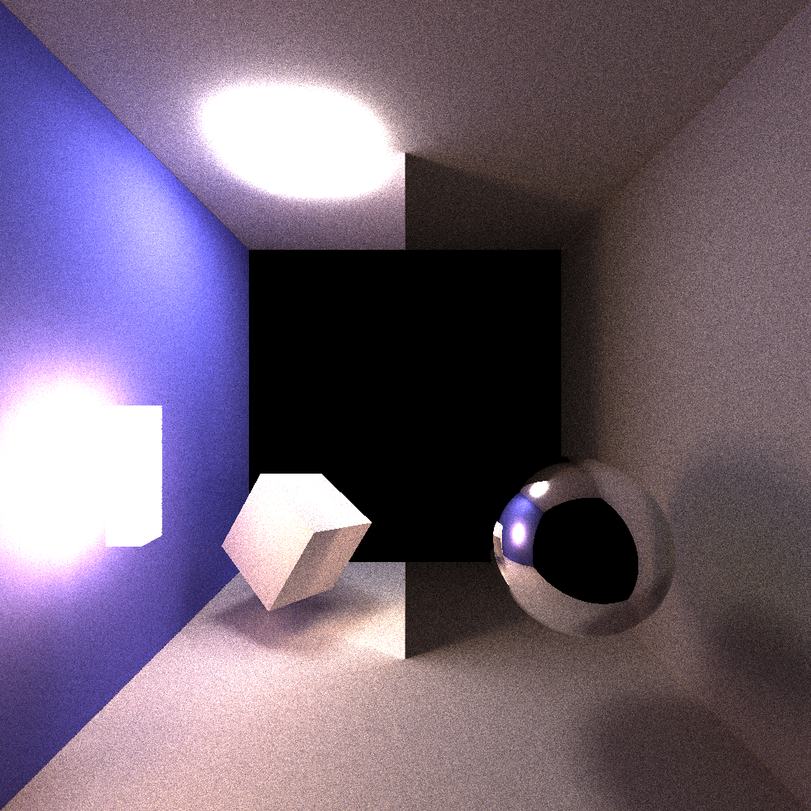</td>
        <td>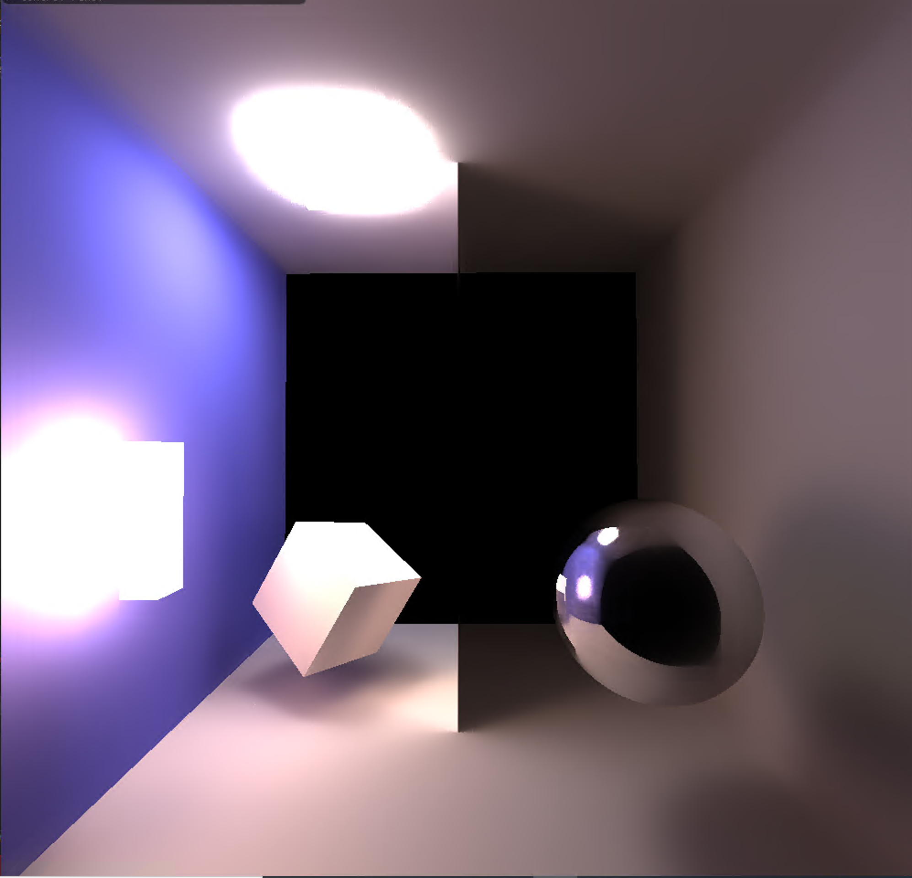</td>
    </tr>
</table>

The denoiser effectively diminishes the noise in the image while retaining significant details with fewer iterations. It also adeptly preserves features like shadows and reflections.

---

### Complex Cornell Box with Varied Materials

Hyperparameters

* `cphi`: 0.552
* `nphi`: 0.458
* `pphi`: 0.089
* Filter kernel: 5x5 B3 spline
* Filter size: 32
* Iterations: 1500
* Denoised Iterations: 500

<table align="center">
    <tr>
        <td>Ray Tracing Result</td>
        <td>Denoiser Result</td>
    </tr>
    <tr>
        <td>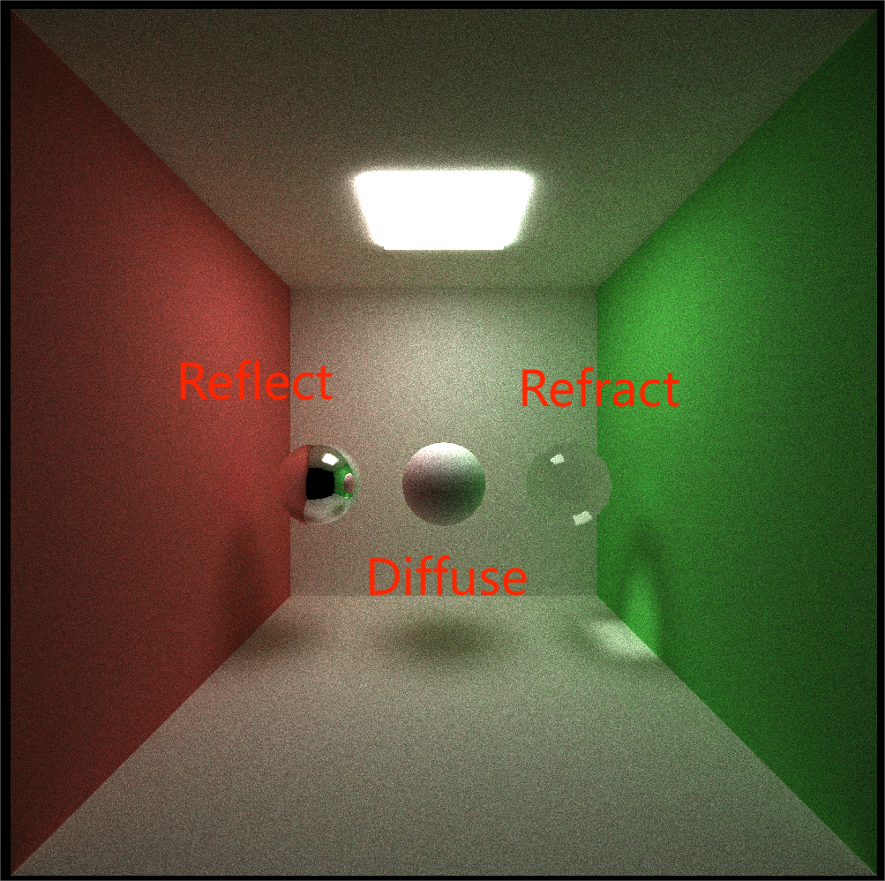</td>
        <td>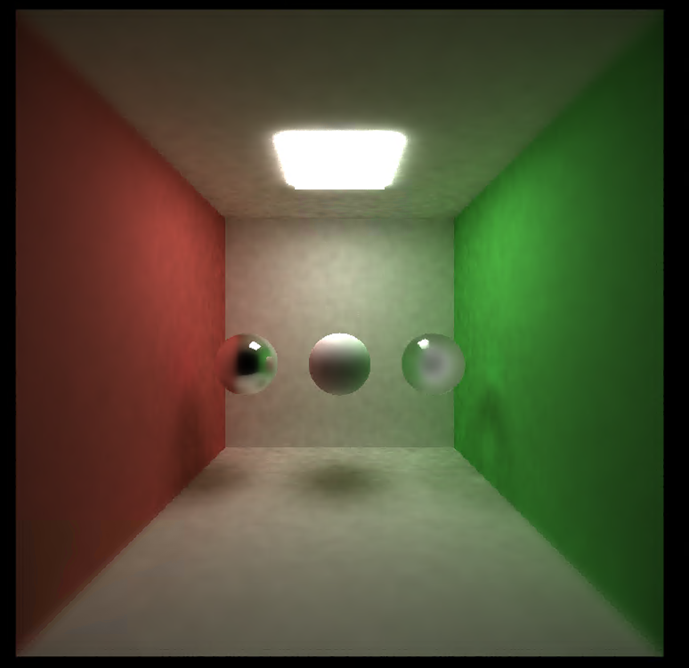</td>
    </tr>
</table>

While the denoiser succeeds in reducing the noise, it occasionally falters at preserving details of fully transparent objects. The central transparency in the image is slightly compromised due to the kernel's color blending effect with surrounding objects.

---

### Complex Cornell Box with OBJ Files

Hyperparameters

* `cphi`: 0.552
* `nphi`: 0.458
* `pphi`: 0.089
* Filter kernel: 5x5 B3 spline
* Filter size: 32
* Iterations: 2000
* Denoised Iterations: 300

<table align="center">
    <tr>
        <td>Ray Tracing Result</td>
        <td>Denoiser Result</td>
    </tr>
    <tr>
        <td>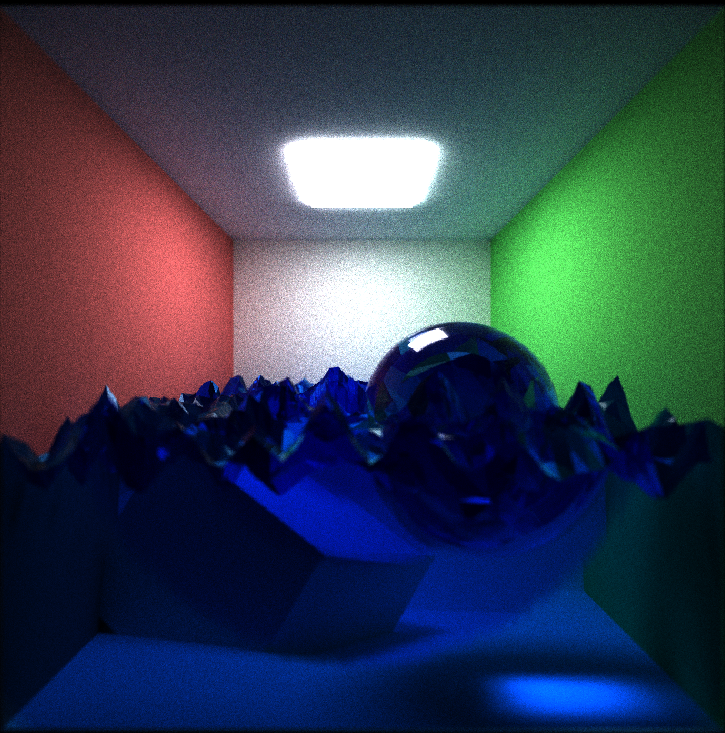</td>
        <td>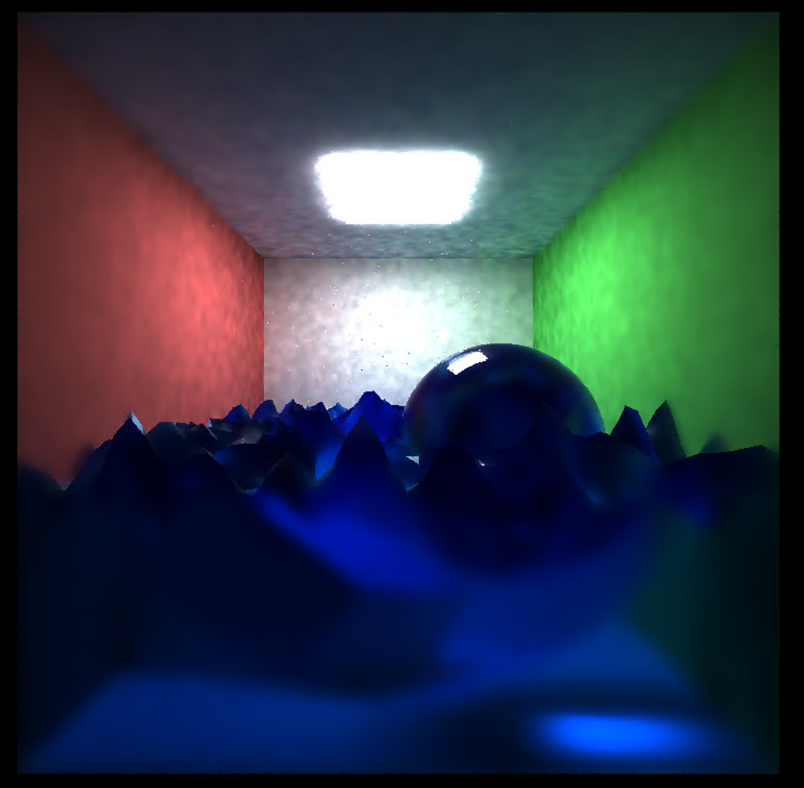</td>
    </tr>
</table>

The intended transparency of the water is somewhat lost due to the denoiser's kernel application, which blends the colors of adjacent objects, leading to a blurrier scene representation.

## Performance Analysis

Evaluating the denoiser's performance across varying hyperparameters is crucial to understand its behavior and optimize its output. This section presents a series of tests conducted to analyze the impact of different hyperparameters on the denoiser's runtime and the quality of the resulting images.

The following hyperparameters were kept consistent across all tests to ensure a fair comparison:

* `cphi`: 0.7
* `nphi`: 0.6
* `pphi`: 0.1
* Filter kernel: 5x5 B3 spline
* Filter size: 16
* Iterations: 10
* Denoised Iterations: 10
* Resolution: 800 * 800

The only exception being the hyperparameter under examination in each respective test.

### Denoiser Runtime vs. Resolution

The chart below illustrates the denoiser's runtime across different resolutions.

<div align="center">

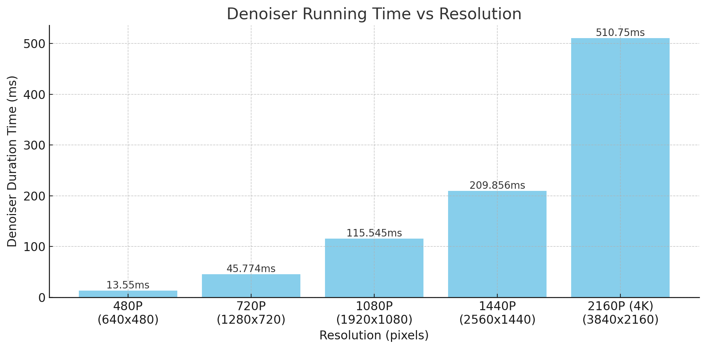

</div>


As anticipated, there's a notable increase in runtime with the rise in resolution, given the increased number of pixels the kernel must process.

---

### Varying Filter Size

#### Denoiser Runtime vs. Filter Size

The denoiser's runtime against various filter sizes is shown below.

<div align="center">

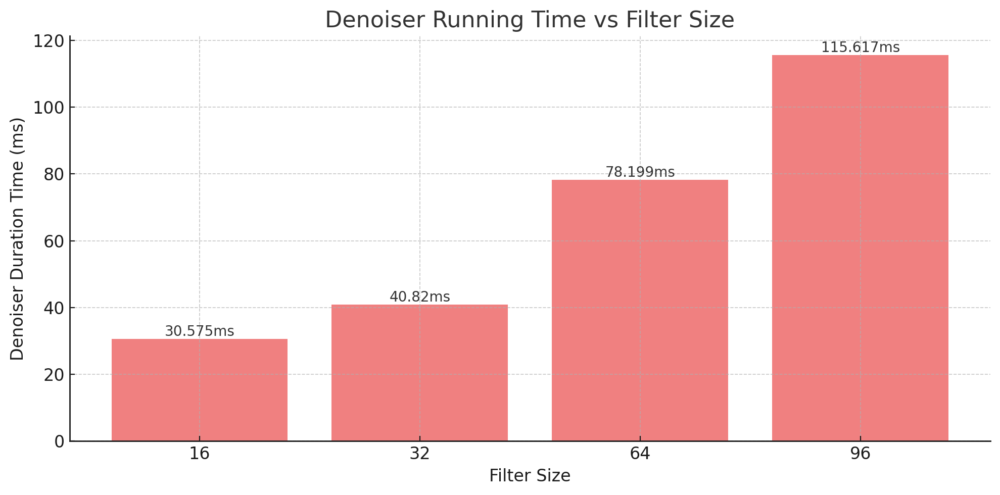

</div>

A linear increase in runtime is observed with larger filter sizes, attributable to the expanded iteration loop to accommodate the additional filter elements.

---

#### Image Quality vs. Filter Size

The following table depicts the image quality at different filter sizes.

<div>
    <table align="center">
        <tr>
            <td>Ray Tracing Result</td>
            <td>Filter Size: 16</td>
            <td>Filter Size: 32</td>
            <td>Filter Size: 64</td>
            <td>Filter Size: 96</td>
        </tr>
        <tr>
            <td></td>
            <td></td>
            <td></td>
            <td></td>
            <td></td>
        </tr>
    </table>
</div>

In simpler scenes, the impact of filter size on image quality isn't immediately discernible. However, a closer examination reveals that larger filter sizes tend to blur the image more, as demonstrated in the gifs below.

<div align="center">


</div>

---

### Varying Number of Iterations

The influence of iteration count on image quality is examined below.

<div>
    <table align="center">
        <tr>
            <td>Iteration Size: 10</td>
            <td>Iteration Size: 50</td>
            <td>Iteration Size: 100</td>
            <td>Iteration Size: 500</td>
        </tr>
        <tr>
            <td></td>
            <td></td>
            <td></td>
            <td>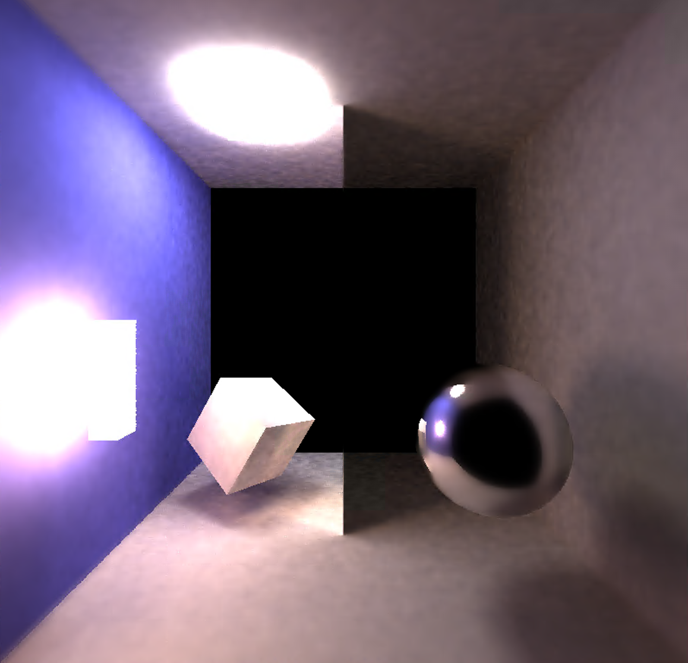</td>
        </tr>
    </table>
</div>

An improvement in image quality is observed with an increased number of iterations. More iterations in ray tracing provide a richer set of details, enabling the denoiser to produce a more refined output.

---

### Varying Cphi

<div align="center">


</div>

As observed, a higher `cphi` value tends to improve the image quality. This is because a higher `cphi` makes the denoiser more sensitive to color variations, enabling it to better differentiate between actual image features and noise, thus resulting in a more accurate denoising process.

---

### Varying Nphi

<div align="center">

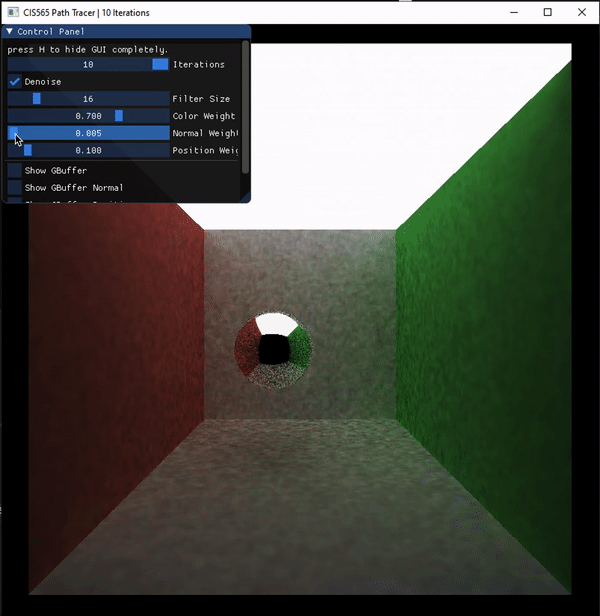

</div>

The image quality tends to improve with a moderate `nphi` value. The parameter `nphi` regulates the sensitivity of the denoiser to differences in normal vectors. A higher `nphi` value might cause over-blurring as it could generalize the normal vector differences as noise, whereas a too low `nphi` might not sufficiently denoise the image. Therefore, finding a balanced `nphi` value is crucial to achieving an optimal denoising effect while preserving the image's structural integrity.

---

### Varying Pphi

<div align="center">


</div>

The images appear to be more blurred with a higher `pphi` value. The `pphi` parameter controls the denoiser's sensitivity to positional differences. A higher `pphi` value causes the denoiser to be less sensitive to positional differences, often resulting in a blurring effect as it fails to distinguish between noise and actual positional details. Lower `pphi` values, on the other hand, could retain more positional details but might also retain more noise. Thus, it's essential to fine-tune the `pphi` value to find a balance between denoising and detail preservation.

---


## Bloopers

The denoiser, being a part of the tail end of the ray tracing pipeline, relies on the accumulated color data gathered during the path tracing process. A crucial step to ensure accurate color representation is to divide the accumulated color by the number of iterations, thereby obtaining an average color value. However, overlooking this step led to an unintended outcome as depicted below:

<div align="center">
    <table>
        <tr>
            <td>Ray Tracing Result</td>
            <td>No Average</td>
            <td>Average</td>
        </tr>
        <tr>
            <td></td>
            <td></td>
            <td></td>
        </tr>
    </table>
</div>

The juxtaposed images clearly illustrate the consequence of omitting the averaging step. The 'No Average' image not only failed to denoise but paradoxically introduced more noise into the scene. This anomaly arises from the undivided color accumulation during path tracing, resulting in overly bright color values. When the denoiser operates on this inaccurate data, it attempts to suppress what it perceives as noise, which, in this case, includes the exaggerated brightness. Consequently, this misinterpretation by the denoiser amplifies the noise, yielding a brighter and noisier image. This blooper underscores the importance of accurate color averaging prior to the denoising process to achieve desirable results.

The code snippet below demonstrates the averaging step when computing wavelet transformation.

```cpp
glm::vec3 ctmp = c_in[otherIdx];
// color is accumulated via path tracing
glm::vec3 t = (cval - ctmp) / (float)iter;
```
