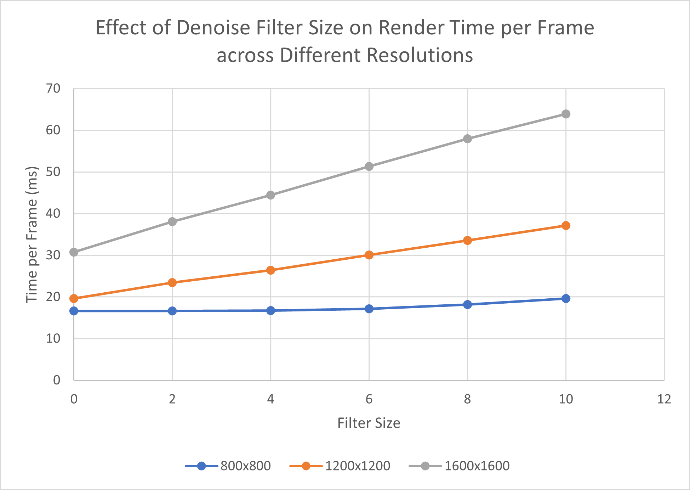
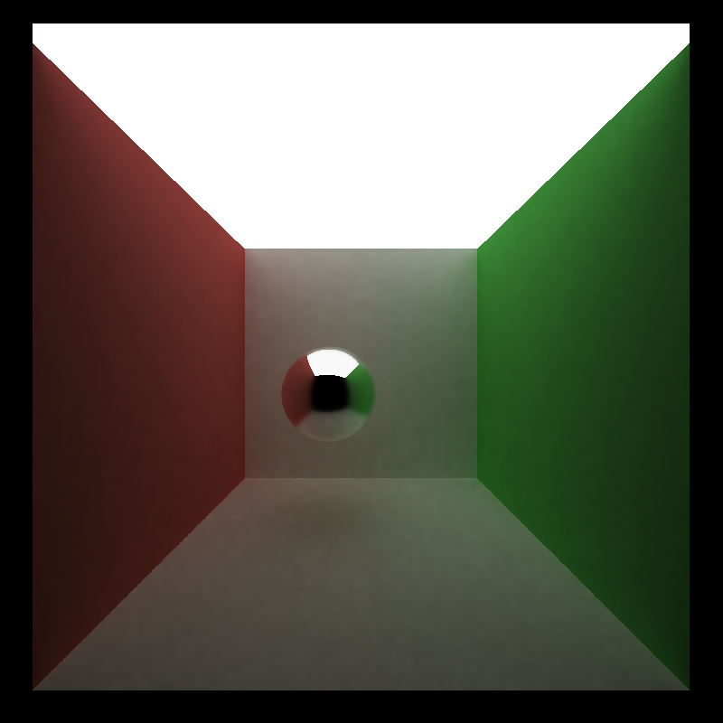
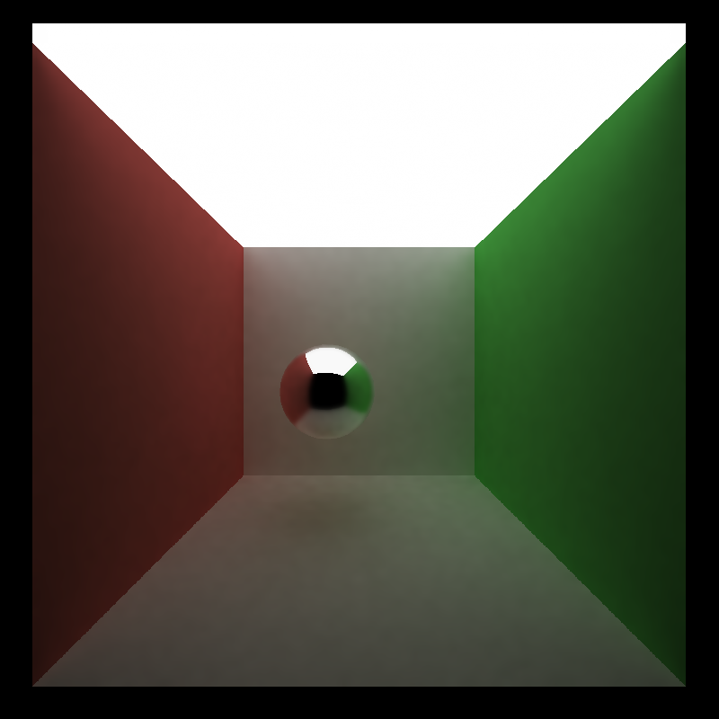
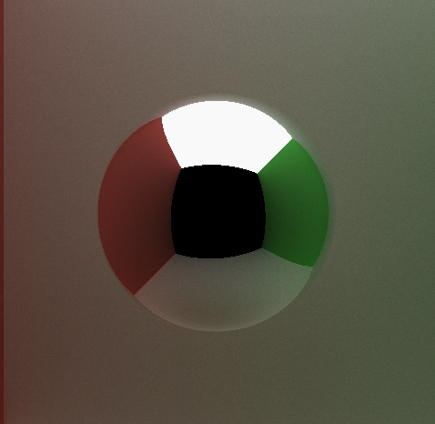
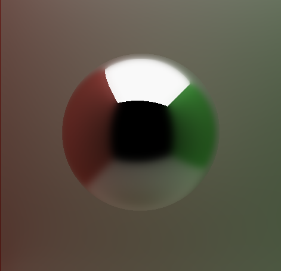

CUDA Denoiser For CUDA Path Tracer
==================================

**University of Pennsylvania, CIS 565: GPU Programming and Architecture, Project 4**

* Alan Qiao
* Tested on: Windows 11 22H2, Intel Xeon W-2145 @ 3.70GHz 64GB, RTX 3070 8GB (Dorm Workstation)

## Introduction

This project demonstrates demonstrates the use of denoising to achieve a faster convergence on a very basic naive path tracer. Specifically, this project implements the Edge-Avoiding À-Trous Wavelet Transform from the paper ["Edge-Avoiding A-Trous Wavelet Transform for fast Global Illumination Filtering,"](https://jo.dreggn.org/home/2010_atrous.pd) by Dammertz, Sewtz, Hanika, and Lensch.

This wavelet provides a relatively simple and inexpensive denoiser that interpolates color from the surrounding pixels using a expanding filter kernel that takes 25 samples from evenly spread positions in the square kernel centered at the pixel. The wavelet also implements stopping functions using normal and position data to detect edges in the image and prevent the bluring of colors across edges.

## Features

The basic path tracer takes in simple text scenes describing basic cube and sphere geometries with different materials and colors and renders it in a static state based on the view of an adjustable pinhole camera.  
There is a control panel with some basic statistics about the render time and number of iterations, as well as several controls for tweaking the weighting of the different parts of the wavelet function.

## Performance Analysis
### Iterations for Acceptable Render
First, to illustrate the benefit of using denoising for faster render convergence, we provide a comparison between two identical scenes render with and without denoising. The parameters were roughly tuned to provide a better denoising result.

On the left is the raw render of the scene averaged across 2000 iterations. There are some minor artifacts such as aliasing at the wall corners but the scene is generally quite smooth. On the right is the denoised render of the raw scene averaged across 100 iterations using a filter size of 8. The ball in the middle looks slightly more blurry, but both renders provide a similarly acceptable outcome. It is clear that the performance improvement is significant as the required number of iterations decreased by 20 times.

### Computation Cost of Denoising Filter
Denoising is not a free operation so there is certainly some additional work introduced for each render frame. The following chart illustrates the cost of denoising based on the filter size (a bigger filter size means more denoising iterations per render) across several different solutions. A filter size of 0 represents the baseline cost of no denoising.

Accounting for margin of error in measurements, the time per frame grows roughly linearly with filter size. This makes sense as the kernel is computed by iteratively drawing 25 samples from a square of increasing radius from the source pixel. The same number of computations per square means that the computation cost grows linearly with the number of squares sampled, which corresponds linearly to the filter size. It is also clear that for an image of higher resolution, the computation cost increases faster as there are more samples to take in each iteration.

### Filter Size on Image Quality
While the computation cost of denoising grows linearly with filter size, the quality of the denoised image does not improve linearly. In fact, the improvement is logarithmic, as shown in the series of renders below.

| 
Filter Size
 | Rendered Image |
| :---: | :---: |
| 0 |  |
| 1 |  |
| 2 |  |
| 3 |  |
| 4 |  |
| 5 |  |
| 6 |  |
| 7 |  |
| 8 |  |

After reaching filter size 5, the difference between the renders are insignificant. This is because the distance of the furthest samples increase exponential with filter size, and so very quickly the pixels become too far such the normals and positions of the sample likely are too different from the source pixel to be mixed in.

### Material Compatibility
Zooming in on the reflective sphere, it is clear that the Edge-Avoiding À-Trous Wavelet Transform does not perform equally well with all materials. When the parameters are optimized to show a smooth blend of diffuse materials at low samples, this over blends for reflective surfaces and results in a blurry image.

These two images were both rendered at 2000x2000 resolution with 2000 iterations. The one on the left is the untreated image, which clearly shows the color bleeding onto the back diffuse wall and a clear reflection on the sphere. The right denoised imaged, on the other hand, shows pretty well blended diffuse walls, but a much more blurry reflection in the sphere.

This suggests that the algorithm works better for simpler surfaces like diffuse, and less so for reflective surfaces that have sharper changes in normals.

### Lighting Comparisons
Finally, we compare the efficacy of the denoiser across two things featuring the same cornell box but different sized ceiling lights. The main impact of the different ceiling light size is that one would have strong illumination of all objects and less shadows compared to the other.

With less light comes more noise in the original picture and a greater gradient of colors to blend. This shows in more aliasing type artifcats in the picture on the right as well as a more prominent bluriness of the overall render. This form of blending denoising seems to work better when there are more pixels of very similar quality in a surrounding region. The more complexity and variance, the poorer the performance.
