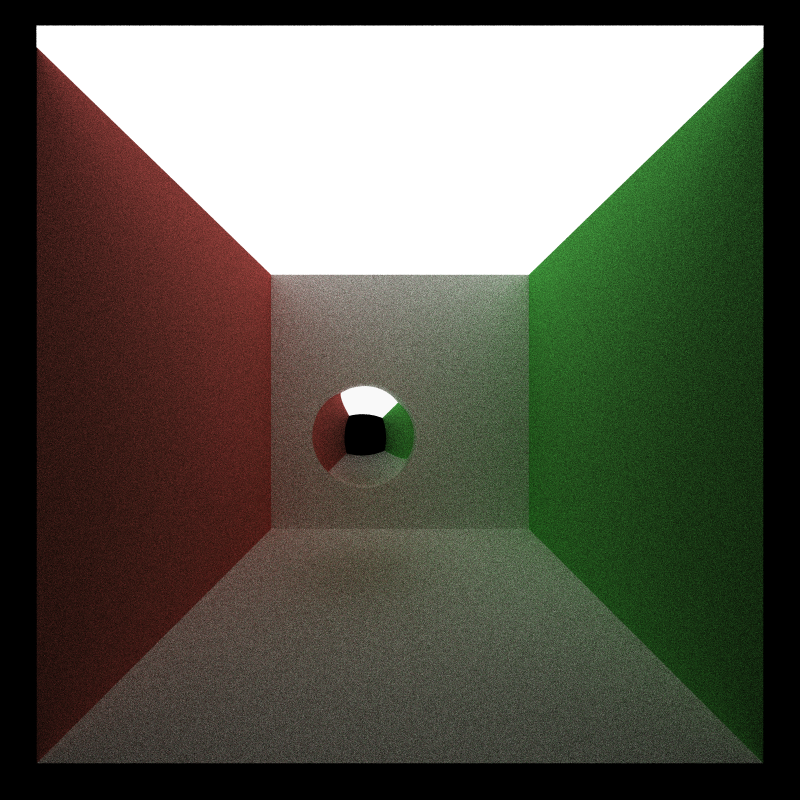
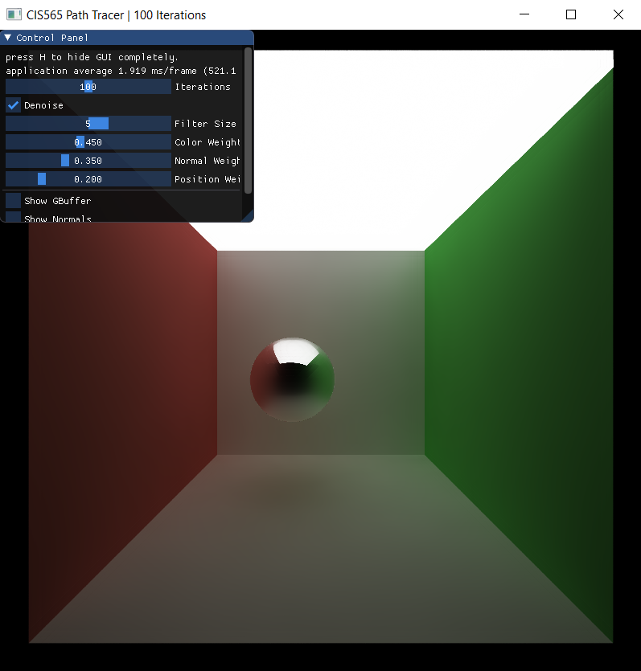
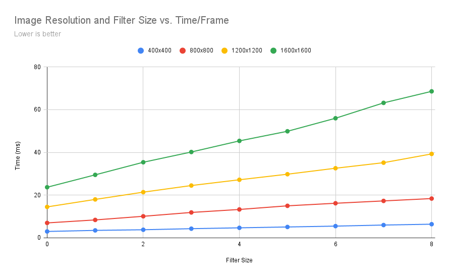
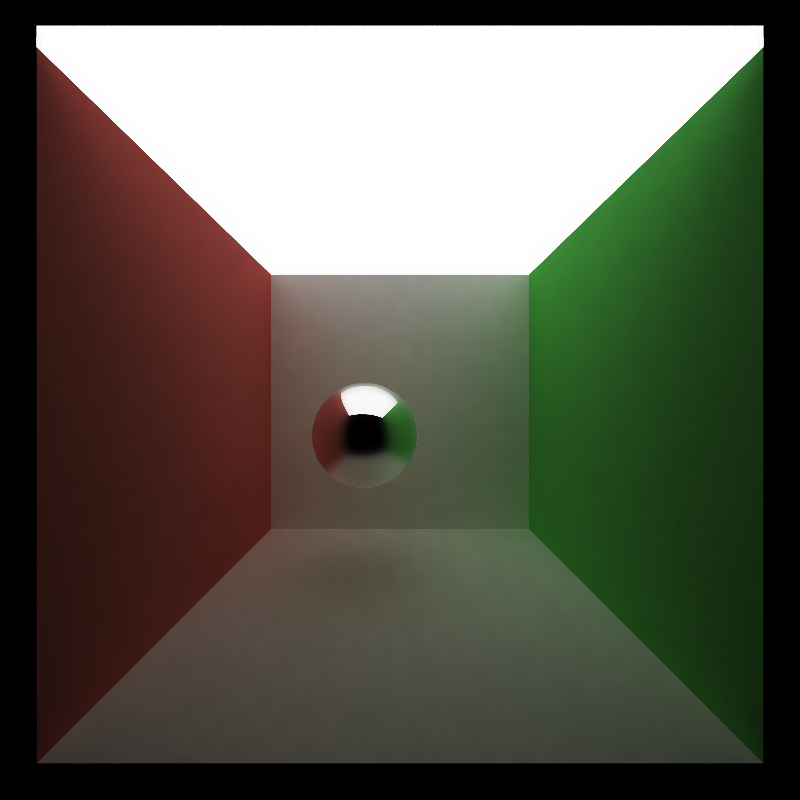
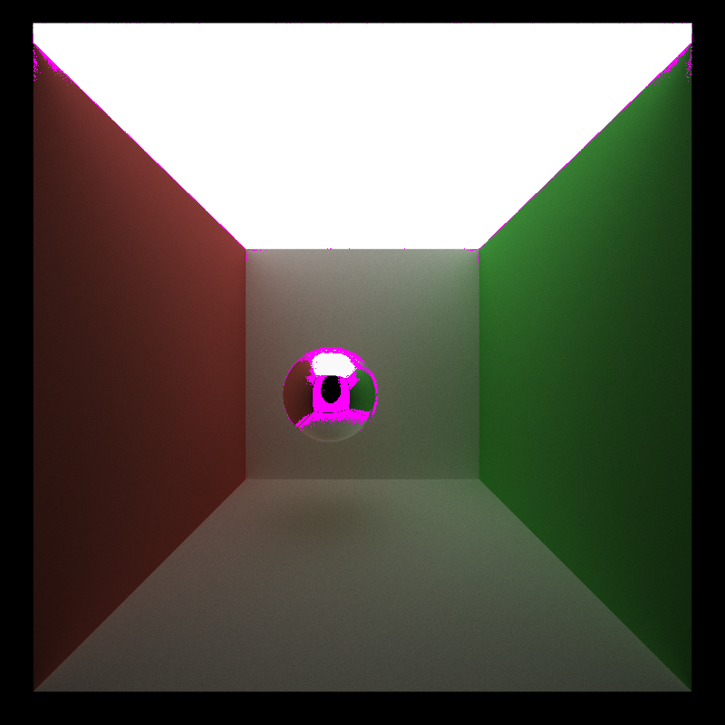
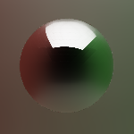
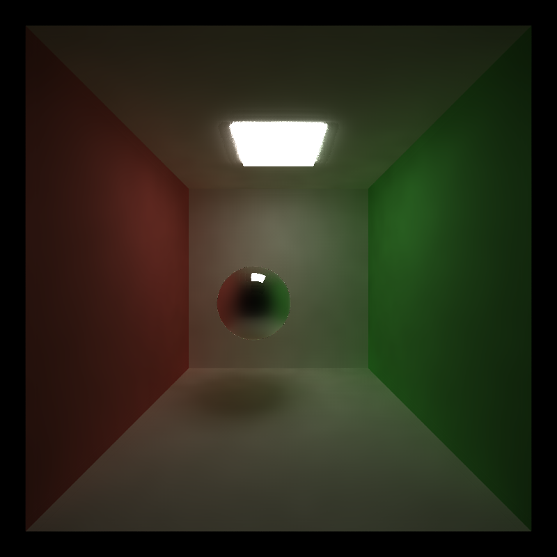

# CUDA Denoiser For CUDA Path Tracer

**University of Pennsylvania, CIS 565: GPU Programming and Architecture, Project 4**

* Aditya Gupta
  * [Website](http://adityag1.com/), [GitHub](https://github.com/AdityaGupta1), [LinkedIn](https://www.linkedin.com/in/aditya-gupta1/), [3D renders](https://www.instagram.com/sdojhaus/)
* Tested on: Windows 10, i7-10750H @ 2.60GHz 16GB, NVIDIA GeForce RTX 2070 8GB (personal laptop)
  * Compute capability: 7.5

## Introduction

This project is a CUDA implementation of [Edge-Avoiding À-Trous Wavelet Transform for fast Global Illumination Filtering](https://jo.dreggn.org/home/2010_atrous.pdf), a denoising method for path tracers. This method involves using successive blurs of increasing size while weighting based on differences in color, position, and normals. The above images show a comparison of the raw path traced output at 100 spp (left) and the denoised version (right).

## Features

The GUI has controls for enabling denoising, setting the filter size, changing weight parameters, and outputting the G-buffer.

## Performance Analysis

### Image Resolution and Filter Size vs. Time/Frame

I first compared the path tracer's performance across multiple resolutions and denoising filter sizes. A filter size of 0 means denoising was disabled. A filter size of $k \geq 1$ means the filter ran $k$ times per path tracing iteration, and for each filter iteration $i$ such that $1 \leq i \leq k$, the filter kernel covered $5 \cdot 2^{i - 1}$ pixels in each direction.

From this graph, we can see that for all tested resolutions, the time per frame increases linearly with the number of filter iterations.

### Filter Size vs. Image Quality

This brings up a question: does an increased filter size necessarily mean better results? Here are some test images:

| Filter Size | Image |
|-------------|-------|
| None        |  |
| 1           |  |
| 3           |  |
| 5           |  |
| 7           |  |

There are differences in the first four images (up to and including size 5), but after size 5 the difference is negligible. This is because pixels that are very far away (e.g. $\frac{1}{2} \cdot 5 \cdot 2^{7-1} = 160$ pixels away for filter size 7) have very different positions and likely very different colors and normals, so their weights will be low.

### Total Iterations Needed

One interesting comparison is the number of iterations requried for an "acceptably smooth" result with and without denoising.

On the left is a non-denoised render with 2000 samples per pixel, and on the right is a denoised render with filter size 5 and 100 samples per pixel. Though they don't look exactly the same (there's a bit of noise in the left image and some aliasing in the right image), they both look smooth. This means denoising can reduce the number of samples required by as much as 20x. The image diff looks like so:

Other than on the reflective sphere and in the corners, the images are almost identical.

### Material Comparisons

The difference in the reflective sphere shown above is an unfortunate side effect of how the filter works. Here is a more detailed comparison:

Because the sphere has gradual changes in position and normals, neither of those weighting strategies come into effect here, meaning the denoiser blurs the sphere too strongly. This means the denoiser is likely more effective for simple surfaces (e.g. diffuse) and less effective for complex surfaces involving lots of reflection/refraction. One possible way to fix this would be to not write to the G-buffer on a specular bounce and instead store the position and normal of the next bounce.

### Scene Comparisons

Lastly, I compared the denoising filter's quality on two different scenes:

The scene on the left has a much larger light, which means pixels will be brighter and likely less noisy on average. Both images were rendered with filter size 5 and 100 samples per pixel. While the plain diffuse walls are relatively noise-free in both images, the image on the right has clear artifacts on the sphere's edges and near the light at the top, likely due to increased noise in the raw image. Additionally, the previously mentioned issues with the specular sphere are present in both images.