CUDA Denoiser For CUDA Path Tracer
==================================

| No denoising | Denoised |
|--------------|----------|
|  |  |

**University of Pennsylvania, CIS 565: GPU Programming and Architecture, Project 4**

* Gene Liu
  * [LinkedIn](https://www.linkedin.com/in/gene-l-3108641a3/)
* Tested on: Windows 10, i7-9750H @ 2.60GHz, 16GB RAM, GTX 1650 Max-Q 4096MB (personal laptop)
  * SM 7.5

# Project 4: CUDA Denoiser

This project implements a CUDA denoiser. A denoiser acts on a noisy ray traced image in order to smooth the overall image. The implementation here is based on the edge avoiding À-trous algorithm detailed in the paper found [here](https://jo.dreggn.org/home/2010_atrous.pdf). The algorithm applies an À-trous filter, or an efficient Gaussian filter approximation, to the image while taking note of the color, normal, and position of neighboring pixels to retain important edges within the scene.

## Performance Analysis

### Filter Size

The impact of the implemented denoising algorithm was tested in various ways. First, we note the effect of a changing filter size on the runtime of the denoising. The denoising runtime is measured as the time from copying the original image up until but not including the writing of the denoised image to the PBO buffer. The following data was obtained on the given `cornell_ceiling_light.txt` scene with default camera parameters and position. Unless noted otherwise, the following data is generated with a color weight `c_phi = 0.25`, normal weight `n_phi = 0.1`, and position weight `p_phi=0.8`, with denoising applied at 10 iterations.

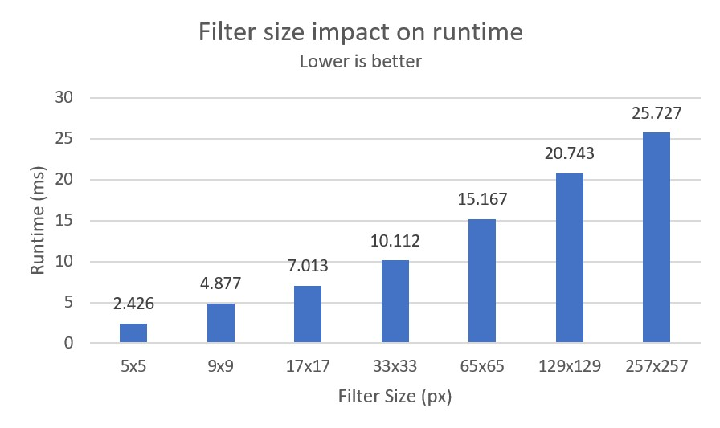

The algorithm begins at a base filter size of 5x5 pixels, then on each iteration doubles the offset of each neighboring pixel to sparsely sample farther pixels. To compute the larger filter sizes above, we iterate until our sparse filter side length is larger than the designated filter. The above filter sizes are chosen to represent threshold values at which the denoise iteration count changes.

As seen above, it seems that the runtime of the denoising increases relatively linearly with the filter size, or equivalently linearly with the number of denoise iterations. This makes sense, as each denoise iteration is relatively similar in runtime, and so a constant increase in iteration count between the above filter sizes should result in a linear increase in denoising time.

The visual results of the above can be seen below:

| Filter Size | Image |
|-------------|-------|
| None |  |
| 5x5 | 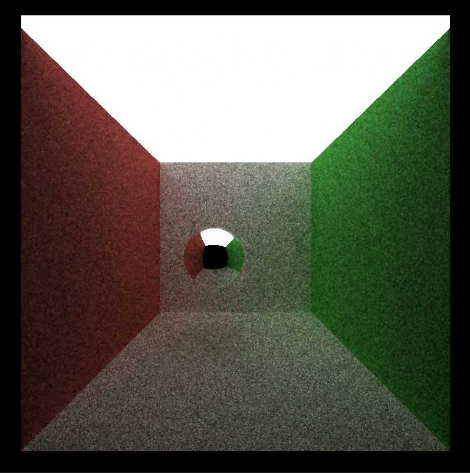 |
| 9x9 | 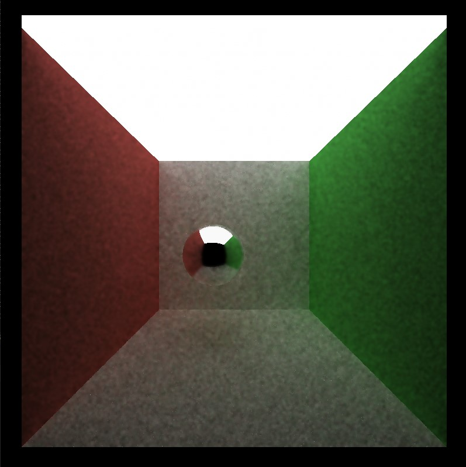 |
| 17x17 | 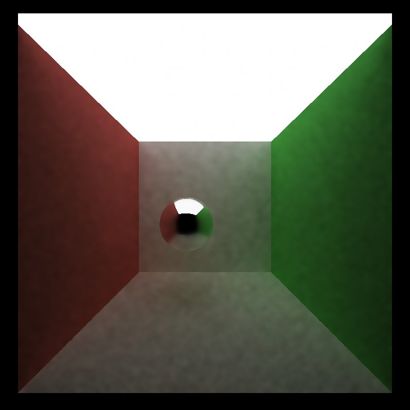 |
| 33x33 | 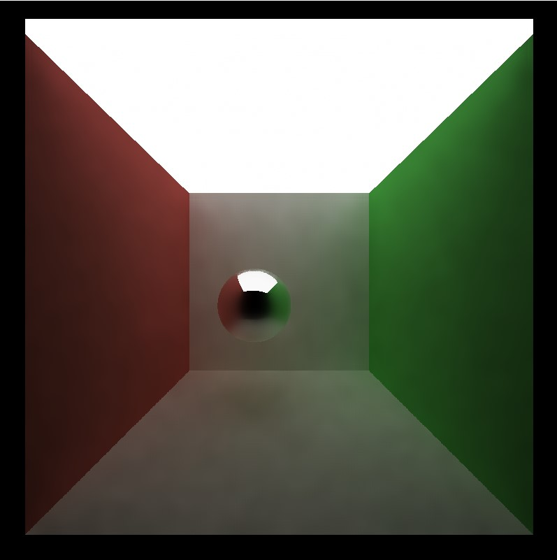 |
| 65x65 | 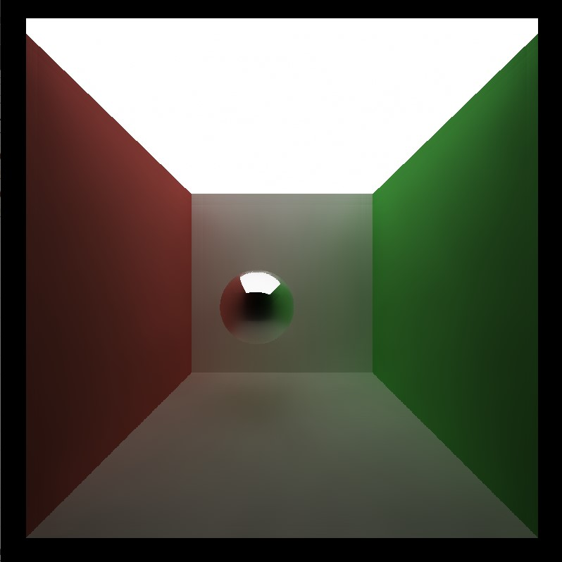 |
| 129x129 |  |
| 257x257 | 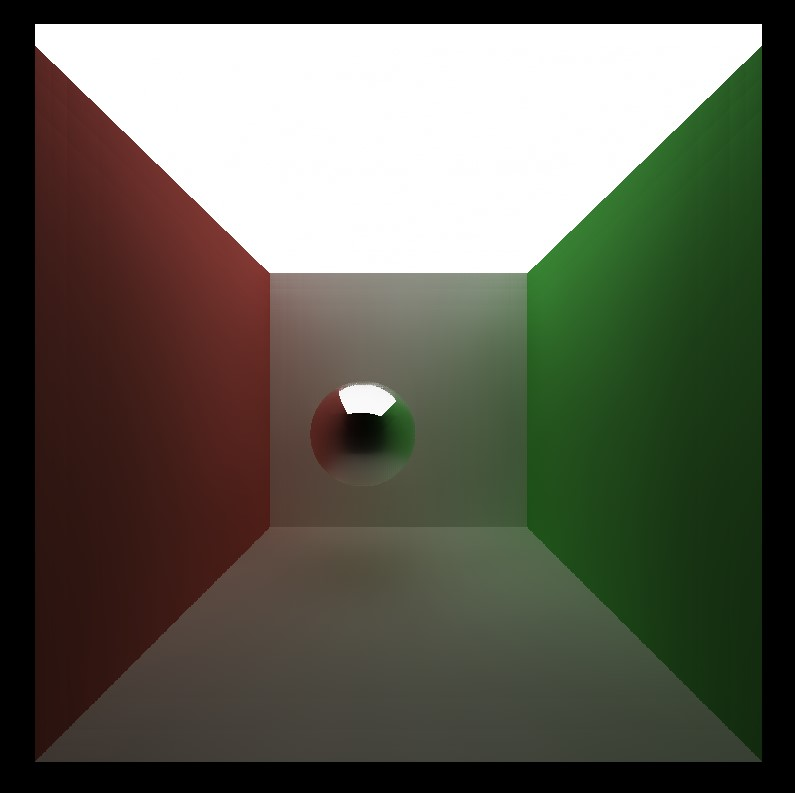 |

The difference in filter size can be seen up to a filter size of about 65x65, after which there is minimal change. This is mainly seen in the dark, noisy spots on the walls that are smoothed out at a 65x65 filter and above. It seems that at even larger filters we start to see some detail loss, particularly within the specular sphere. This is likely due to the filter taking into account more and more neighboring pixels in the blur, which can decrease the specular detail. However, this overall change is not too significant due to the edge avoiding weights, which only allow a pixel to contribute if they have similar normals, positions, or colors. This is less likely the farther we get from the center pixel at larger filter iterations.

### Resolution

We can further analyze the impact of the resolution of the denoised image with the runtime of the denoiser. The following data is generated with the same conditions as the previous section, but with a fixed filter size of 65. The camera resolution is now varied to measure its impact.

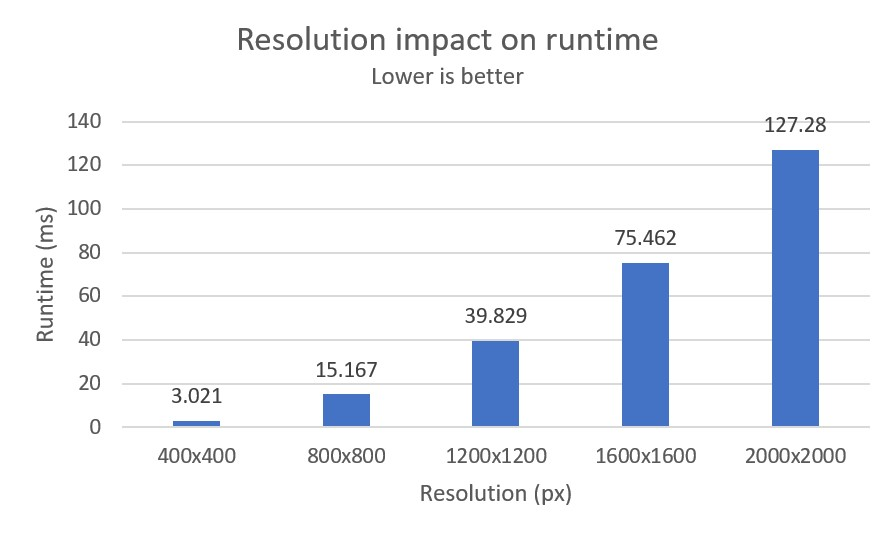

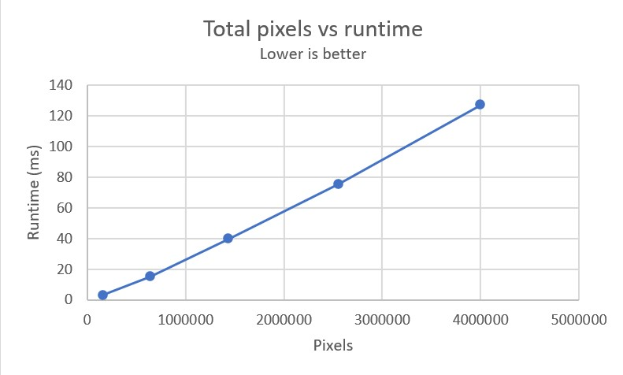

The first graph seems to show a nonlinear growth of runtime with respect to increasing resolution, but once we compute the relationship in terms of the total pixels we see that this relationship is also relatively linear. This also makes sense, as an increased number of pixels means more warps needed to compute the denoise result for each pixel, which linearly increases with the pixel count.

From these previous two sections, we see that the total time that denoising adds to rendering varies depending on the setup, but under the standard denoising parameters(same as the filter size settings but with a filter size of 65), we see about a 15 ms overhead.

### Iterations Saved

The purpose of denoising is to help produce a smoother and less noisy image from a low iteration pathtraced image. To assess roughly the iterations saved from this process the above "acceptably smooth" denoised image is compared to a standard pathtraced image of the same scene at 1000 iterations.

| 1k iter pathtraced | 10 iter denoised |
|--------------------|------------------|
|  |  |

Running these images through an image diff tool yields the following results:

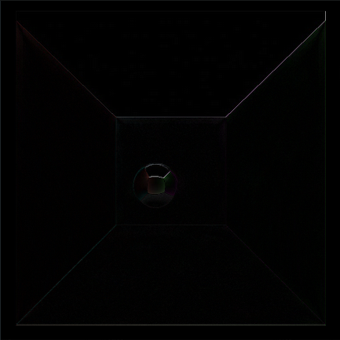

Or when overlayed:

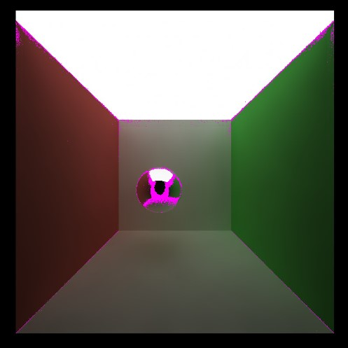

We see the differences mainly lie on the perfectly specular sphere and the edges of the room.

### Material Type Differences

The material of the objects within the scene also affects the effectiveness of denoising, as we partially saw in the above section. As the implemented denoiser attempts to smooth colors, the denoiser performs better on perfectly diffuse material surfaces which are naturally smooth rather than the perfectly specular reflective one. This can be seen below in the comparison between the non denoised and denoised scenes at 10 iterations.

| Specular no denoise | Specular denoised |
|---------------------|-------------------|
|  |  |

| Diffuse no denoise | Diffuse denoised |
|--------------------|------------------|
| 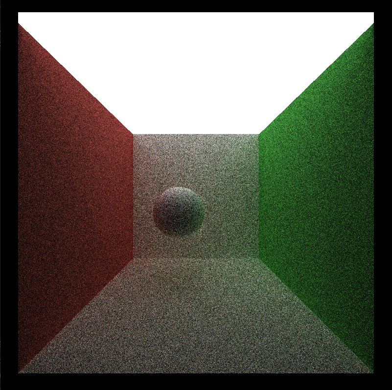 | 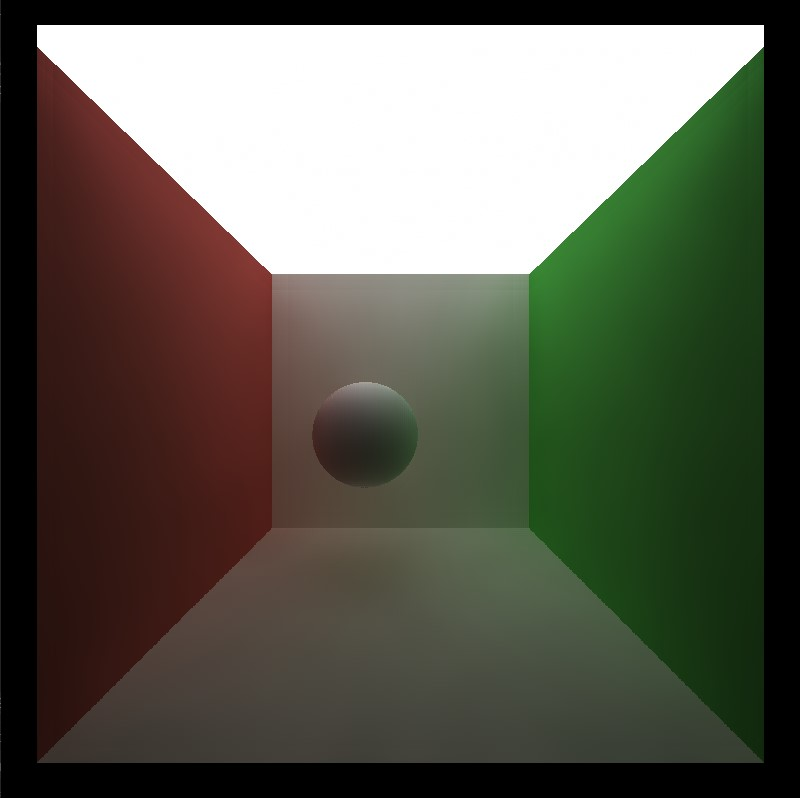 |

The worse performance on specular materials is also due to there not being enough information for the algorithm to retain reflected edges. The gBuffer used stores scene pixel normal and position data, but this data gives no information about reflected edges on for example the specular sphere in the above scene. This causes a loss of detail as the smoothing is applied to the sphere, which decreases its accuracy from a more refined scene.

### Scene Differences

Finally, we can test the difference of denoising on different scenes. The above tested scenes were modifications of the previous standard cornell box scene with a larger ceiling light. We also run denoising on the original scene with the smaller light to examine the effects:

| Scene | Base image | Denoised image |
|-------|------------|----------------|
| 10 iter big light |  |  |
| 10 iter small light |  | 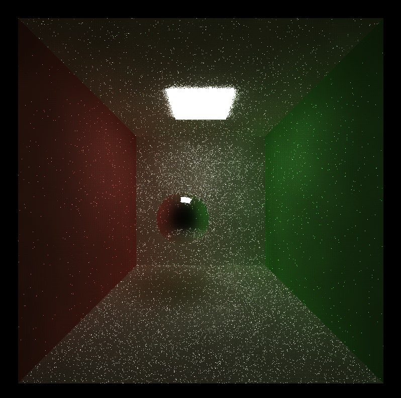 |
| 100 iter small light | 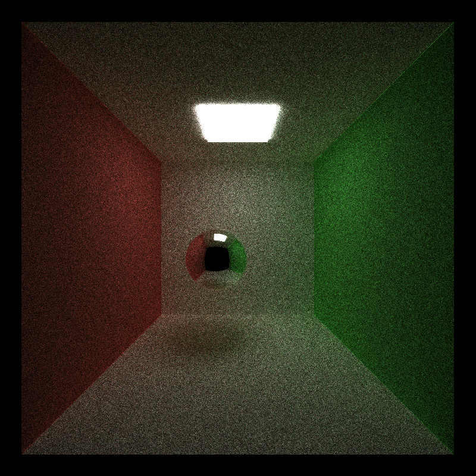 | 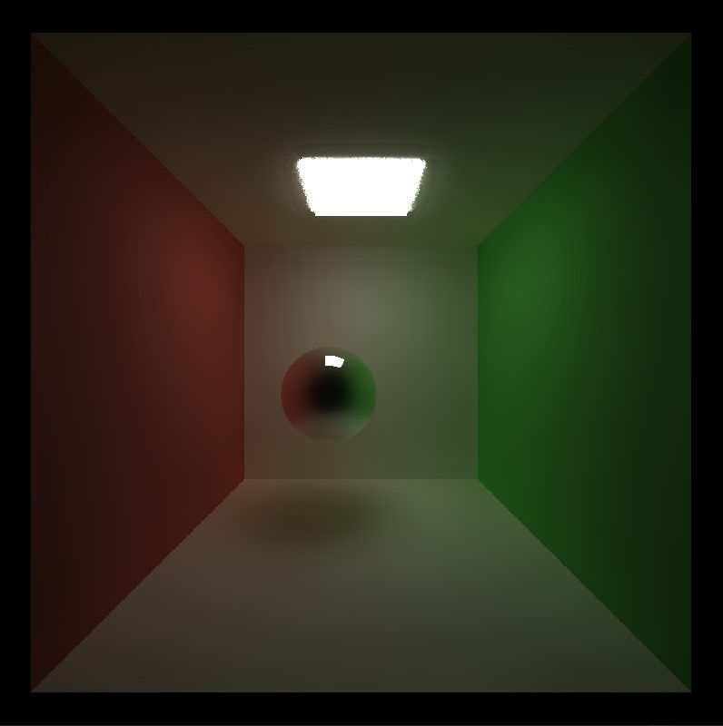 |

We can see that the denoising produces significantly worse results at 10 iterations on the smaller light scene. This is likely due to the base image being more noisy than the larger light scene due to the smaller light and less paths/pixels terminating. This causes the denoiser to perform poorly due to a lack of good neighboring pixels to use in the blur. At 100 iterations on the same scene we see significant improvement, due to a cleaner image with less initial noise. However, the specular sphere details are more blurred than the larger light scene, which again can be contributed to the initial noise in the sphere.
