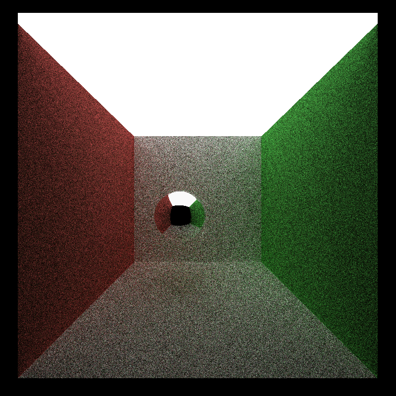
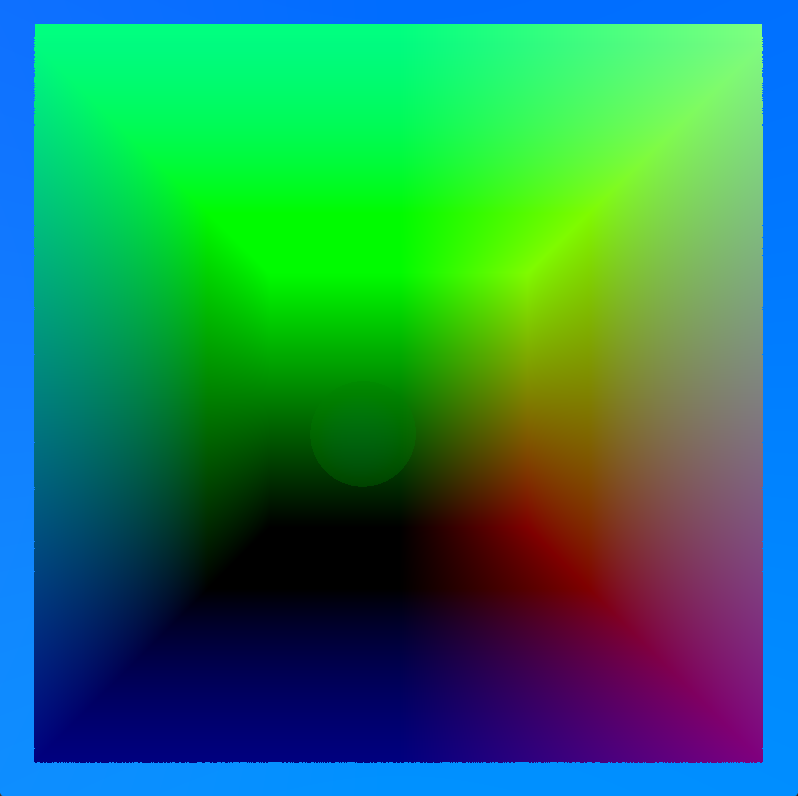

CUDA Denoiser For CUDA Path Tracer
==================================

**University of Pennsylvania, CIS 565: GPU Programming and Architecture, Project 4**

* Alan Qiao
* Tested on: Windows 11 22H2, Intel Xeon W-2145 @ 3.70GHz 64GB, RTX 3070 8GB (Dorm Workstation)

# Introduction

This project demonstrates demonstrates the use of denoising to achieve a faster convergence on a very basic naive path tracer. Specifically, this project implements the Edge-Avoiding À-Trous Wavelet Transform from the paper ["Edge-Avoiding A-Trous Wavelet Transform for fast Global Illumination Filtering,"](https://jo.dreggn.org/home/2010_atrous.pd) by Dammertz, Sewtz, Hanika, and Lensch.

This wavelet provides a relatively simple and inexpensive denoiser that interpolates color from the surrounding pixels using a expanding filter kernel that takes 8 samples at each distance from the pixel. The wavelet also implements stopping functions using normal and position data to detect edges in the image and prevent the bluring of colors across edges.

  
