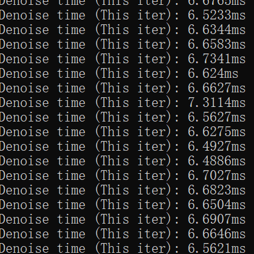

Project 4 CUDA Denoiser
================

**University of Pennsylvania, CIS 565: GPU Programming and Architecture, Project 4**

* Janet Wang [website](https://xchennnw.github.io/en.github.io/)
* Tested on: Windows 11, i7-12700H @ 2.30GHz 16GB, Nvidia Geforce RTX 3060 Ti  8054MB
  
## Summary
This project is a pathtracing denoiser that uses geometry buffers (G-buffers) to guide a smoothing filter. The technique is based on the paper "Edge-Avoiding A-Trous Wavelet Transform for fast Global Illumination Filtering," by Dammertz, Sewtz, Hanika, and Lensch.

* G-Buffers for normals and positions

|  the scene  | per-pixel normals | per-pixel positions | 
|---|---|---|
||||
* the A-trous kernel and its iterations

## Performance Analysis
* how much time denoising adds to your renders & how varying filter sizes affect performance

| |  filter size = 10 | filter size = 40 | filter size = 80 |
|---|---|---|---|
| Denoise time recorded| |||
|---|---|---|---|
|Denoise time (average)| 2.83ms|6.62ms|8.56ms|

* how denoising at different resolutions impacts runtime

The time needed for running the denoise roughly scale with the image resolution.
| |  resolution = 400 * 400 | resolution = 800 * 800| 
|---|---|---|
| Denoise time recorded| ||
|---|---|---|
|Denoise time (average)| 4.90ms |8.56ms|
