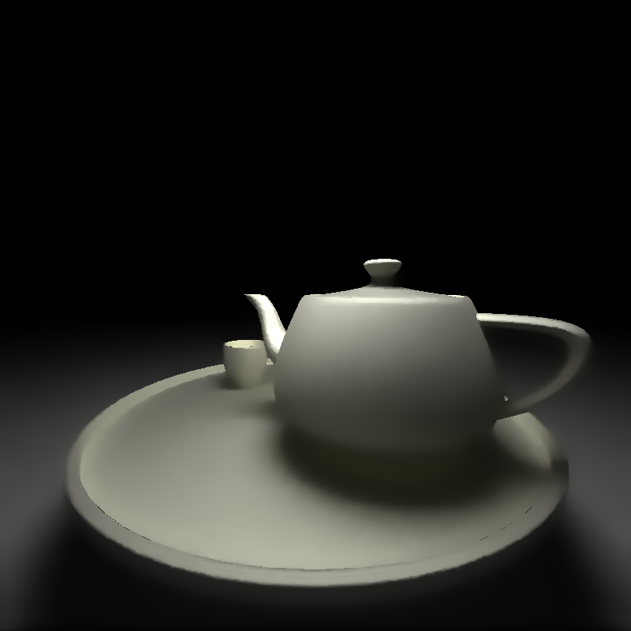
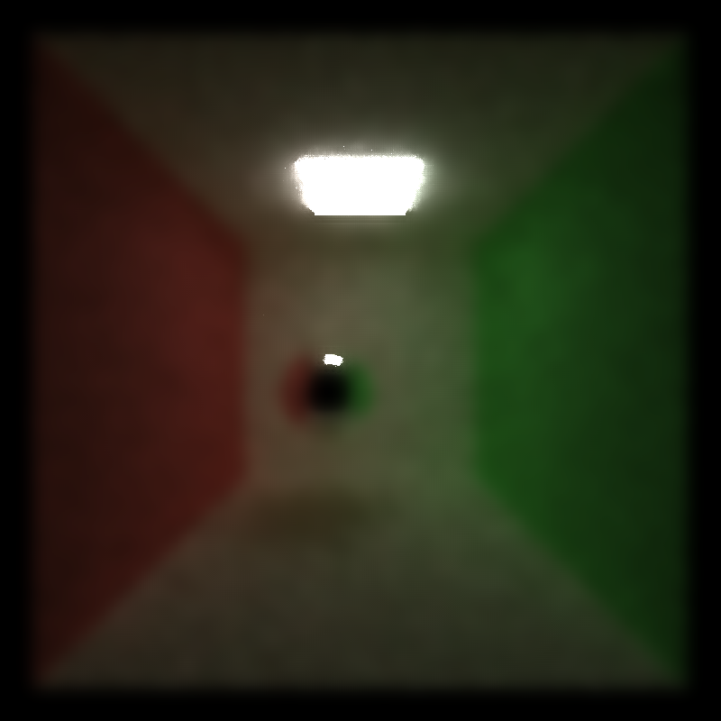
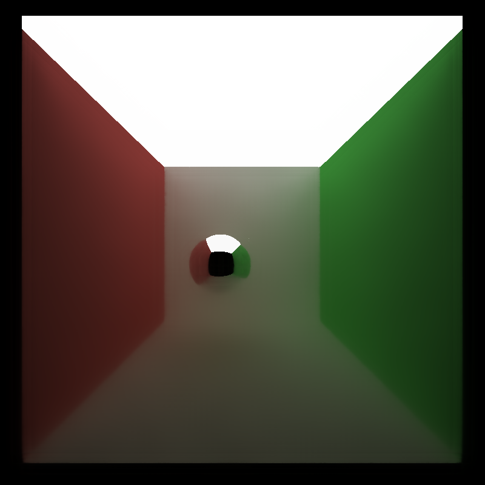

CUDA Denoiser For CUDA Path Tracer
==================================

**University of Pennsylvania, CIS 565: GPU Programming and Architecture, Project 4**

* Xiaoxiao Zou
  * [LinkedIn](https://www.linkedin.com/in/xiaoxiao-zou-23482a1b9/)
* Tested on: Windows 11, AMD Ryzen 9 7940HS @ 4.00 GHz, RTX 4060 Laptop 

### Performance & Analysis

<table>
    <tr>
        <td>SPP at original image/noisy image </td>
        <td>original images </td>
        <td>noisy image at lower spp</td>
        <td>denoised image</td>
    </tr>
    <tr>
        <td>  2000spp/204 spp </td>
        <td> 
            
        </td>
        <td> 
            
        </td>
        <td> 
            
        </td>
    </tr> 
    <tr>
        <td> 3500spp/504 spp </td>
        <td> 
            
        </td>
        <td> 
            
        </td>
        <td> 
            
        </td>
    </tr> 
    <tr>
        <td> 5000spp/1140 spp </td>
        <td> 
            
        </td>
        <td> 
            
        </td>
        <td> 
            
        </td>
    </tr> 
</table>
 
Denoising will give an "acceptably smooth" result at lower iteration as shown above, however, the image also get somehow blurred out due to the denoising filter.

#### Denoising Runtime - filter size, resolution

Denoising will add more time to the renders. For A-tous, it usually slow down the renderer about 10-20FPS. For Guassian, it slower the renderer a lot especially when the filter size is large. Larger filter size will genuinely add more time to the renders. For A-Tous, it adds slightly more time since number of levels need to compute did not increase much as the filter size goes larger and larger. However, for guassian, FPS get a huge markdown due to increasing size of kernel. For resolution, smaller resolution will give better runtime for both unfiltered and denoised image. Denoising will be a good technique for smaller resolution since the image will be blurry anyway for small image, this gives a better approximation for image. 

#### Denoising Visual effect - Filter size, material type, etc.

Denoising visual effect does depends on filter size, however, the visual quality does not scale uniformly with filter size. For image that itself contains a lot of details, when filter size is large, it will lose the smaller details as the filter size get larger. The visual quality scale with image only if it does not exceed the threshold that it will starts to blur out the details. Here are images with filter size 10,20,40,80. Note the details of teapot lower bottom with light reflection starts to fade out when filter size is large.

Denoising filter gives good result when there is huge change in color contrast or object contrast, however, for objects that is smooth and simple color shaded, it will genuinely lose details for small shading in the geometry. For materials such as metallic or glass, it genuinely gives better result. For materials such as diffuse, sometimes, it will lose the details. Same scene as last section but change the material, the glass gives good approximation at around 500spp, whereas the lambert one gives good appromixation around 1000spp. 

For scene between cornell.txt and cornell_ceiling_light.txt, denoising filter gives better approximation for cornell_ceiling_light. In the ceiiling_light scene, there is larger ligt object, that allows the scene to be less noisy (larger possibility to hit the light source). Here are images at 21 spp for two scenes with same filter size.

Cornell: 

Cornell_ceiling_light:

