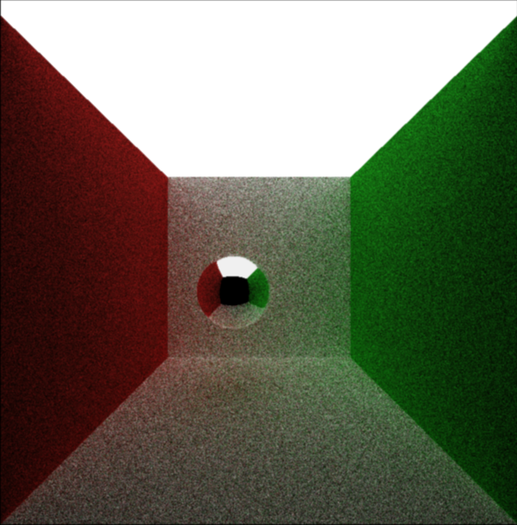
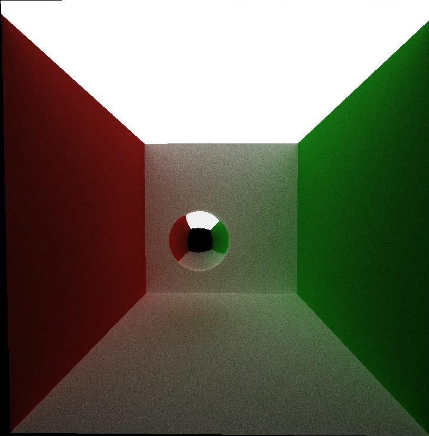
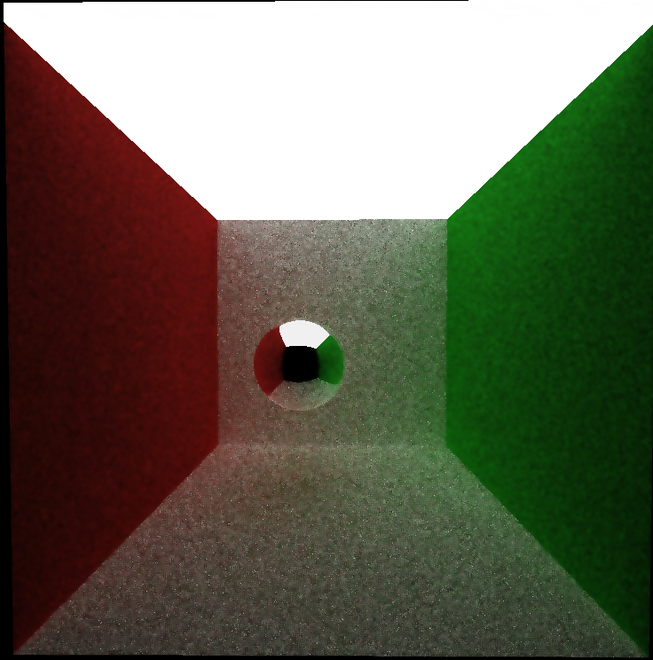

CUDA Denoiser For CUDA Path Tracer
================

**University of Pennsylvania, CIS 565: GPU Programming and Architecture, Project 4**

* Xiaoyue Ma
  * [LinkedIn](https://www.linkedin.com/in/xiaoyue-ma-6b268b193/)
* Tested on: Windows 10, i7-12700H @ 2.30 GHz 16GB, GTX3060 8GB

# Overview
This project implements a CUDA-powered pathtracing denoiser that utilizes geometry buffers (G-buffers) to steer a smoothing filter. Drawing inspiration from the study "[Edge-Avoiding A-Trous Wavelet Transform for Fast Global Illumination Filtering](https://jo.dreggn.org/home/2010_atrous.pdf)", this denoiser enhances the appearance of pathtraced images by producing smoother results with fewer samples per pixel.

  

 

By iteratively applying sparse blurs of increasing sizes, one can approximate the effects of a Gaussian filter. Instead of using a large filter, this method utilizes a smaller one but spaces out the samples that pass through it. Interestingly, to achieve a greater blur size, it doesn't require enlarging the filter; instead, it demands more iterations. This approach optimizes performance while still achieving the desired blurring effect.

  

 

# Features
## Core features
##### **A-Trous**

A-Trous Filtering enhances our denoiser's efficiency by applying iterative sparse blurs, achieving large filter results with a smaller filter size.

|No Filter | Filter Size = 16 | Filter Size = 64 |
|:-----: | :-----: |:-----: |
| |  |  |

##### **Edge-Avoiding A-Trous**

A-Trous Filtering can blur vital details, but using G-buffer information, we adjust blurring on sharp edges to preserve key image elements, optimizing denoising.

|No Filter | A-Trous (64) | A-Trous with Edge-Avoiding (64) |
|:-----: | :-----: |:-----: |
| |  |  |

##### **G-Buffer**

Using normal, position, and time intersection data as weights, we minimize edge blurring during application. This data is viewable via the "Show GBuffer" option in the GUI.

| Time to Intersect |Normal | Position |
|:-----: | :-----: |:-----: |
| |  |  |

## Extra Feature

#### Gaussian Filtering

The Gaussian Filter calculates a pixel's new color by averaging its neighbors, giving more weight to those nearby. In my tests, it generated a more blurred image when edge-avoiding was off and a marginally noisy one when on.

|No Filter | A-Trous (16)  | Gaussian (16)|
|:-----: | :-----: |:-----: |
| |  |  |

| A-Trous Edge-Avoiding(64) | Gaussian Edge-Avoiding(64)|
|:-----: | :-----:|
 |  |

# Performance Analysis

### **How much time denoising adds to the renders**

The denoiser activates after the path tracer's image rendering, with its runtime being influenced by image resolution and filter size, not scene complexity. My tests show that for an 800x800 image with an 80x80 filter, the denoising time remains consistent regardless of iteration count.   

  

 

### **How denoising influences the number of iterations needed to get an "acceptably smooth" result**

Perceptions of "smoothness" differ among individuals and can be influenced by various image factors. In the **'cornell_ceiling_light'** test, a smooth appearance was achieved at 300 iterations without denoising. With denoising, only 150 iterations were needed, marking a 100% reduction. While the benefit of denoising can depend on the scene, it notably reduces required iterations overall.

No Denoising, 300 iterations | Denoised, 150 iterations
:----------:|:-----------:
 | 

### **How denoising at different resolutions impacts runtime**

The runtime for denoising rises with resolution, but the increase isn't linear. For instance, even though a significant resolution jump (from 200x200 to 800x800) is made, the runtime only multiplies by seven. As the resolution increases, the denoising process requires more time, attributed to the higher pixel count and added A-trous filter iterations. However, this growth in runtime doesn't scale proportionally with the resolution.

  

 

### **How varying filter sizes affect performance**

Predictably, an increase in filter size results in an extended denoising runtime because more neighboring pixels get sampled to determine each pixel's new color. In a chart derived from the test at an 800x800 resolution, while there's a relationship between additional time and filter size, it's not strictly linear.

  

 

### **How visual results vary with filter size -- does the visual quality scale uniformly with filter size?**

For images from the test scene at 10 iteration, denoising sees a marked improvement from 32 to 64 and a discernible one from 16 to 32. However, further increments offer limited visual benefits. 

Filter Size 4 | Filter Size 16 | Filter Size 32 | Filter Size 64 |
:-----:|:-----:|:-----:|:-----:|
  |  |  |  | 

### **How effective/ineffective is this method with different material types**   

This technique excels with diffuse materials, but often results in a softer appearance as the "roughness" diminishes from color smoothing. Its efficacy is diminished with reflections, causing them to blur noticeably and reducing the material's shine.

Diffuse | Specular | Imperfect Specular
:----------:|:-----------:|:-----------:
 |   |  

### **How do results compare across different scenes**
**For example, between `cornell.txt` and `cornell_ceiling_light.txt`. Does one scene produce better denoised results? Why or why not?**

The efficacy of denoising is scene-dependent. In the cornell_ceiling_light setup, it shows promising results, whereas in the standard cornell scene, it's less effective. Uniformly lit scenes with limited color variations favor denoisers, as consistent illumination aids in rapid light emission computations. In contrast, darker scenes with infrequent bright spots introduce more noise, posing challenges to the denoising process.  

Cornell Scene | Light Cornell Scene 
:----------:|:-----------:
 |  

### **A-Trous Filtering vs. Gaussian Filtering**

In performance comparisons, A-Trous Filtering notably surpasses Gaussian Filtering. A-Trous runtime grows almost linearly with increasing filter size or resolution, whereas Gaussian's runtime rises exponentially. 

  

 

