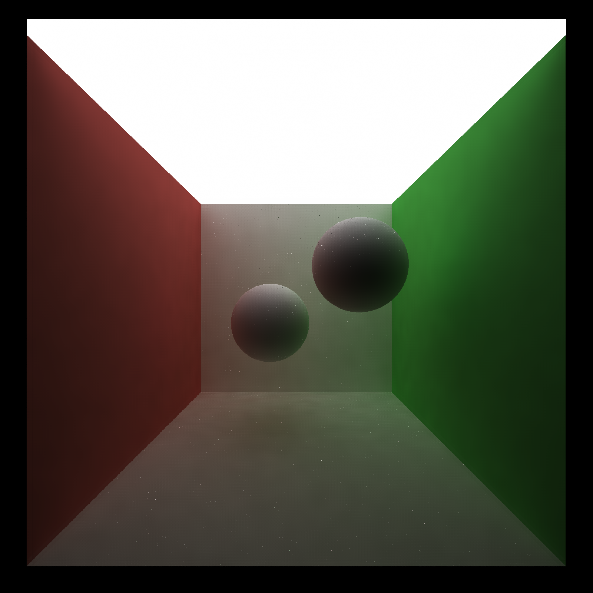

CUDA Denoiser For CUDA Path Tracer
==================================

**University of Pennsylvania, CIS 565: GPU Programming and Architecture, Project 4**

* Yue Zhang
  * [LinkedIn](https://www.linkedin.com/in/yuezhang027/), [personal website](https://yuezhanggame.com/).
* Tested on: Windows 11, i9-13900H @ 2.60GHz 32GB, NVIDIA GeForce RTX 4070 Laptop 8GB (Personal Laptop)
* Compute capability: 8.9

## Project View

A diffuse rabbit denoised with À-Trous filter after 30 iterations.

Custom painter scene with denoiser.

## GBuffer Visualization
Here are the visualized GBuffer result:
 per-pixel normals | per-pixel positions (scaled down) |
|---|---|
|||

## Performance Analysis
* How much time denoising adds to your renders?

  I setup a cpu timer to take all time `denoise()` function cost into account, including CUDA memory operation since they are all additional to the original show image process. Here is the table comparing results along different optimzation methods (filter size = 80, iter = 10, resolution = 800 x 800):

  The average time with optimization on gbuffer struct performs a little worse the the baseline. That should be the extra call to encode and decode z-depth and oct-normal in the short denoise process. In the other side, the gBuffer will require a smaller memory size and will be an optimization in a complicated enough scene (when memory bandwidth becomes a bottleneck).

* How denoising influences the number of iterations needed to get an "acceptably smooth" result?

|Ground Truth (5000 iter)|Iter = 1|Iter = 5|Iter = 10|
|------|------|-------|-------|
||||

  After 10 iterations, the result is visually close to the final ground truth and the following iterations doesn't improve the result strongly as in the first 10 iterations. Denoising largely decrease the iteration to get a smooth result due to its scene-aware blur feature.
  
* How denoising at different resolutions impacts runtime?

  Here is a line chart for the average denoising time for different resolutions:

  Larger resolution increases the pixel count to run denoise algorithm. When the resolution is large enough, the increase of average denoise time is close to the multiple of the two pixel counts. In the smaller case, the memory operation will be the main time cost.

* How varying filter sizes affect performance?
  
  Here is a line chart for the average denoising time for different filter sizes:

  Since the cost of À-Trous filter relates direct with the iteration count determined from the log of filter size, the average denoising time with respect to filter size is linear to the log of filter size, as reflected in this chart. The image with lower filter size obtain less average denoising time, but requires more iterations to achieve the acceptably smooth result.
  
* How different is À-Trous filter and gaussian filter in visual effect?
  
|Ground Truth (5000 iter)|À-Trous filter(10 iter)|Gaussian filter(10 iter)|Gaussian filter(50 iter)|Gaussian filter(100 iter)|
|------|------|------|------|------|
||||||

  Since gaussian filter only computes a global blur effect upon the image, it makes the image blurrier than À-Trous filter and requires longer time to remove all the noise point.

* How visual results vary with filter size -- does the visual quality scale uniformly with filter size?

  Here are the visual output for three different filter size: 20, 40 and 80 in the same scene `cornell_ceiling_light.txt` with À-Trous filter and the same size on the other scene `cornell.txt` with only plain blur occurred (without weight from G-Buffer).

||Filter Size = 20|Filter Size = 40|Filter Size = 80|
|------|------|-------|-------|
|Plain blurry||||
|À-Trous||||

  The larger filter gives a better removal of noise point since the noise point take less account in the final averaged result, with an obviously blurry effect. Since the iteration count is determined by log of the filter size, the increment of visual quality (suggested by removal of noise point here) is not uniformly increase. There will be an obvious increase when each level of À-Trous wavelet transform increases.

* How effective/ineffective is this method with different material types?

  We compare diffuse, reflective and refractive ball here for the visual effect along different material types.

||Diffuse|Reflective|Refractive|
|------|------|------|-------|
|Ground Truth||||
|Original (10 iter)||||
|Denoised (10 iter)||||

  In this comparision, diffuse ball performs best in the output. The surface of reflective and refractive ball is blurry due to failure to avoid edge by normal buffer (its normal is always continous) and position buffer on it. The color buffer for reflective material will compute a blurry effect upon the surface.

* How do results compare across different scenes - for example, between `cornell.txt` and `cornell_ceiling_light.txt`. Does one scene produce better denoised results? Why or why not?

  Here are the comparision for reflective material and refractive material in these two different scene:

|`cornell.txt`|`cornell_ceiling_light.txt`|
|------|------|
|||
|||

  The scene with larger light source obviously perform better since the chance for rays to shoot at the light surface is higher. Since the image converges better in the same iteration, the denoiser works better based on better path-traced result.
