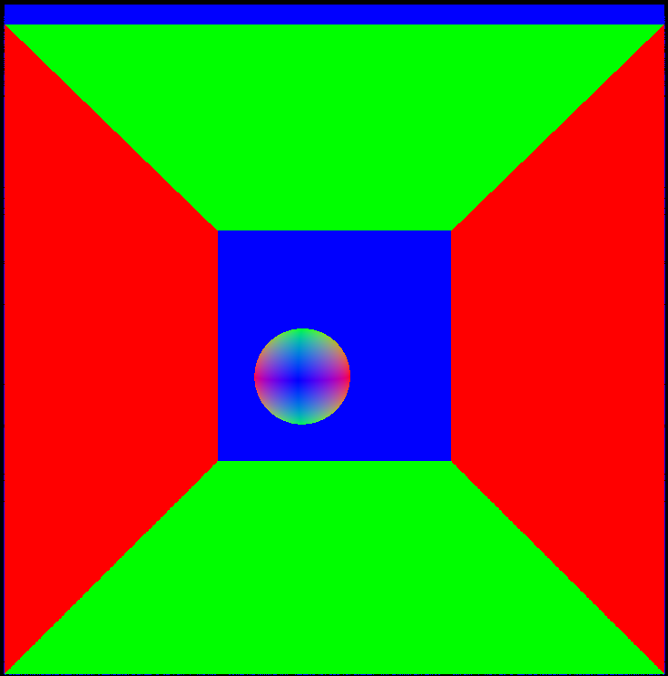
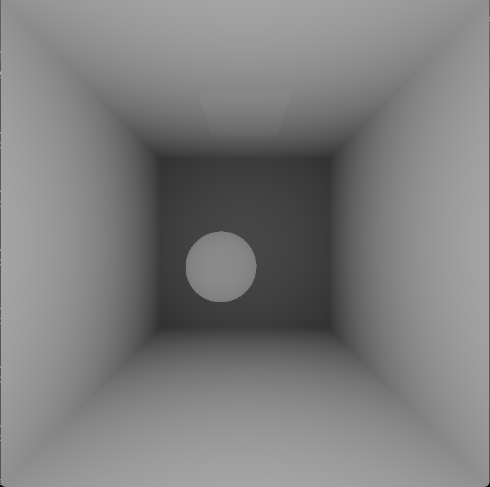
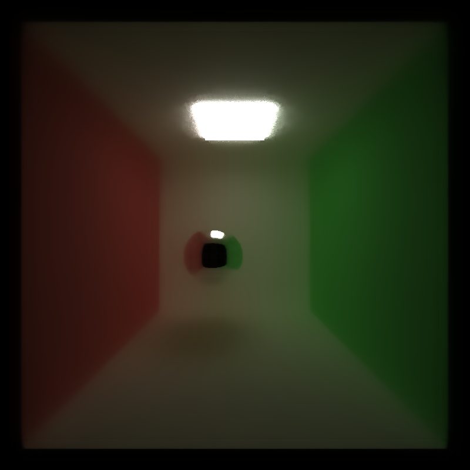

CUDA Denoiser For CUDA Path Tracer
==================================

**University of Pennsylvania, CIS 565: GPU Programming and Architecture, Project 4**

* Utkarsh Dwivedi
  * [LinkedIn](https://www.linkedin.com/in/udwivedi/), [personal website](https://utkarshdwivedi.com/)
* Tested on: Windows 11 Home, AMD Ryzen 7 5800H @ 3.2GHz 16 GB, Nvidia GeForce RTX 3060 Laptop GPU 6 GB

## Introduction

|||
|:-:|:-:|
|Original 100 samples per pixel|Denoised|

This is a CUDA implementation of the paper ["Edge-Avoiding A-Trous Wavelet Transform for fast Global Illumination Filtering"](https://jo.dreggn.org/home/2010_atrous.pdf), which describes a fast-approximation for a Gaussian-blur based denoiser for noisy path traced images coupled with an edge-avouding solution. This denoiser helps significantly reduce render times by reducing the overall samples per pixel required to get a denoised render that looks comparable to a render that would require many more samples per pixel to look similar.

This project is an extension of my [CUDA Path Tracer](https://github.com/utkarshdwivedi3997/CIS-565-Project3-CUDA-Path-Tracer).

## Process

### 1. Generate noisy path-traced result

This can be something generated with very few samples per pixel (in my experience as low as 40 spp work well with lambertian diffuse surfaces).

||
|:-:|
|100 samples per pixel|

### 2. Generate G-Buffer

The paper explains using a G-buffer with world-space positions and world-space normals as a texture. This project's CUDA implementation simply makes a buffer of these values in the first path tracing sample and sends them over to the GPU for use later in the denoising process.

||||
|:-:|:-:|:-:|
|World Space Positions|World Space Normals|Depth (only visualised, not needed in G-buffer)|

### 3. Blur noisy pathtraced image using A trous wavelet transform

I'm not a fan of fancy names. What the A trous wavelet transformation described in this paper actually does is a **fast approximation of the Gaussian blur applied over iteratively increasing filter sizes**.

This works as follows: in Gaussian blur, we look at the neighbouring pixels of the current pixel and average out its colours based on a weight kernel that describes how much each pixel's colour contributes to the final average colour of the current pixel. "Denoising" here works by increasing this kernel size over multiple iterations, so we first look at a kernel of 5x5, then 7x7, then 9x9 and so on. This can become expensive, as we start to include more and more pixels for computation with increasing kernel sizes.

This is where "a-trous" comes in. In very simple terms, this is still a Gaussian blur, but *with holes*. When kernel size is increased in successive iterations, the number of pixels sampled for averaging colour is kept constistent: every iteration, every 2i *th*  pixel is sampled, where *i* is the iteration number. This keeps the kernel size constant, and the iterative blur algorithm fast.

||
|:-:|
|3 iterations of the fast approximated Gaussian blur kernel (image source: see [paper](https://jo.dreggn.org/home/2010_atrous.pdf))|

This blur looks like this:
||||
|:-:|:-:|:-:|
|Fast Approximated Blur 3 Iterations|Fast Approximated Blur 5 Iterations|Photoshop's Gaussian Blur|

### 4. Apply edge-stopping function

Finally, we apply an edge stopping function that uses the position, normal from the G-buffer and the colour values from the noisy pathtraced result to maintain sharp edges in the blurred output, based on user-defined weightage given to each of the parameters.

|||
|:-:|:-:|
|Original 100 samples per pixel|Denoised|

## Performance and Quality Analysis

### Denoise time compared to path-tracing time

This comparison was done using a filter size of 65x65 (5 denoiser iterations) on the cornell box scene with a specular sphere, by varying the samples per pixel taken during path tracing.

Since the denoising happens only once at the end of the path-tracing, it does not have a significant cost if used. Since at least 5 samples are required to get a good result anyway, we can use the denoiser without much worry about its performance cost, as that is definitely not the bottleneck.

### Denoise time at different resolutions

This comparison was done using a filter size of 65x65 (5 denoiser iterations) on the cornell box scene with a specular sphere, with increasing image resolution.

The time to denoise images with exponentially growing scales also scales exponentially. With that said, when compared to the time taken to path-trace an acceptable image, the denoise time is insignificant, as the path-tracing time is what scales up exponentially as well.

### Denoise time with varying filter sizes

This comparison was done using varying filter sizes on the cornell box scene with a specular sphere, with a constant image resolution of 800x800 pixels.

The time taken to denoise with exponentially increasing filter sizes scales linearly only, since exponentially increasing filter sizes only scale the denoiser iterations linearly (by 1 with each power of 2 filter size). This means that the filter size is not too much of a concern and will not be the primary bottleneck in path-tracing.

how denoising influences the number of iterations needed to get an "acceptably smooth" result

how visual results vary with filter size -- does the visual quality scale uniformly with filter size?
how effective/ineffective is this method with different material types
how do results compare across different scenes - for example, between cornell.txt and cornell_ceiling_light.txt. Does one scene produce better denoised results? Why or why not?

## References

- Adam Mally's CIS 561 Advanced Computer Graphics course at University of Pennsylvania
- TinyGLTF
- PBRT
- [Edge-Avoiding A-Trous Wavelet Transform for fast Global Illumination Filtering](https://jo.dreggn.org/home/2010_atrous.pdf)