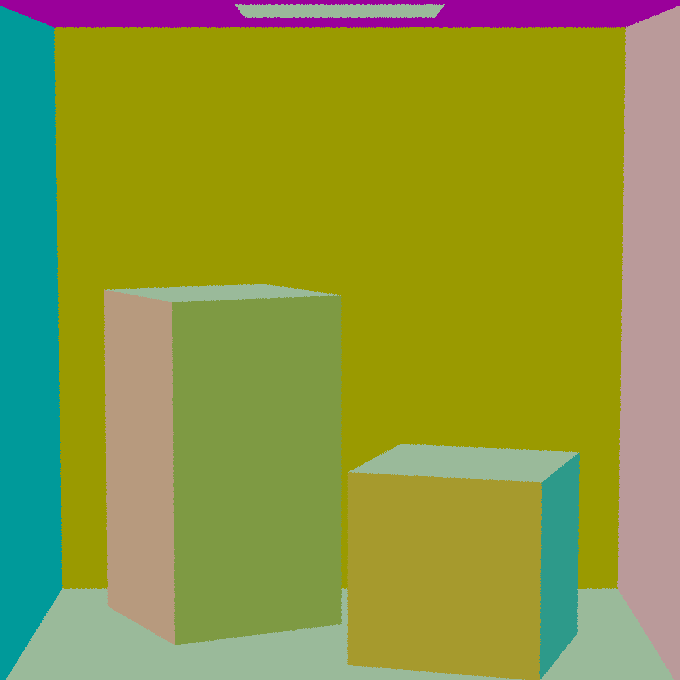
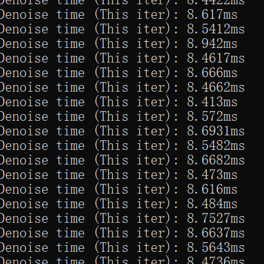
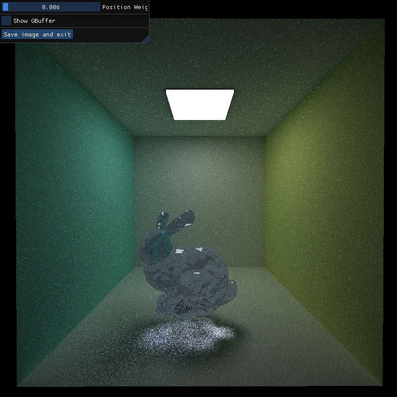
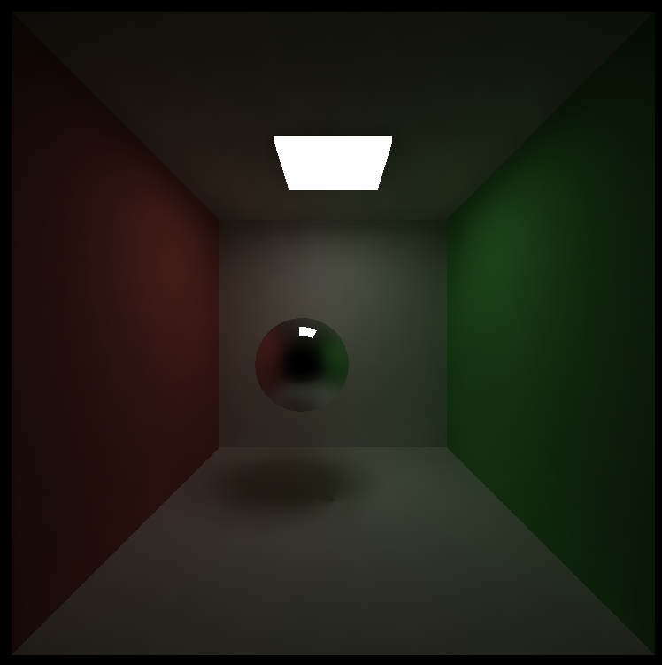

Project 4 CUDA Denoiser
================

**University of Pennsylvania, CIS 565: GPU Programming and Architecture, Project 4**

* Janet Wang [website](https://xchennnw.github.io/en.github.io/)
* Tested on: Windows 11, i7-12700H @ 2.30GHz 16GB, Nvidia Geforce RTX 3060 Ti  8054MB
  
## Summary
This project is a pathtracing denoiser that uses geometry buffers (G-buffers) to guide a smoothing filter. The technique is based on the paper "Edge-Avoiding A-Trous Wavelet Transform for fast Global Illumination Filtering," by Dammertz, Sewtz, Hanika, and Lensch.

* G-Buffers for normals and positions

|  the scene  | per-pixel normals | per-pixel positions | 
|---|---|---|
||||

* The A-trous filter denoiser

 

## Performance Analysis
 
#### how much time denoising adds to your renders & how varying filter sizes affect performance

| |  filter size = 10 | filter size = 40 | filter size = 80 |
|---|---|---|---|
| Denoise time recorded| |||
|Denoise time (average)| 2.83ms|6.62ms|8.56ms|
 

#### how denoising influences the number of iterations needed to get an "acceptably smooth" result

| |  without denoiser | with denoiser| 
|---|---|---|
|Acceptable image | ||
|Iterations| 500 |40|
 

#### how denoising at different resolutions impacts runtime

The time needed for running the denoise roughly scale with the image resolution.
| |  resolution = 400 * 400 | resolution = 800 * 800| 
|---|---|---|
| Denoise time recorded| ||
|Denoise time (average)| 4.90ms |8.56ms|
 

#### how visual results vary with filter size
As the filter size increases, the degree of improvement in image optimization caused by the filter size increase gradually diminishes.
|  filter size = 4  | filter size = 40 | filter size = 80 | 
|---|---|---|
||||
 

#### how effective/ineffective is this method with different material types

The method is very effective for diffuse and specular materials, but less effective for glass materials. The refraction material generates extremely light dot noise that is hard to be blured by the filter.

| | Diffuse | Perfect Specular | Specular + Refraction (Glass) | 
|---|---|---|---|
|Denoiser Off| |||
|Denoiser On |  | | |
 

#### how do results compare across different scenes

The method is more effective for the regular cornell box light than for the cornell box with the ceiling light. There are extremely light dot noises that are similar to the ones showed up in scenes with glass materials. The filter is not able to deal with too many dots with very high color value.

| cornell | cornell_ceiling_light | 
|---|---|
|||
