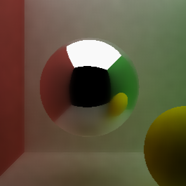

CUDA Denoiser For Path Tracer
==================================

* Linda Zhu: [LinkedIn](https://www.linkedin.com/in/lindadaism/)
* Tested on: Windows 11, i7-12800H @ 2.40GHz 16GB, NVIDIA GeForce RTX 3070 Ti (Personal Laptop)

## Overview
In this project, I implemented a pathtracing denoiser that uses geometry buffers (G-buffers) to guide a smoothing filter.

My denoising technique is based on the paper "Edge-Avoiding A-Trous Wavelet Transform for fast Global Illumination Filtering," by Dammertz, Sewtz, Hanika, and Lensch. You can find the paper here: https://jo.dreggn.org/home/2010_atrous.pdf

Denoisers can help produce a smoother appearance in a pathtraced image with fewer samples-per-pixel/iterations, although the actual improvement often varies from scene-to-scene.
Smoothing an image can be accomplished by blurring pixels - a simple pixel-by-pixel blur filter may sample the color from a pixel's neighbors in the image, weight them by distance, and write the result back into the pixel.

However, just running a simple blur filter on an image often reduces the amount of detail, smoothing sharp edges. This can get worse as the blur filter gets larger, or with more blurring passes.
Fortunately in a 3D scene, we can use per-pixel metrics to help the filter detect and preserve edges (Figure 1).

| Raw Path-Traced Image | Simple Blur | Denoised Guided by G-Buffers |
|---|---|---|
||||

*Figure 1. Comparison between different path traced outputs at 10 iterations. Denoiser parameters are configured using slidebars in the GUI.*

These per-pixel metrics can include scene geometry information (hence G-buffer), such as per-pixel normals and per-pixel positions (Figure 2), as well as surface color or albedo for preserving detail in mapped or procedural textures. For this project I only used per-pixel metrics from the "first bounce" of the ray.

 Per-Pixel Normals | Per-pixel Positions (Normalized) |
|---|---
||

*Figure 2. Per-pixel normal map (mapped to 0-1 range) and position map (scaled down).*

## Performance Analysis
## Visual Quality Analysis
The test scene used for the following results is a standard cornell box with a resolution of 800x800 pixels generated at 50 iterations. For the 3 denoiser weights, we use a `color weight` of 150.0, a `normal weight` of 0.35 and a `position weight` of 0.35.

### Varying Filter Size
According to Table 2 in the Dammertz et al. paper, 5 * 2<sup>#Iter</sup> corresponds to the total filtersize. Therefore, varying the filter size basically determines how many times the A-Trous denoiser is applied to the input image. We calculate the number of iterations as the following:
```
    int numIter = filterSize < 5 ? 0 : floor(log2(filterSize / 5.f));
```
We loop from zero to `numIter` inclusive so the denoiser would still be applied once even if `numIter` is zero.

| Filter size = 10 | Filter size = 40 | Filter size = 80 |
|---|---|---|
||||

| Filter size = 120 | Filter size = 160 | Filter size = 200 |
|---|---|---|
||||

As can be seen in the outputs above, increasing the filter size in general improves the smoothness of the scene. The visual quality does seem to scale uniformly with the filter size until filter size hits 160. To my human eyes, there's no obvious improvement between filter size = 160 and 200. I also tried to use the [ImageCompare](https://www.textcompare.org/image/) tool to find the differences (pertaining to transparency, different color, anti-aliasing etc.) in those two images and it showed 0% changes.

### Different Material Types
Fixing filter size to 80x80 in the denoiser, we add another diffuse sphere in the scene in addition to the specular reflective one, and compare the denoised results to the raw path-traced outputs.

 Raw PT | Denoised |
|---|---
||

Denoising is most effective on diffuse materials where there aren't many fine details to capture. This is reasonable because on diffuse materials, rays can be scattered equally in all directions within the hemisphere of a surface normal, so averaging out its neighboring pixels using some heuristics to contribute to the final color of a pixel is a quick and easy way to "smooth out" the appearance. In fact, with fewer path-tracing iterations (as shown in the comparison below), we can achieve a quite decent visual quality on **diffuse materials** if we tune the weights properly. Considering the point of denoising is to reduce the number of samples-per-pixel/pathtracing iterations needed to generate an acceptably smooth image, our denoiser is sufficient for diffuse materials.

35 iter, color weight=81, normal weight=0.28, position weight=0.22 | 50 iter, color weight=150, normal weight=0.35, position weight=0.35 |
|---|---
||

However, denoising is less effective on specular materials, especially at lower iteration counts. Even with the integration of the edge-avoiding function, the edges of the cornell box and the boundaries of the yellow sphere in the reflection are still very blurry. This is because for the scene reflected from the surface of the specular sphere, the positions and normals of the corresponding pixels are continuous on the sphere, which defeats the purpose of the edge detection algorithm. To retain the fine details on specular surfaces, we still need to rely on the iteration counts.

All images denoised:
 50 spp | 100 spp | 500 spp | Image diff between 50 vs. 500 spp
|---|---|---|---|
||||

### Varying Light Source
Since we are using the provided super basic version of path tracer, for this comparison between a small light source and a large light source, we increase the default path-tracing iteration to 500 so that there's at least no fireflies in render of the small light source scene. The denoiser spec remains the same.

 Small Light Source | Large Light Source |
|---|---
||

The scene with the larger ceiling light produces much better denoised results than the scene with the smaller light. With the same number of iterations, our scene can converge faster with a larger light source because the rays have a higher probability to hit the light source. In the smaller light scene, rays are more likely to miss the light, which leads to a noisier image. Imagine how many iterations it would require for the default cornell box to produce an image with a comparable quality as the scene with the ceiling light. The denoiser is able to produce an image much closer to the expected outcome quickly.