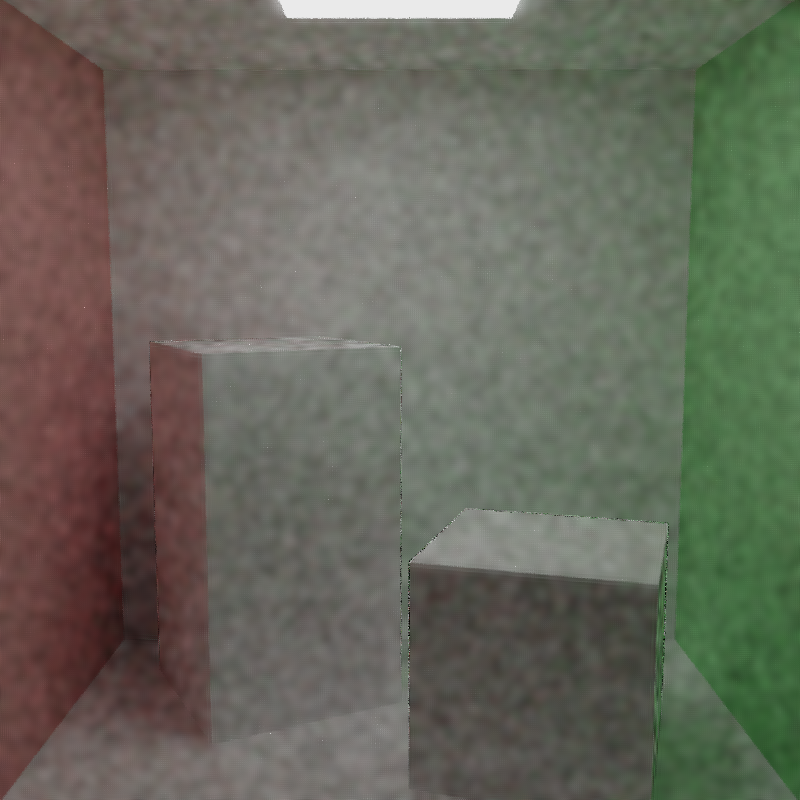

CUDA Denoiser For CUDA Path Tracer
==================================

**University of Pennsylvania, CIS 565: GPU Programming and Architecture, Project 4**

* Licheng CAO
  * [LinkedIn](https://www.linkedin.com/in/licheng-cao-6a523524b/)
* Tested on: Windows 10, i7-10870H @ 2.20GHz 32GB, GTX 3060 6009MB

Result
====
 * Here are the denoiser results. The outcome is generally deemed acceptable when the sample count is approximately 64.

|number of samples| 1 | 4 | 16 | 64 | 128|
|:--:|:--:|:--:|:--:|:--:|:--:|
|original||||||
|denoised||||||

Filter
===
* The images below illustrate the storage of g-buffers. As evident in the "1 sample" row, artifacts are present in the storage of normals and positions due to ray jittering for anti-aliasing. To mitigate this, I employ interpolation, combining the output of the previous g-buffer with the current frame's intersection results in my application.

|filter| normal | position | A-trous without weighting |
|:--:|:--:|:--:|:--:|
|1 sample||||
|100 sample||||

Analysis
===
## Resolution
* Based on the table, it's evident that rendering time increases as the resolution is raised. However, the time dedicated to denoising remains relatively consistent across varying resolutions.

|resolution|400x400|600*600|800x800|
|:---:|:---:|:---:|:---:|
|origin render time(ms)| 5.43| 8.93 |16.28 |
|denoise render time(ms)| 6.15| 10.41| 16.85|

## Filter size
* As anticipated, the render time increases when the filter size is enlarged, as the denoiser has to process more iterations to generate the final result. It's worth noting that neither excessively large nor excessively small filter sizes tend to yield satisfactory results.

|filter size|1|2|3|4|5|
|:---:|:---:|:---:|:---:|:---:|:---:|
|render time(ms)|16.18 | 16.46| 18.18| 19.97| 21.77|
|result| | | | | |

## Material
* Utilizing image color as a filter input can sometimes lead to excessive blurring of the result. Inspired by  [HummaWhite](https://github.com/HummaWhite), I opted to employ the light incident on the surface, rather than the output color, as the filter input. This approach allowed me to apply the texture after denoising, resulting in a significantly improved outcome.

|origin|origin denoise|apply texture after denoise|
|:---:|:---:|:---:|
||||

## Scene
* The intensity of the lighting can indeed impact the denoiser's output. In the case of the cornelbox scene featuring a large ceiling light, we observed that just 4 samples were sufficient to produce a high-quality result. This result matched or even exceeded the quality of the output from the standard cornelbox scene with 8 samples.

|normal (4 samples)| normal (8 samples)| ceiling light (4 samples)|
|:---:|:---:|:---:|
||||

Third Party
============
### Code
  * [tinyobjloader](https://github.com/tinyobjloader/tinyobjloader)
  * [imgui](https://github.com/ocornut/imgui)
  * [stb_image](https://github.com/nothings/stb/blob/master/stb_image.h)
### Assets
  * [planet](https://www.turbosquid.com/3d-models/3d-stylized-planet-system-4k-free-1973128)
