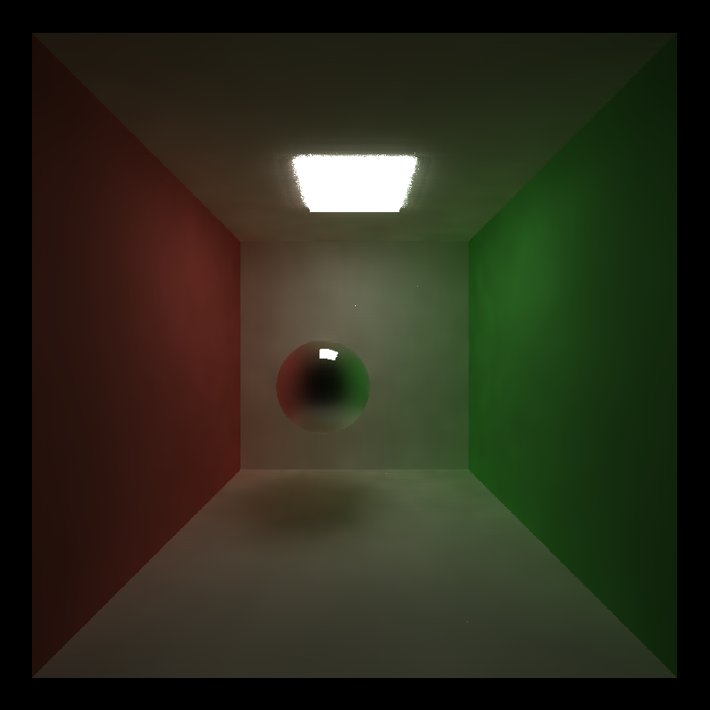

CUDA Denoiser For CUDA Path Tracer
==================================

**University of Pennsylvania, CIS 565: GPU Programming and Architecture, Project 2**

Jason Li   ([LinkedIn](https://linkedin.com/in/jeylii))
* Tested on: Windows 10, Ryzen 5 3600X @ 3.80GHz 32 GB, NVIDIA RTX 4070 

# **Summary** 
This project is an implementation of the image filter method described in this paper: [the Edge-Avoiding A-Trous Wavelet Transform](https://jo.dreggn.org/home/2010_atrous.pdf). We use a basic path tracer as a base and implement the algorithm described in the paper. 

Example Scene             |  
:-------------------------:|
  |

# **Implementation**
The paper describes a blurring algorithm which is used as an image filter. This algorithm considers position and normal data from each point to incorporate edge information, preserving the detail in simple edges while speeding up image rendering significantly for realtime applications. We implement this algorithm using a G-buffer to store the position and normal data, and apply it to the image after a few basic path tracer iterations to view the final results. Below is a basic performance analysis of our implementation of this algorithm.

# **Denoising Performance Analysis**
The main impact of using a denoising filter is to reduce the amount of time it takes for our path tracer to render an "acceptably smooth" image. For our sample Cornell Box Scene, included below is a comparison between two images. The first takes 80 iterations of the path tracer then applies our denoising filter to it with a filter size of 129 x 129 pixels. The second does not apply the denoising filter but takes 2500 iterations of the path tracer to render. A differential between the two images is shown, along with their total render times.

Denoising Filter          |  No Filter         | Image Diff
:-------------------------:|:-------------------------:|:-------------------------:
  |   |  
0.600 s|15.125 s|

As seen in the above image, applying the denoising filter produced an acceptably smooth image comparable with the image produced without the filter in a fraction of the time taken. 

## **Denoising At Different Resolutions**
Time Per Frame vs. Resolution Graph             |  
:-------------------------:|
  |

The graph above compares the time required to render a frame on average for our Cornell Box scene when using different resolutions. We can see that as the image resolution increases, the time per frame appears to increase as approximately *O(n2)*. This is expected, as the horizontal axis of our graph represents the number of pixels on one side of our image, or the width of the image. Thus, as our width doubles, for example, the number of pixels increases by 4 times the original.

## **Denoising with Different Filter Sizes**
Time Per Frame vs. Filter Size Graph             |  
:-------------------------:|
  |

The graph above compares the time required to render a frame on average for our Cornell Box with Ceiling Light scene when using different filter sizes. We can see that as the filter size increases, the time per frame also increases - here it seems to be approximately *O(lgn)*. However, by plotting the time required to render a frame against the number of iterations of the filter that we run instead of the filter size, we can see that the time increases somewhat linearly, with a negligible increase in time per frame for very small numbers of filter iterations.

Time Per Frame vs. Filter Iterations Graph             |  
:-------------------------:|
  |

Below, we can see a visual comparison of these different filter sizes when used on our Cornell Box scene, with 10 path tracer iterations:

No Filter, 10 Path Tracer Iterations          |  1 Filter Iteration; Size 5x5         
:-------------------------:|:-------------------------:
  |   

2 Filter Iterations; Size 9x9          |  3 Filter Iterations; Size 17x17         
:-------------------------:|:-------------------------:
  |   

4 Filter Iterations; Size 33x33          |  5 Filter Iterations; Size 65x65         
:-------------------------:|:-------------------------:
  |   

6 Filter Iterations; Size 129x129          |  7 Filter Iterations; Size 257x257         
:-------------------------:|:-------------------------:
  |   

As seen here, after about 4 or 5 filter iterations, with a size of around 33x33 to 65x65, the difference in visual quality between the final images rendered for a larger number of iterations is negligible. Between 1-4 iterations, we can see a somewhat clear difference in visual quality. This is most likely due to the fact that for exceedingly large filters, the weight consideration of the further pixels in the final color is much lower due to the large difference between its position and the original pixel's position. Thus, the visual quality of the rendered image does not scale uniformly with filter size.

## **Denoising on Different Material Types**
Denoising Filter          |  No Filter         
:-------------------------:|:-------------------------:
  |   
0.600 s|

In the above comparison between an image rendered with many iterations and no denoising filter and an image rendered with fewer iterations while using the denoising filter, note that the resultant reflections on the specular sphere in the middle of the scene are of much lower quality for the image rendered using the denoising filter. This can also be confirmed by looking at the image differential between the two, included below. The reflection on the specular sphere in the image rendered using the denoising filter is much more blurred, with less distinction on the reflected edges of the box. 

This is likely due to the fact that the position and normals of each intersection of the sphere itself do not indicate that edges are present in the reflection on its surface; thus, the algorithm blurs the reflection as if no edges are present. A method that could possibly be used to rectify this for any perfectly specular material would be to instead save the position and normal of the first non-specular, diffuse surface that the ray which bounces off the specular surface subsequently bounces onto and intersects with.

Time Per Frame vs. Resolution Graph             |  
:-------------------------:|
  |

## **Denoising on Different Scenes**
Cornell Box Scene with Large Ceiling Light          |  Cornell Box Scene with Small Ceiling Light         
:-------------------------:|:-------------------------:
  |   

Above is a visual comparison between the use of the denoising algorithm on two different scenes; one with a large light source on the ceiling of the Cornell box and one with a much smaller light source on the ceiling of the Cornell Box. For both scenes, a filter size of 129x129px was used, with 40 path tracer iterations. We can see a clear difference in visual quality between them; for the cornell box scene with a smaller light, we can see visible artifacts in the image, especially near the light. The image is also generally much more noisy as compared to the more well-lit rendered image with a larger light. This is likely due to that fact that the image produced by path tracer itself is much more noisy in less well lit scenes, when a smaller number of path tracer iterations is used. Because the probability of rays terminating or hitting the light is much lower with the smaller light, more noise is observed, which carries over to the denoised result. When using a higher number of path tracer iterations, the presence of these artifacts lessens. This means that for scenes with smaller lights using this particular path tracer method, the denoiser is less effective; it requires more path tracer iterations and thus a higher time per frame to produce a clean image.