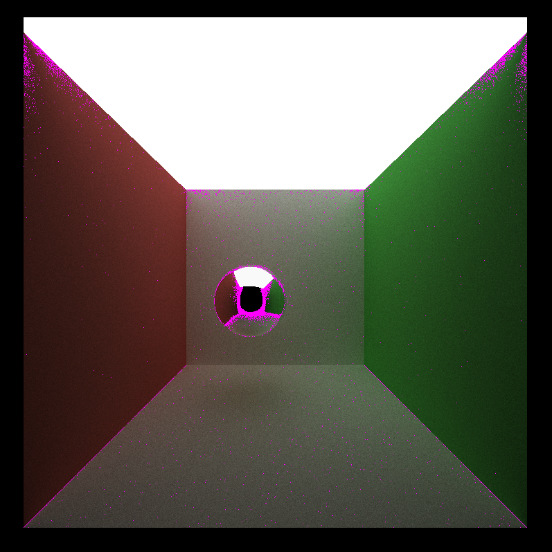
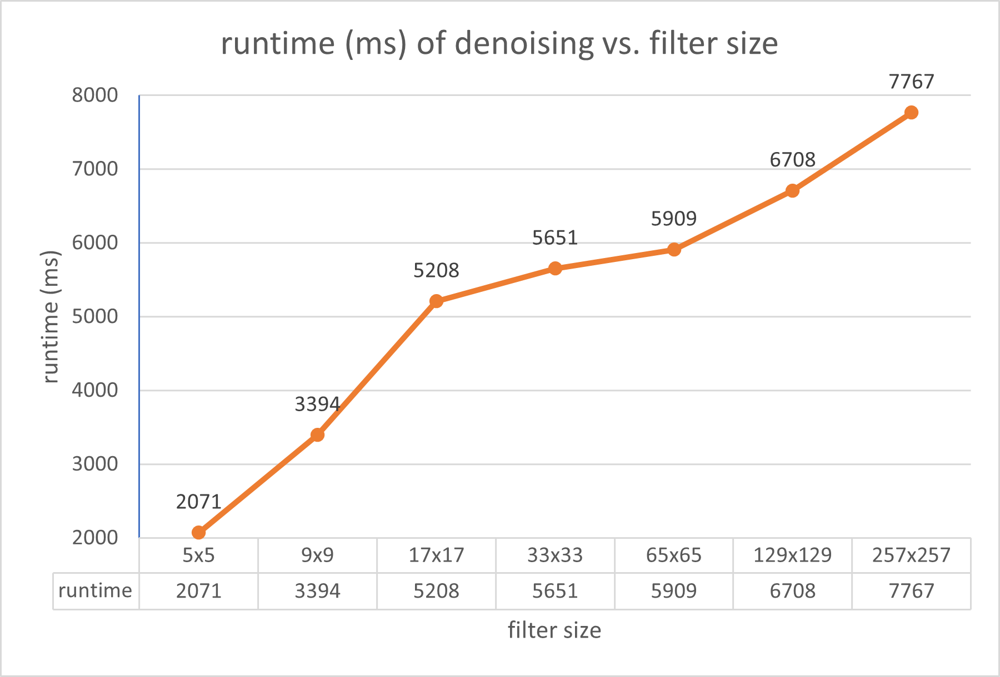
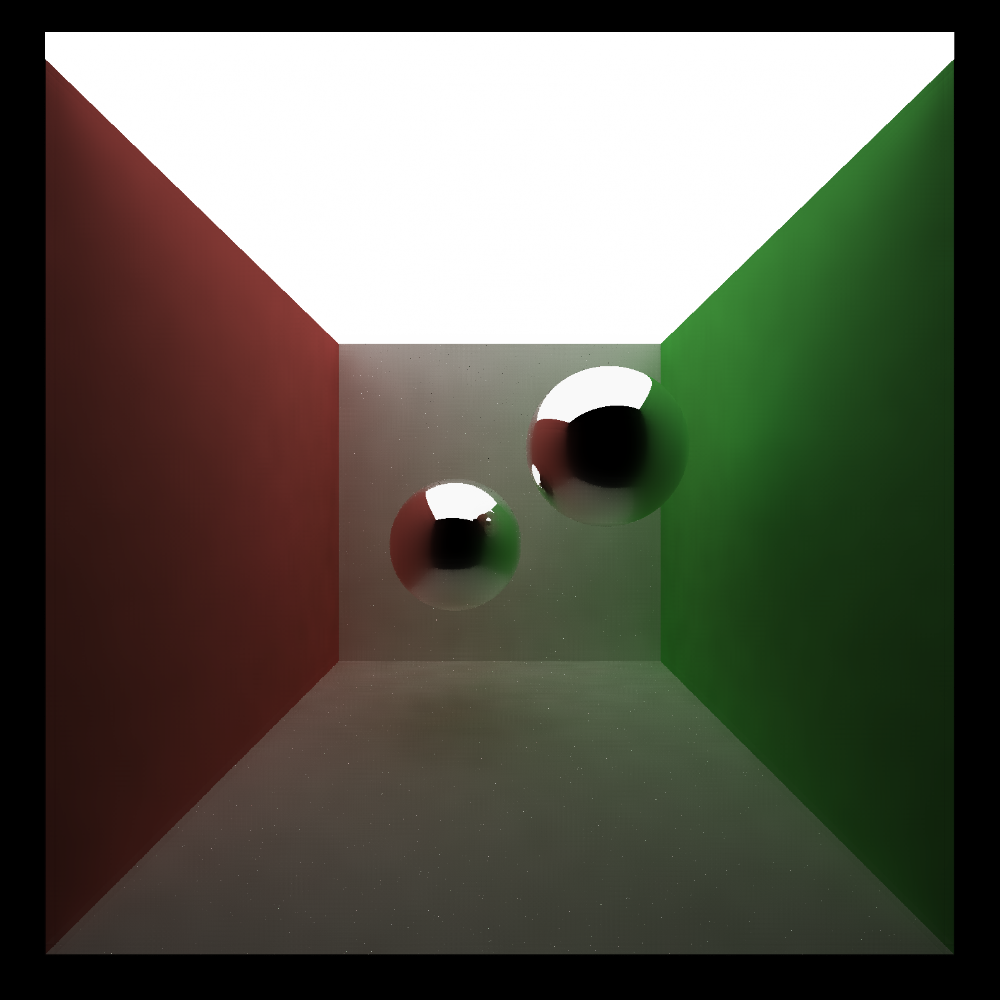
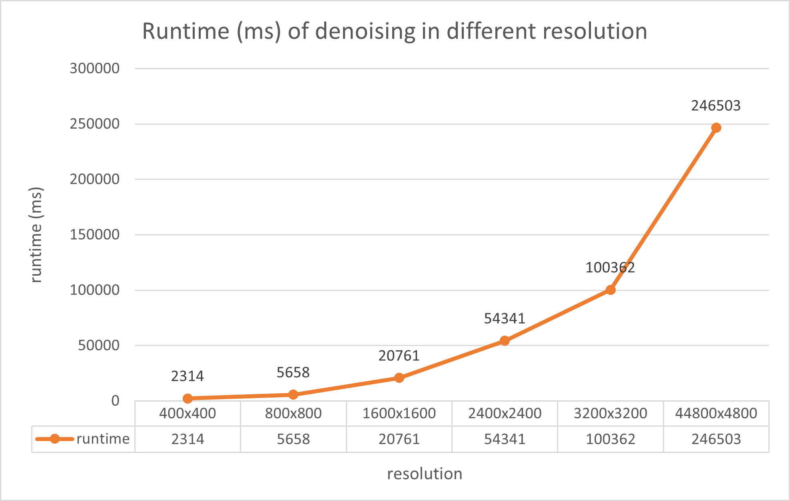
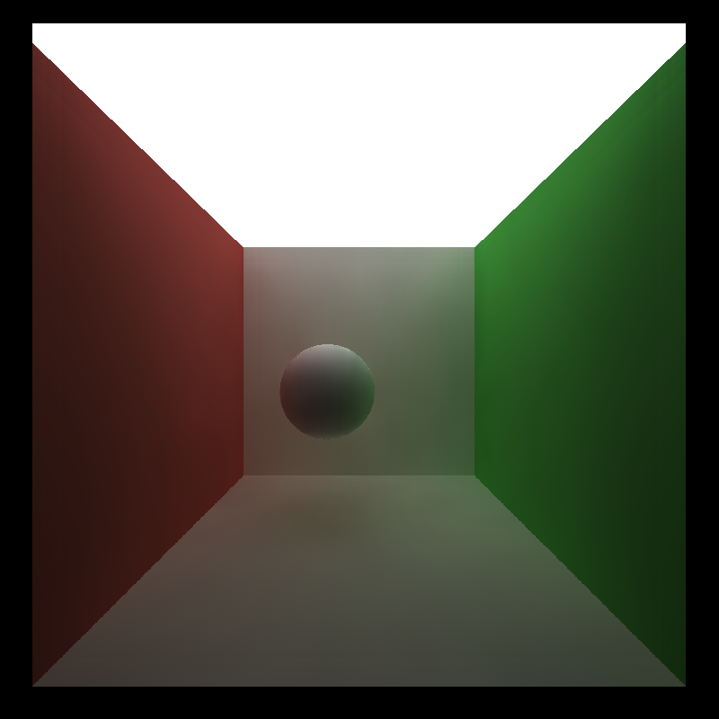
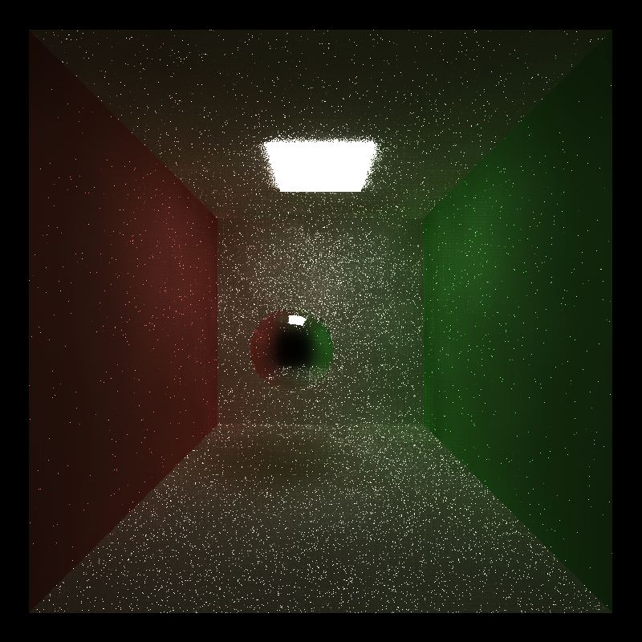
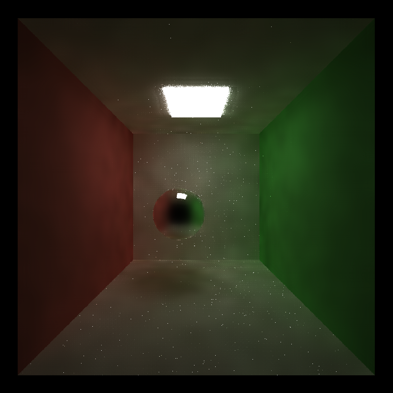
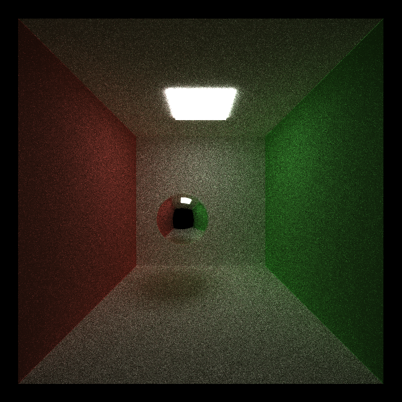
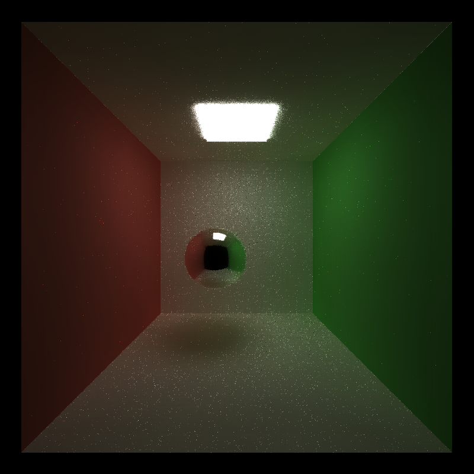
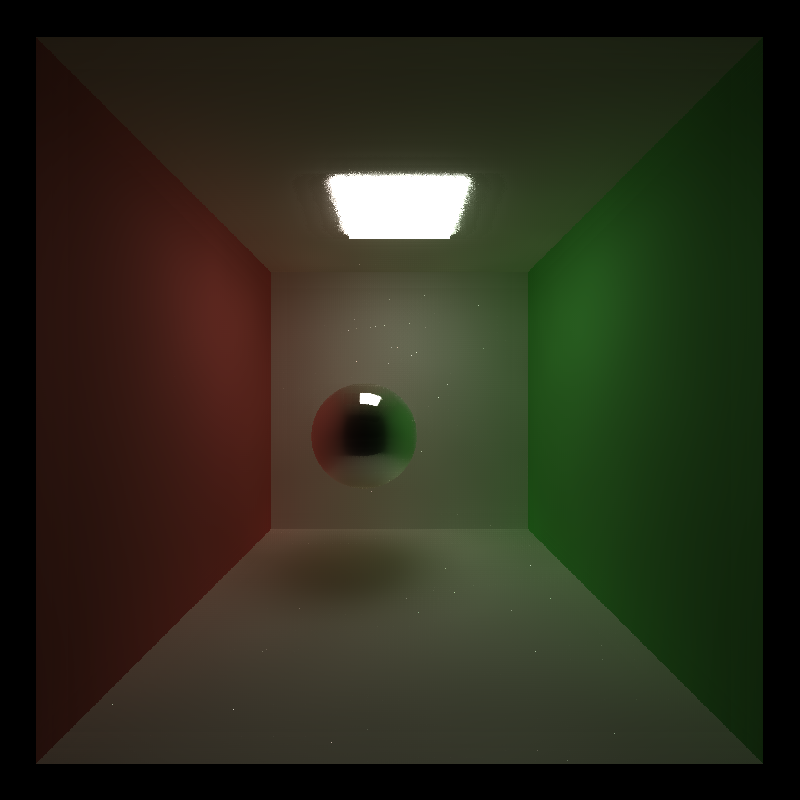

CUDA Denoiser For CUDA Path Tracer
==================================

**University of Pennsylvania, CIS 565: GPU Programming and Architecture, Project 4**

* Tong Hu
* Tested on: Tested on: Windows 11, Ryzen 7 1700X @ 3.4GHz 16GB, RTX 2060 6GB (Personal Desktop)

## Introduction
In this project, I have adopted the techniques presented in the paper: [Edge-Avoiding À-Trous Wavelet Transform for fast Global
Illumination Filtering](https://jo.dreggn.org/home/2010_atrous.pdf). This denoising algorithm significantly enhances the quality of images generated through ray-tracing. Below are the performance analysis showing the efficacy of this method under various scenarios.

## Performance Analysis
### Overall performance

|ray-tracing (1500 iterations) | denoised (10 iters)| 
|:-:|:-:|
| | |

From above comparison, it is evident that the denoised image, with just 10 iterations, achieves results comparable to those from a 1500-iteration ray-traced image.

The following images, obtained from an image difference tool, provide a visual testament to this. Through this images, one can distinctly observe how the denoised version refines the output, drawing it remarkably closer to the image produced with 1500 ray-tracing iterations. 

From the comparison we can say the denoisor is highly effective. With a limited number of iterations, it refines the image to produce an output comparable to a ray-traced image with a significantly higher number of resolutions.

Also observed from the difference examination is that on surface intersections, and on specular surfaces, the denoiser is less effective and can mix color together. To minimize such effects, proper selection of weights of color, normal, and position are needed to achieve a smooth but clear image.

### Different Filter Size

origin | 05x05 | 09x09 | 17x17
:-:|:-:|:-:|:-:
 |  | |  

033x033 | 065x065 | 129x129 | 257x257
:-:|:-:|:-:|:-:
 |  | |  

We can see from the denoise results of different filter sizes, that images tend to become more smooth and the colors tend to be more uniform. Less noise persists in images with larger filter sizes. This result is anticipated since as the size of filter increases, the weighted color summation tend to take remote pixels into consideration, and the more iterations, the more uniform the color will be. We can also see that when the size passes 65x65, the effect of more denoise iterations becomes negligible. Therefore, a suitable filter size like 65x65 or 129x129 can be taken to achieve optimum result. More iterations are not recommended as they introduce additional overhead while providing limited improvment over what is already a smooth image.

### Different Resolution

From following graph, we can see that the time for denoising is higher for higher resolution image. This is rational since the denoising is done by applying filters for each pixel, as the resolution increased, the number of pixels increased, and the time for denoising increased as well. 

### Different Material
||original image|denoised image|
|:-:|:-:|:-:|
|specular|||
|diffusive|||

As we observe the denoise results on both diffusive and specular spheres, it is obvious that the diffusive sphere achieve much better denoise result than specular sphere. The specular sphere, when denoised, becomes blurred and the reflections are less realistic. This can be explained by the mechanism of the denoiser. Since the reflections on the sphere are not influenced by the normal nor positions, the edge-stopping function becomes less effective. As a result, colors of nearby colors will start to mix. From this phenomenon, we can also predict that the denoiser may not work well on surfaces with high-variance texture. Too few sampling cannot be compensated by a simple average denoiser.

### Minimal Light Scene
|          | original    | denoised    | higher w_c  |
| :-: | :-: | :-: | :-: |
| 10 iter  |  |  |  |
| 100 iter |  |  |  |

When using the denoisor on scenes with minimal lighting, its performance isn't as optimal as in scenes illuminated by ceiling lights. The original images rendered via ray-tracing exhibit more noise in low-light conditions compared to those with ceiling lighting. To improve the results, we must adjust the color weight to be less sensitive to color disparities near pixels, ensuring a smoother blend in the image.
