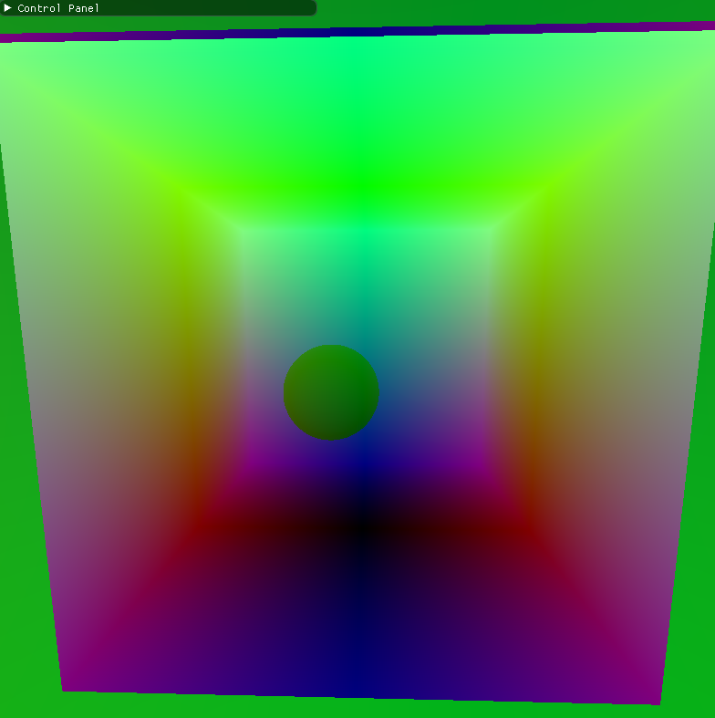

CUDA Denoiser For CUDA Path Tracer
==================================

**University of Pennsylvania, CIS 565: GPU Programming and Architecture, Project 4**

* Xinyu Niu
* [Personal website](https://xinyuniu6.wixsite.com/my-site-1)
* Tested on: Windows 11, i9-13980HX @ 2.20GHz 16GB, RTX 4070 16185MB (Personal)

## Introduction
This project is about implementing a pathtracing denoiser that uses geometry buffers(G-buffers) to guide a smoothing filter. The algorithm implemented here is based on the paper  ["Edge-Avoiding A-Trous Wavelet Transform for fast Global Illumination Filtering,"](https://jo.dreggn.org/home/2010_atrous.pdf) by Dammertz, Sewtz, Hanika, and Lensch.

| raw pathtraced image | simple blur | blur guided by G-buffers |
|---|---|---|
||||

## Features Implemented
* A-trous wavelet filter
* Gaussian Blur
* UI item to show the G-Buffers with their normals or positions.

## G-Buffer

With the help of G-Buffer, A-trous wavelet filter could perseve perceived edges, which a simple Gaussian blur could not do.


Figure1: G-Buffer Normals



Figure2: G-Buffer Positions

## Performance Analysis

* How much time denoising adds to your renders?

    ```Averagely, denoising adds around 3 milliseconds to renders, which is ignorable comparing to the rendering time.```

* How denoising influences the number of iterations needed to get an "acceptably smooth" result?

    ``` Use denoising technique significantly reduces the iterations need to get a smooth result, 100 iterations of a denoised pathtracer generates similar result with 5000 iterations of a non-denoised pathtracer.```

    | raw pathtraced image 100 iterations | denoised image 100 iterations | raw pathtraced image 5000 iterations |
    |---|---|---|
    ||||

* How denoising at different resolutions impacts runtime?

    ``` From the graph we can see that with the resolution increases, the runtime for denoising process also increases. This is an expected behavior as the increase of resolution means more pixels to be considered and thus more iterations are needed by the denoiser, which results in an increase in runtime. ```

    
* How varying filter sizes affect performance?

    ``` From the graph we can see that with the filter size increases, the runtime for denoising process also increases. This is an expected behavior as the increase of requires more iterations by the denoiser, which results in an increase in runtime. ```

    

* How visual results vary with filter size -- does the visual quality scale uniformly with filter size?

    ``` When change from 1 to 10, we can observe a significantly improvement of visual quality. However, when change from 10 to 100, the improvement is hard to identify.```

    | 1 | 5 | 10 | 50 | 100 |
    |---|---|---|---|---|
    ||||||


* How effective/ineffective is this method with different material types?

    ```It is more efficient with diffuse material since specular material reflects on its surface, but positions and normals of G-Buffer can really identify edges reflected on a surface, so the reflected part might be more blurry than other parts.```

    | Diffuse | Specular | 
    |---|---|
    |||


* How do results compare across different scenes - for example, between cornell.txt and cornell_ceiling_light.txt. Does one scene produce better denoised results? Why or why not?

    ```It's clear that cornell_ceiling_light.txt has a better results. This is because a larger light source makes pathtracer coverge faster, which means in the same iteration, it will produce better raw image. A better raw image will result in a better denoised image.```

    | Cornell | Cornell with ceiling light | 
    |---|---|
    |||

    ### Compare with Gaussian Blur

    ```Visually we can find that A-Trous produces a much better result than simply using Gaussian blur, which doesn't consider the geometry information so we can see that the edges are much more blurry than those on the image denoised by A-Trous.```

    | raw pathtraced image | Gaussian blur | A-Trous |
    |---|---|---|
    ||||
